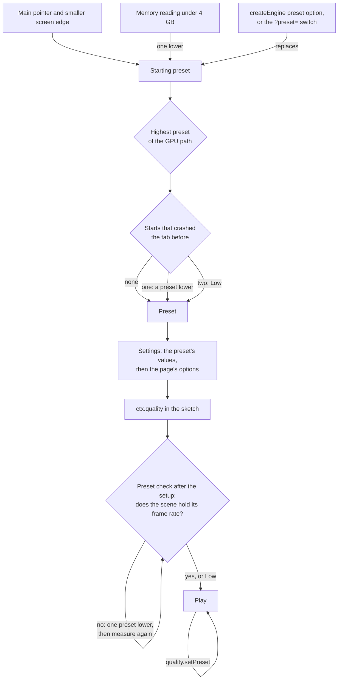

# Quality presets, dynamic resolution and frame budgets

> Ships in null3D 0.1. The API is experimental, so it can still change between versions. The engine chooses a preset and checks it after the first frame. It applies the preset's pixel ratio cap, texture settings and memory maximum, and reports it. A sketch can switch presets with `quality.setPreset`. The settings that the table below marks as planned are not built yet. Neither are dynamic resolution and the frame-budget governor. Coding agents must not use them.



A quality preset is one row of settings: the pixel ratio cap, anti-aliasing, shadows, texture filtering and uploads, light limits and memory. null3D has four presets, from the lightest to the heaviest: Low, Medium, High and Ultra. The engine chooses one when it starts, from facts about the device and never from browser or GPU names. Each setting then starts at that preset's value.

Your sketch reads the preset and the settings from `ctx.quality`. Keep your own choices for each device in a table keyed by preset, as the engine does. Never check the device type in your own code.

```ts
import { defineSketch } from '@null3d/engine';

// Particles per preset, in one table, like the engine's own settings.
const PARTICLES = { low: 500, medium: 2000, high: 5000, ultra: 10000 };

export default defineSketch(({ quality }) => {
  let particles = PARTICLES[quality.preset];
  quality.onChange(() => {
    particles = PARTICLES[quality.preset];
  });
  return {
    onUpdate(dt) {
      // Move `particles` particles.
    },
  };
});
```

## How the engine chooses a preset

The engine starts from the kind of device. A coarse main pointer, as on a touch screen, marks a phone or a tablet, and the screen's smaller edge tells them apart. That edge stays the same when the device turns and when the browser's address bar hides.

<!-- null3d:preset-devices:start -->

| Device | Main pointer | Smaller screen edge | Starting preset |
| --- | --- | --- | --- |
| Phone | coarse | under 600 CSS pixels | Low |
| Tablet | coarse | 600 CSS pixels or more | Medium |
| Desktop or laptop | fine | any | High |

A memory reading under 4 GB lowers the starting preset by one.

<!-- null3d:preset-devices:end -->

Only Chromium browsers report the device's memory, and they report at most 8 GB. So memory can lower a preset, but it never raises one. The engine picks Ultra only when a page asks for it.

The GPU path then caps the preset, because WebGL2 and WebGPU's compatibility mode lack features that the heavier presets use. For example, compatibility mode cannot draw multisampled float targets.

<!-- null3d:preset-ceilings:start -->

| GPU path | Highest preset |
| --- | --- |
| WebGPU | Ultra |
| WebGPU's compatibility mode | Medium |
| WebGL2 | Medium |

<!-- null3d:preset-ceilings:end -->

A page can name a preset instead, such as a preset that a player picked in a menu. The GPU path still caps it:

```ts
const engine = await createEngine({ canvas, sketch, preset: 'high' });
console.log(engine.mode.preset); // 'medium' on WebGL2
```

A name that is not `auto`, `low`, `medium`, `high` or `ultra` fails the start with [E1213](../errors/E1213.md). The `?preset=low` switch in the page's address fixes the preset for tests, and wins over the option.

## Starts that crashed the tab

A phone closes a tab that uses too much memory, and the page gets no event for it. So while the engine starts, it keeps a note in the page's `localStorage`. It removes the note once the engine has drawn for its first few seconds, or when the page stops the engine or leaves before then. A note that the next start finds means that the tab crashed during that start:

- After one crashed start, the engine starts one preset lower than it would.
- After two in a row, it starts at Low. If the start that crashed drew with WebGPU, it draws with WebGL2, unless the page names a GPU path.

This also applies to a preset that the page names, so a device that crashed at the player's choice can start again. The page can read the count in `engine.mode.crashedStarts` and tell the player. When the browser refuses the storage, as in a sandboxed frame, each start counts as a normal one. Hold mode and the `?preset=` switch leave the note alone. The note belongs to one sketch module and one origin.

## The preset check

Device hints only suggest a preset. A laptop with a weak GPU and a desktop with a strong one both have a fine pointer. So when the engine chooses the preset itself, it checks the choice with the scene that the sketch built:

1. The sketch's setup runs at the chosen preset and builds its scene.
2. The engine draws the first frame, with every pipeline built, and then draws the scene for a moment more. The sketch's `onUpdate` does not run yet.
3. The engine measures two rates: the frames that it presented, and the frames that the GPU finished. It reads the lower one, so frames that wait in a queue on the GPU cannot pass for a healthy rate.
4. When that rate misses the target, the engine lowers the preset by one, waits for the new preset's first frame, and measures again. It stops at a preset that holds the target, or at Low.
5. `createEngine` resolves after the check. The sketch's `quality.onChange` handlers then hear of the new preset at the start of the first frame of play.

<!-- null3d:preset-check:start -->

| Rule | Value |
| --- | --- |
| Target frame rate | The display's refresh rate, at most 60 frames per second |
| A preset holds its target | At 90% of the target or more |
| Frames drawn before each measurement | 250 ms, and up to 2000 ms more while textures upload |
| Measurement of each preset | 500 ms |

<!-- null3d:preset-check:end -->

The engine checks only a preset that it chose itself, when a lighter preset exists. A preset that the page names, the `?preset=` switch, and hold mode skip the check. So does Low, as on phones. The first frame does not wait for the check, but `createEngine` does. The check takes about three quarters of a second, and as long again for each lighter preset that it measures. So keep the loading screen until `createEngine` has resolved and `engine.firstFrame` has too.

The check measures the scene as the setup left it. So build the scene in the setup, and load its textures there: the check waits while textures upload. A scene that the setup leaves empty passes the check on any GPU.

`engine.mode.presetCheck` reports what the check measured:

```ts
const engine = await createEngine({ canvas, sketch });
const check = engine.mode.presetCheck;
if (check && check.from !== engine.mode.preset)
  console.log(`${check.from} missed ${check.targetFps} fps; the engine runs ${engine.mode.preset}`);
// check.rounds: [{ preset: 'high', presentedFps: 31, completedFps: 29.6 }, ...]
```

## Switching presets

A game can let the player pick a preset in a menu. The `quality.setPreset` call switches presets at a point that the sketch picks, and every setting takes the new preset's value. [Quality API](../api/quality.md#switching-presets) shows the call.

A change of preset can change pipelines and render targets, and building them takes time. So the engine keeps the last frame on screen until the new preset's frame has every pipeline built, and the sketch's frames wait meanwhile. Switch presets at a menu or a loading screen, where the short wait does not show.

## The settings of each preset

Each value is a starting point, which measurements on phones, tablets and desktops tune from release to release. A setting that changes "during play" takes a new value at any time. One that changes "at the start" is fixed while a preset runs. It changes only at a point that the sketch picks, through `quality.setPreset` or `quality.set`. The engine then keeps the last frame on screen until the new pipelines are built. The memory maximum is fixed before the engine loads. "Planned" settings belong to features that are not built yet.

<!-- null3d:preset-settings:start -->

| Setting | Low | Medium | High | Ultra | Changes | Status |
| --- | --- | --- | --- | --- | --- | --- |
| Pixel ratio cap (`maxPixelRatio`) | 1.5 | 2 | 2 | none | during play | built |
| Lowest render scale (`minRenderScale`) | 0.5 | 0.6 | 0.75 | 1 | during play | planned |
| Anti-aliasing (`antialias`) | FXAA | MSAA 4x | MSAA 4x | MSAA 4x | at the start | planned |
| Shadow cascades (`shadowCascades`) | 1 | 2 | 3 | 4 | at the start | planned |
| Shadow map size in texels (`shadowMapSize`) | 1024 | 2048 | 2048 | 4096 | at the start | planned |
| Shadow filter (`shadowFilter`) | 3 x 3 taps | 3 x 3 taps | 5 x 5 taps | 5 x 5 taps | at the start | planned |
| Far cascade updates (`farCascadeInterval`) | every 4th frame | every 3rd frame | every 2nd frame | every 2nd frame | during play | planned |
| Point light shadows (`pointLightShadows`) | no | no | yes | yes | at the start | planned |
| Depth prepass (`depthPrepass`) | no | no | yes | yes | at the start | planned |
| Anisotropic filtering cap (`maxAnisotropy`) | 2x | 4x | 8x | 16x | during play | built |
| Texture uploads per frame (`uploadBytesPerFrame`) | 2 MiB | 4 MiB | 8 MiB | 16 MiB | during play | built |
| Point and spot lights per frame (`maxLights`) | 256 | 256 | 512 | 1024 | at the start | planned |
| Lights per cluster (`maxLightsPerCluster`) | 32 | 64 | 64 | 128 | at the start | planned |
| Texture memory budget (`textureMemoryMiB`) | 256 MiB | 512 MiB | 1024 MiB | 2048 MiB | at the start | planned |
| Engine memory maximum (`memoryMaximumMiB`) | 1024 MiB | 1024 MiB | 1024 MiB | 1024 MiB | before loading | built |

<!-- null3d:preset-settings:end -->

The pixel ratio cap is the cheapest large saving on phones. The GPU fills each device pixel, and a screen's device pixels grow with the square of its ratio. So a ratio of 3 fills 2.25 times the pixels of a ratio of 2. The `maxPixelRatio` option of `createEngine` replaces the preset's cap, and `quality.set({ maxPixelRatio })` changes it during play.

The anisotropic filtering cap limits the `anisotropy` option of every texture, so surfaces seen at a slant cost fewer texture reads on the lighter presets. The upload budget limits the texel bytes that one frame sends to the GPU, so loading many textures does not make one frame slow. A larger texture goes up over several frames. `quality.set({ maxAnisotropy, uploadBytesPerFrame })` changes either during play.

The engine makes its memory while it tests the GPU paths. So the memory maximum follows the starting preset and the crashed starts, and the GPU path does not cap it. The `memory` option of `createEngine` replaces it: [Page API](../api/engine.md#memory).

## Related pages

- [Quality API](../api/quality.md): `ctx.quality`, its settings, `setPreset` and its errors.
- [Loading screens and warm-up](../guides/loading-screens.md): the preset check during loading, and a preset change behind a loading screen.
- [Phones and tablets](../guides/phones.md): pixel ratios, memory and testing on real devices.
- [GPU tiers and backends](backends.md): how the engine picks the GPU path.
- [Page API: createEngine](../api/engine.md): the `preset`, `maxPixelRatio` and `memory` options, and `engine.mode`.
