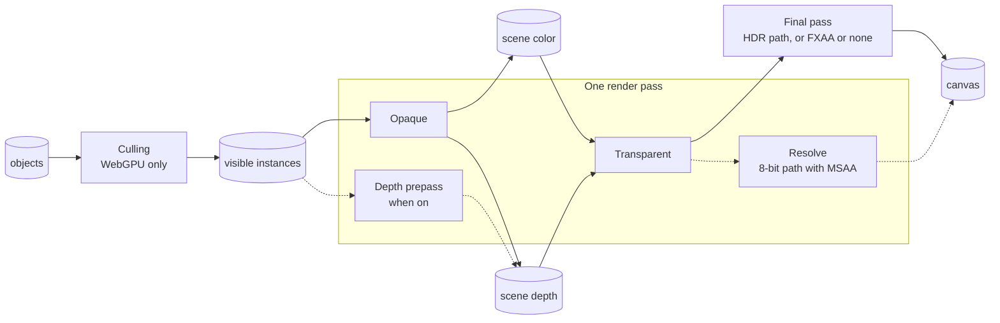
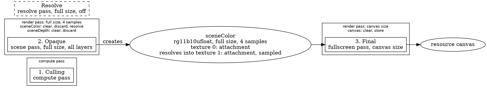

# The render graph

> Roadmap step 0.1, first released in null3D 0.1.0. The API is experimental, so it can still change between versions.

null3D draws each frame as a series of passes. A pass is one job for the GPU, such as culling the objects that a camera cannot see, or drawing the scene from the camera. Each pass declares what it reads and what it writes. The render graph reads these declarations before a frame draws. It puts the passes in order and plans the textures they draw into.

The engine declares its own passes. From step 0.2, a sketch adds scene passes of its own with `render.addPass`, and `render.dumpGraph()` prints the graph ([Render graph API](../api/render.md)).

In the diagram, boxes are passes and cylinders are data. An arrow into a pass shows what it reads, and an arrow out of a pass shows what it writes. The opaque and transparent passes share one render pass on the GPU. The scene color reaches the canvas through the final pass on devices that draw HDR color. So it does in the FXAA and no anti-aliasing modes. On the other devices with MSAA, the resolve pass takes its place, along the dotted arrows. It shares the opaque and transparent passes' render pass.

## The engine's passes

| Pass | Kind | Reads | Writes |
| --- | --- | --- | --- |
| Light clustering | Compute, on WebGPU only | The camera's point and spot lights | The list of lights of each cluster |
| Culling | Compute, one pass per view (the camera's, and each shadow cascade's and tile's), on WebGPU only | The world matrix and bounds of every object and instance | The view's visible instances and draw counts |
| Shadow | Scene, one pass per shadow cascade and per tile of the shadow atlas, in the frames in which it draws | The visible casters of its view | Its layer of the shadow map or of the shadow atlas |
| Depth prepass | Scene, one pass per view, with the `depthPrepass` setting | The view's visible instances | The scene depth |
| Opaque | Scene, one pass per view | The view's visible instances (on WebGPU), the lights of each cluster, and the shadow map and atlas | The scene color and depth |
| Occluders | Scene, one pass per camera view, on WebGPU with the `gpuOcclusion` setting | The instances that showed in the view's last frame | The occluders' depth |
| Depth pyramid | Compute, one pass per camera view, on WebGPU with the `gpuOcclusion` setting | The occluders' depth | The view's depth pyramid |
| Late culling | Compute, one pass per camera view, on WebGPU with the `gpuOcclusion` setting | The world matrix and bounds of every object, and the depth pyramid | The view's visible instances and draw counts |
| Debug lines | Scene, in development builds, in frames with debug drawing | The frame's lines | The scene color and depth |
| Transparent | Scene, one pass per view, on while some object blends | The view's blended objects, sorted back to front on the job workers | The scene color and depth |
| A sketch's scene pass | Scene, one per `render.addPass({ kind: 'scene' })`, with its culling and transparent passes | The view's visible instances, and the textures it names in `reads` | Its texture, which the graph keeps between frames |
| Copy | Fullscreen, one per scene pass, on WebGPU only | The scene pass's image | Its texture, with the rows turned around |
| Resolve | Resolve, on the 8-bit path with MSAA, while the render scale cannot drop below 1 | The scene color | The canvas |
| Final pass | Fullscreen, on the HDR path, with FXAA or no anti-aliasing, and while the render scale can drop below 1 | The scene color | The canvas |

On WebGL2 the job workers cull the objects and list the lights of each cluster before the frame draws. So the graph has no compute passes there. A shadow pass draws its casters' depth from the light. The opaque pass reads that depth, so every shadow pass runs before it. [Shadows](shadows.md) says when each cascade and each tile draws.

With the depth prepass on, each view draws the depth of its opaque objects first, in the render pass that then shades them. The opaque pass then shades only the nearest surface at each pixel. [Quality presets](quality-presets.md#the-depth-prepass) says when the prepass saves time.

With GPU occlusion culling on, each camera view's culling pass keeps the objects that showed in its last frame. The occluders' pass draws their depth into a target of its own, and the depth pyramid pass reads it. The late culling pass tests every object in view against the pyramid, and writes the visible instances again. The occluders' pass must read them before that write. The graph runs a pass that reads a resource "so far" after the writers declared before it, and before the writers declared after it. The opaque pass then draws what the late culling pass kept. [Culling](culling.md#gpu-occlusion-culling-on-webgpu) describes the method.

A view is the scene seen from one camera, culled on its own. On WebGPU each view has a culling pass, and on WebGL2 the job workers list the visible objects of each view. The camera's view draws the scene color and depth, and the scene color reaches the canvas. Each scene pass that a sketch adds has a view of its own, which draws into its texture. The camera's passes read the texture of every scene pass that a material shows, so those passes run first. WebGPU draws an image's top row first, and materials sample the bottom row at v = 0, as three.js's render targets hold it. So on WebGPU a copy pass turns each pass's image over into its texture. WebGL2 draws the rows in that order already.

Where the scene draws HDR color, the final pass reads it and draws the canvas. It applies the exposure and the tone mapping, and encodes the color for the display. In the FXAA anti-aliasing mode it also smooths the edges. Some devices cannot draw float targets in the anti-aliasing mode. There the scene shaders tone map their own output into an 8-bit target. With MSAA the resolve pass then runs instead of the final pass. It draws nothing: the scene's render pass resolves its multisampled color straight into the canvas. The frame then needs no extra pass, copy or texture. With FXAA or none, the final pass reads the 8-bit target and keeps its colors. [Color management](color-management.md) covers both paths.

## Why passes are declarations

By default, your sketch code runs in the sketch worker and the render worker draws. The render worker never runs sketch code, so a pass cannot be a function that the engine calls while it draws. A pass is data instead. It gives its kind, the size it draws at, and what it reads and writes.

Because passes are declarations, the engine can:

- check every pass before a frame draws, and report each mistake with an error code
- order the passes from what they read and write
- let neighboring passes share one render pass, and let temporary targets share memory
- switch passes on and off with no new code
- skip passes whose output nothing uses
- print the whole graph as text for people and agents to read (0.2)

## How the graph orders passes

Two rules decide the order:

1. Passes that write one target run in the order they were declared. The first one that draws into it in a frame clears it, and each later one draws over what the earlier ones left.
2. A pass that reads a target or a buffer runs after every pass that writes it, so it sees what they wrote.

Where the rules leave a choice, the graph first runs a pass that can join the open render or compute pass. Next it runs a compute pass: compute passes never share a render pass, so running them early keeps later render passes whole. After that it takes the first pass in the order of declaration.

For example, the resolve pass reads the scene color, so it runs after the opaque pass that draws it. The order holds even when the resolve pass is declared first. On WebGPU the opaque pass reads the visible instances, so the culling pass runs before it.

## Targets and memory

A target is a texture that passes draw into. A temporary target lives for one frame, and the pass that creates it sets its size. That size is the render size, half or a quarter of it, the canvas size, or a fixed size in pixels. The render size is the canvas size at the render scale, which [dynamic resolution](quality-presets.md#dynamic-resolution) moves. The engine makes each target of a relative size at the canvas's size, and passes draw into its top-left corner at a lower scale. So a new scale needs no new texture. A kept target holds its contents from one frame to the next, in a texture of its own. The engine's scene color and depth are temporary targets.

Temporary targets share memory when their lifetimes do not overlap. Such targets must also need the same format, size, sample count and usage. For example, a blur can pass an image through three half-size targets in a row. The first one is done before the third one starts, so the two share one texture. The blur then needs two half-size textures instead of three.

The graph also works out how each texture is used: as a render target, as a texture that shaders sample, or as compute storage. Each texture gets only the usage it needs.

## Phone GPUs

Phone GPUs draw in tiles, and copying tiles between the chip and memory takes much of their time. The graph keeps that copying low:

- Neighboring passes that draw into the same targets share one render pass, so the targets stay on the chip between them. The opaque pass and the resolve pass share one render pass this way.
- A render pass stores a target only when a later pass or frame needs it. With MSAA, the engine's render pass resolves the multisampled scene color into a texture for the final pass. On the 8-bit path, it resolves the color straight into the canvas instead. It then discards the multisampled color and the depth, so neither goes to memory.
- A target that lives within one render pass takes the transient attachment usage where the browser offers it. The multisampled color and the depth are such targets. The GPU can then keep it in tile memory and never give it memory of its own.

## Switching passes on and off

The graph can switch a pass on or off with no new declarations. A pass that is off counts as absent. The engine switches its final pass and its resolve pass this way, from the format of the scene color and the anti-aliasing mode. `render.setPassEnabled` switches a sketch's pass, whose texture then keeps its last image.

## Passes that nothing uses

Some passes are optional: a sketch's scene passes and the passes that serve them. An optional pass runs only while a running pass uses what it writes. The graph culls the others when it compiles, and the passes that only fed them, and their kept textures take no memory. A culled pass counts as switched off. A scene pass whose texture no material shows costs nothing.

After a batch of changes, the graph compiles once, before the next frame draws. While nothing changes, it keeps its plan. Compiling reuses the graph's memory, so switching passes allocates no memory in the frame loop.

## Checks

The graph checks the passes each time it compiles, and reports each problem as an error with a code:

| Code | Problem |
| --- | --- |
| [E1502](../errors/E1502.md) | A pass uses a target or buffer that no pass creates, or reads one that no running pass writes. |
| [E1503](../errors/E1503.md) | Two passes create the same target, or a pass creates a target that the graph keeps. |
| [E1504](../errors/E1504.md) | The passes form a cycle, so no order works. |
| [E1505](../errors/E1505.md) | A pass draws into targets that cannot share one render pass, or a resolve pass cannot resolve its target into the canvas. Or its color targets pass the budget of every device: 4 targets, of 32 bytes per sample in all. |

The passes that a sketch adds get the same checks. The core checks them when `render.addPass`, `render.removePass` or `textures.fromPass` changes the graph, so the call that breaks the graph throws the error, with the passes and targets by name. An error among the engine's own passes alone is an engine bug.

## The text dump

`render.dumpGraph()` returns the compiled graph as Graphviz DOT text (0.2). Paste the text into any Graphviz viewer to see it as a picture.

- Each render or compute pass that the GPU runs is a box around the passes it runs.
- The number before each pass is its place in the order.
- Each render pass lists its targets, with how it loads and stores each one.
- Each target shows its format, its size and the texture it uses.
- Passes that are off show as dashed boxes, and so do culled passes, marked "culled: nothing uses its output".

Part of the dump of the engine's passes on WebGPU, on a device that draws HDR color:

## Related pages

- [Architecture: threads and the frame](architecture.md): which thread records the passes and which one draws them.
- [Render layers](render-layers.md): the layer masks that decide what a pass draws.
- [Quality presets, dynamic resolution and frame budgets](quality-presets.md): the settings that switch passes and scale the render size.
- [Shadows](shadows.md): the shadow cascades.
- [Render graph API](../api/render.md): adding passes and printing the graph (0.2).
- [The security camera demo](https://github.com/null3d-engine/null3d/tree/main/examples/security-camera): a scene pass that draws a second camera's view for a monitor.
