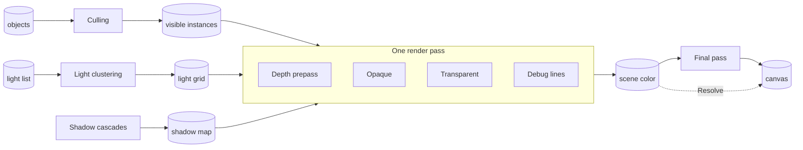
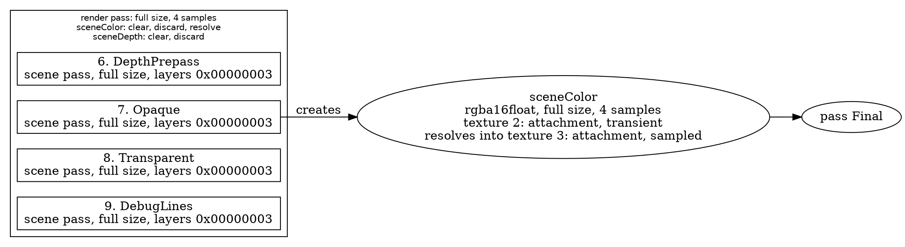

# The render graph

> Planned for null3D 0.1. In 0.1 the render graph is internal: the engine declares every pass itself. The calls that add passes and print the graph come in null3D 0.2, so coding agents must not use them.

null3D draws each frame as a series of passes. A pass is one job for the GPU, such as drawing the shadow casters from the sun, or drawing the scene from the camera. Each pass declares what it reads and what it writes. The render graph reads these declarations before a frame draws. It puts the passes in order and plans the textures they draw into.

In the diagram, boxes are passes and cylinders are data. An arrow into a pass shows what it reads, and an arrow out of a pass shows what it writes. The four scene passes share one render pass on the GPU. The dotted arrow is the resolve pass, which takes the place of the final pass when the final pass has no work.

## The engine's passes

| Pass | Kind | Reads | Writes |
| --- | --- | --- | --- |
| Culling | Compute, one pass per view | The world matrix and bounds of every object | The view's visible instances and draw counts |
| Light clustering | Compute | The light list | The light grid, which lists the lights that reach each part of the view |
| Shadow cascades | Shadow, one pass per cascade | Nothing | One layer of the shadow map each |
| Depth prepass | Scene | Nothing | The scene depth |
| Opaque | Scene | The camera's visible instances, the shadow map, the light grid and the light list | The scene color and depth |
| Transparent | Scene | The shadow map, the light grid and the light list | The scene color and depth |
| Debug lines | Scene | Nothing | The scene color and depth |
| Final pass | Fullscreen | The scene color | The canvas |
| Resolve | Resolve | The scene color | The canvas |

The depth prepass runs on the quality presets that turn it on. Debug lines run only while the sketch draws debug lines. On WebGL2 the job workers cull the objects and cluster the lights, so the graph has no culling or clustering pass there.

A view is what one pass draws from: a camera or a light's frustum, a layer mask, and a target. The engine culls each view on its own. On WebGPU each view has a culling pass, and on WebGL2 the job workers list the visible objects of each view.

The final pass runs when it has work to do on the scene color, such as tone mapping or scaling the image up. When it has none, the resolve pass runs instead. The resolve pass draws nothing: the scene's render pass resolves its multisampled color straight into the canvas. The frame then needs no extra pass, copy or texture.

## Why passes are declarations

Your sketch code runs in the sketch worker, and the render worker draws. The render worker never runs sketch code, so a pass cannot be a function that the engine calls while it draws. A pass is data instead. It gives its kind, the size it draws at, the render layers of the objects it draws, and what it reads and writes.

Because passes are declarations, the engine can:

- check every pass before a frame draws, and report each mistake with an error code
- order the passes from what they read and write
- let neighboring passes share one render pass, and let temporary textures share memory
- switch passes on and off with no new code, as quality presets need
- print the whole graph as text for people and agents to read (0.2)

## How the graph orders passes

Two rules decide the order:

1. Passes that write one target run in the order they were declared. The first one that draws into it in a frame clears it, and each later one draws over what the earlier ones left.
2. A pass that reads a target runs after every pass that writes it, so it sees the finished target.

Where the rules leave a choice, the graph first runs a pass that can join the open render pass. Next it runs compute passes, because they never share a render pass. After that it follows the order of declaration.

For example, the final pass reads the scene color, so it runs after the opaque, transparent and debug line passes. It does so even when it was declared before them. The opaque pass reads the shadow map, so every shadow cascade runs before it.

## Targets and memory

A target is a texture that passes draw into. A temporary target lives for one frame, and the pass that creates it sets its size. That size is the render size, half or a quarter of it, the canvas size, or a fixed size in pixels. A kept target, such as the shadow map, holds its contents from one frame to the next.

Temporary targets share memory when their lifetimes do not overlap. For example, a blur can pass an image through three half-size targets in a row. The first one is done before the third one starts, so the two share one texture. The blur then needs two half-size textures instead of three.

Relative sizes follow dynamic resolution without new textures. The engine makes each target with a relative size for the whole canvas. When the render scale drops, passes draw into a corner of the same texture. The final pass then scales the image up to fill the canvas.

The graph also works out how each texture is used: as a render target, as a texture that shaders sample, or as compute storage. Each texture gets only the usage it needs.

## Phone GPUs

Phone GPUs draw in tiles, and copying tiles between the chip and memory takes much of their time. The graph keeps that copying low:

- Neighboring passes that draw into the same targets share one render pass, so the targets stay on the chip between them. The four scene passes share one render pass this way.
- A render pass stores a target only when a later pass or frame reads it. The scene's render pass resolves the multisampled scene color into a texture for the final pass. When the resolve pass runs, the color goes straight into the canvas instead. The render pass then discards the multisampled color and the depth, so neither goes to memory.
- On devices that support transient attachments, a target that lives within one render pass gets that usage. The GPU can then keep it in tile memory only. Chrome 146 and later support them.

## Switching passes on and off

The engine switches passes on and off as settings change. The depth prepass follows the quality preset, far shadow cascades redraw in turn, and debug lines draw only when the sketch draws them. A pass that is off counts as absent.

After a batch of changes, the graph compiles once, before the next frame draws. While nothing changes, it keeps its plan. Compiling reuses the graph's memory, so switching passes allocates no memory in the frame loop.

## Checks

The graph checks the passes each time it compiles, and reports each problem as an error with a code:

| Code | Problem |
| --- | --- |
| [E1502](../errors/E1502.md) | A pass uses a target or buffer that no pass creates, or reads one that no running pass writes. |
| [E1503](../errors/E1503.md) | Two passes create the same target. |
| [E1504](../errors/E1504.md) | The passes form a cycle, so no order works. |
| [E1505](../errors/E1505.md) | A pass draws into targets that cannot share one render pass, or a resolve pass cannot resolve its target into the canvas. |

In 0.1 the engine declares every pass, so these errors mean an engine bug. From 0.2, passes that you add get the same checks.

## The text dump (0.2)

From null3D 0.2, `render.dumpGraph()` returns the compiled graph as Graphviz DOT text. Paste the text into any Graphviz viewer to see it as a picture.

- Each render or compute pass that the GPU runs is a box around the passes it runs.
- The number before each pass is its place in the order.
- Each render pass lists its targets, with how it loads and stores each one.
- Each target shows its format, its size and the texture it uses.
- Passes that are off show as dashed boxes.

Part of the dump of the engine's passes:

## Related pages

- [Architecture: threads and the frame](architecture.md): which thread records the passes and which one draws them.
- [Render layers](render-layers.md): the layer masks that decide what a pass draws.
- [Quality presets, dynamic resolution and frame budgets](quality-presets.md): the settings that switch passes and scale the render size.
- [Shadows](shadows.md): the shadow cascades.
- [Render graph API](../api/render.md): adding passes and printing the graph, from 0.2.
