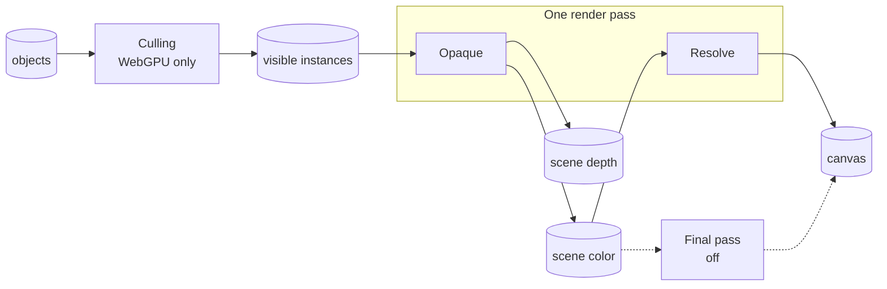
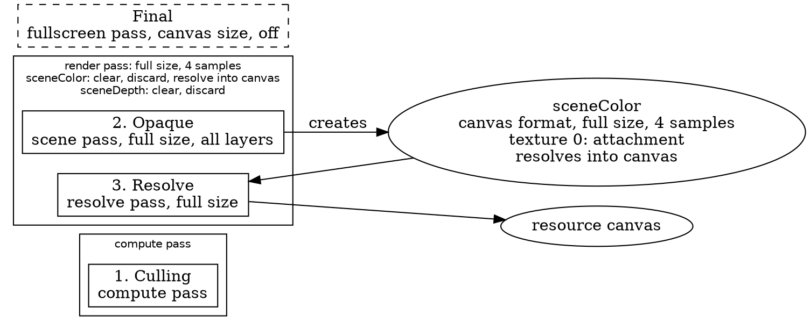

# The render graph

> Ships in null3D 0.1. The API is experimental, so it can still change between versions.

null3D draws each frame as a series of passes. A pass is one job for the GPU, such as culling the objects that a camera cannot see, or drawing the scene from the camera. Each pass declares what it reads and what it writes. The render graph reads these declarations before a frame draws. It puts the passes in order and plans the textures they draw into.

In 0.1 the render graph is internal: the engine declares every pass itself. The calls that add passes and print the graph come in null3D 0.2.

In the diagram, boxes are passes and cylinders are data. An arrow into a pass shows what it reads, and an arrow out of a pass shows what it writes. The opaque and resolve passes share one render pass on the GPU. The final pass is off, so its arrows are dotted.

## The engine's passes

| Pass | Kind | Reads | Writes |
| --- | --- | --- | --- |
| Culling | Compute, one pass per view, on WebGPU only | The world matrix and bounds of every object and instance | The view's visible instances and draw counts |
| Opaque | Scene, one pass per view | The view's visible instances, on WebGPU | The scene color and depth |
| Resolve | Resolve | The scene color | The canvas |
| Final pass | Fullscreen, off | The scene color | The canvas |

On WebGL2 the job workers cull the objects before the frame draws, so the graph has no culling pass there. Passes for shadows, light clustering, a depth prepass, transparent objects and debug lines join the graph as those features ship.

A view is the scene seen from one camera, culled on its own. On WebGPU each view has a culling pass, and on WebGL2 the job workers list the visible objects of each view. The engine draws one view: the camera's. Its opaque pass draws the scene color and depth, and the scene color reaches the canvas.

The engine declares a final pass that reads the scene color and draws the canvas. It has no work yet, so it stays off, and the resolve pass runs in its place. The resolve pass draws nothing: the scene's render pass resolves its multisampled color straight into the canvas. The frame then needs no extra pass, copy or texture.

## Why passes are declarations

By default, your sketch code runs in the sketch worker and the render worker draws. The render worker never runs sketch code, so a pass cannot be a function that the engine calls while it draws. A pass is data instead. It gives its kind, the size it draws at, and what it reads and writes.

Because passes are declarations, the engine can:

- check every pass before a frame draws, and report each mistake with an error code
- order the passes from what they read and write
- let neighboring passes share one render pass, and let temporary targets share memory
- switch passes on and off with no new code
- print the whole graph as text for people and agents to read (0.2)

## How the graph orders passes

Two rules decide the order:

1. Passes that write one target run in the order they were declared. The first one that draws into it in a frame clears it, and each later one draws over what the earlier ones left.
2. A pass that reads a target or a buffer runs after every pass that writes it, so it sees what they wrote.

Where the rules leave a choice, the graph first runs a pass that can join the open render or compute pass. Next it runs a compute pass: compute passes never share a render pass, so running them early keeps later render passes whole. After that it takes the first pass in the order of declaration.

For example, the resolve pass reads the scene color, so it runs after the opaque pass that draws it. The order holds even when the resolve pass is declared first. On WebGPU the opaque pass reads the visible instances, so the culling pass runs before it.

## Targets and memory

A target is a texture that passes draw into. A temporary target lives for one frame, and the pass that creates it sets its size. That size is the render size, half or a quarter of it, the canvas size, or a fixed size in pixels. The render size equals the canvas size. A kept target holds its contents from one frame to the next, in a texture of its own. The engine's scene color and depth are temporary targets.

Temporary targets share memory when their lifetimes do not overlap. Such targets must also need the same format, size, sample count and usage. For example, a blur can pass an image through three half-size targets in a row. The first one is done before the third one starts, so the two share one texture. The blur then needs two half-size textures instead of three.

The graph also works out how each texture is used: as a render target, as a texture that shaders sample, or as compute storage. Each texture gets only the usage it needs.

## Phone GPUs

Phone GPUs draw in tiles, and copying tiles between the chip and memory takes much of their time. The graph keeps that copying low:

- Neighboring passes that draw into the same targets share one render pass, so the targets stay on the chip between them. The opaque pass and the resolve pass share one render pass this way.
- A render pass stores a target only when a later pass or frame needs it. The engine's render pass resolves the multisampled scene color straight into the canvas. It then discards the multisampled color and the depth, so neither goes to memory.

## Switching passes on and off

The graph can switch a pass on or off with no new declarations. A pass that is off counts as absent. The engine keeps its final pass off in this way.

After a batch of changes, the graph compiles once, before the next frame draws. While nothing changes, it keeps its plan. Compiling reuses the graph's memory, so switching passes allocates no memory in the frame loop.

## Checks

The graph checks the passes each time it compiles, and reports each problem as an error with a code:

| Code | Problem |
| --- | --- |
| [E1502](../errors/E1502.md) | A pass uses a target or buffer that no pass creates, or reads one that no running pass writes. |
| [E1503](../errors/E1503.md) | Two passes create the same target, or a pass creates a target that the graph keeps. |
| [E1504](../errors/E1504.md) | The passes form a cycle, so no order works. |
| [E1505](../errors/E1505.md) | A pass draws into targets that cannot share one render pass, or a resolve pass cannot resolve its target into the canvas. |

In 0.1 the engine declares every pass, so these errors mean an engine bug. From 0.2, passes that you add get the same checks.

## The text dump (0.2)

From null3D 0.2, `render.dumpGraph()` returns the compiled graph as Graphviz DOT text. Paste the text into any Graphviz viewer to see it as a picture.

- Each render or compute pass that the GPU runs is a box around the passes it runs.
- The number before each pass is its place in the order.
- Each render pass lists its targets, with how it loads and stores each one.
- Each target shows its format, its size and the texture it uses.
- Passes that are off show as dashed boxes.

Part of the dump of the engine's passes on WebGPU:

## Related pages

- [Architecture: threads and the frame](architecture.md): which thread records the passes and which one draws them.
- [Render layers](render-layers.md): the layer masks that decide what a pass draws.
- [Quality presets, dynamic resolution and frame budgets](quality-presets.md): the settings that switch passes and scale the render size.
- [Shadows](shadows.md): the shadow cascades.
- [Render graph API](../api/render.md): adding passes and printing the graph, from 0.2.
