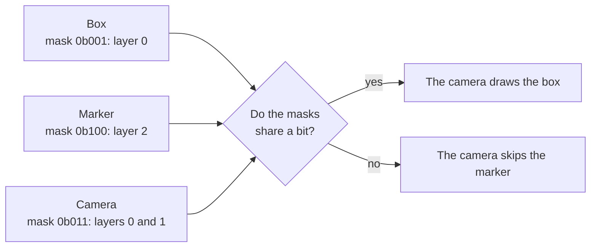

# Render layers

> Ships in null3D 0.1. The API is experimental, so it can still change between versions. Raycasts and render passes that sketches declare take layer masks too, but they come in null3D 0.2, so coding agents must not use them yet.



A layer mask is a 32-bit number. Bit n puts an object on layer n, so the mask `1 << 2` is layer 2, and `0b101` is layers 0 and 2. Every object, every instance batch and every camera has a mask. A camera draws an object only when their masks share at least one bit.

New objects, batches and cameras are on layer 0 alone, with the mask 1, as in three.js. Every camera draws every object until you change a mask.

## Setting layers

```ts
import { defineSketch } from '@null3d/engine';

/** The scene itself, and markers that only the editor view shows. */
const WORLD = 1 << 0;
const MARKERS = 1 << 1;

export default defineSketch(({ scene, geometry, materials, input }) => {
  const camera = scene.createPerspectiveCamera({ position: [0, 4, 10], target: [0, 0, 0] });
  scene.setActiveCamera(camera);
  scene.createDirectionalLight({ direction: [-1, -2, -1], intensity: 3 });

  // On the default layer, 0.
  scene.createMesh({ mesh: geometry.box(), material: materials.standard({ color: '#e8554e' }) });
  // Every row of a batch shares the batch's layers.
  const markers = scene.createInstances(geometry.sphere({ radius: 0.1 }), 50, {
    material: materials.unlit({ color: '#f2c14e' }),
    layers: MARKERS,
  });
  for (let i = 0; i < 50; i++) markers.positions.set([(i % 10) - 4.5, 0.1, Math.floor(i / 10) - 2], i * 3);
  markers.markDirty();

  let showMarkers = false;
  return {
    onUpdate() {
      if (input.wasPressed('KeyM')) {
        showMarkers = !showMarkers;
        camera.setLayers(showMarkers ? WORLD | MARKERS : WORLD);
      }
    },
  };
});
```

- The `layers` option sets the mask when you create an object, a batch or a camera. `createMesh`, `createGroup`, `createPerspectiveCamera`, `createInstances` and the calls that create lights all take it.
- `obj.setLayers(mask)` changes an object's layers, and `batch.setLayers(mask)` changes the layers of every row of a batch.
- `camera.setLayers(mask)` changes the layers that the camera draws.
- A mask of 0 puts an object on no layer, so no camera draws it.
- In development builds, a mask that is not a whole number of 32 bits throws E1207. Negative numbers down to `-(2 ** 31)` work too, so `1 << 31`, which JavaScript makes negative, is layer 31.

## Layers and visibility

`setVisible(false)` hides an object and everything under it from every camera. Layers choose which cameras draw one object, and they belong to that object alone: its children keep their own layers. A parent on a layer that the camera leaves out does not hide its children.

Neither change rebuilds the engine's tables of what it draws, so a sketch can change layers or visibility in every frame. [Scene](../api/scene.md#when-changes-take-effect) says when a change takes effect.

## How the engine tests layers

The engine tests each mask while it culls the scene, beside the test against the camera's view. [Culling](culling.md) describes that test.

- On WebGPU, each object and each instance row has its mask in a table on the GPU. The GPU thread that culls a row reads its mask, and skips the row when its mask shares no bit with the camera's.
- On WebGL2, the job workers test the masks. They skip a whole batch whose mask shares no bit with the camera's, and test each object's mask. While every object in the scene has the default mask, they skip the test per object.

A new mask rebuilds none of the engine's tables of what it draws. On WebGPU it rewrites one number for an object, or one number per row for a batch.

## Coming from three.js

| three.js | null3D |
| --- | --- |
| `object.layers.set(n)` | `obj.setLayers(1 << n)` |
| `object.layers.enable(n)` and `disable(n)` | Keep the mask in your code, change its bits, and pass it to `setLayers` |
| `object.layers.enableAll()` | `obj.setLayers(0xffffffff)` |
| `camera.layers.set(n)` | `camera.setLayers(1 << n)` |
| `instancedMesh.layers` | `batch.setLayers(mask)`, for every row |

The rule is the same as three.js's: an object draws when its mask and the camera's share a bit. Lights follow the rule too: a light lights the camera's view only when its mask and the camera's share a bit.

## Related pages

- [Objects and transforms](../api/objects.md): `setLayers` and the other object calls.
- [Cameras](../api/cameras.md): the camera's layers.
- [Scene](../api/scene.md): the `layers` option, and when changes take effect.
- [Culling](culling.md): the test that masks join.
- [The render layers demo](https://github.com/null3d-engine/null3d/tree/main/examples/layers): a camera that changes its layers every 2 seconds, to show or hide roofs and map pins.
