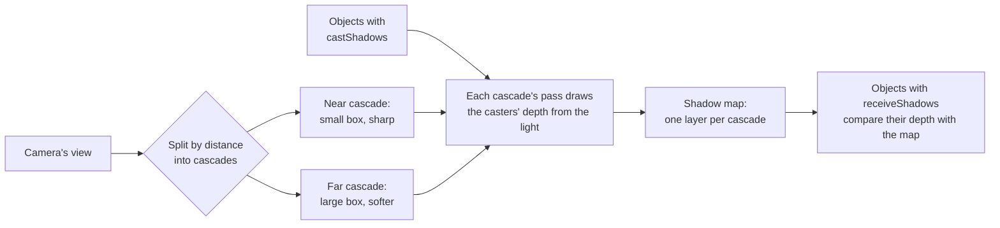

# Shadows

> Ships in null3D 0.1. The API is experimental, so it can still change between versions. In this version the first directional light casts shadows. Point and spot lights cast none yet. Instance batches neither cast nor receive shadows yet. Cascades fit the view again in every frame, so their edges can shimmer as the camera turns, and every cascade draws in every frame. The quality presets do not set the cascades, the map size or the filter yet. Coding agents must not rely on these parts.



A directional light casts shadows when you create it with `castShadows: true` or call `setCastShadows(true)`. An object casts shadows with `castShadows: true`, and shadows fall on it with `receiveShadows: true`. All three are false by default, as in three.js.

The engine splits the camera's view by distance into cascades. Each cascade is a box along the light that holds one slice of the view. Near slices are short and far slices long, so each cascade covers about the same share of the screen. Shadows near the camera then stay sharp. Each frame, each cascade culls the casters in its box and draws their depth from the light into its layer of the shadow map. A surface that receives shadows then finds its cascade and compares its depth from the light with the depth in the map.

```ts
import { defineSketch } from '@null3d/engine';

export default defineSketch(({ scene, geometry, materials }) => {
  const camera = scene.createPerspectiveCamera({ position: [0, 5, 12], target: [0, 0, 0] });
  scene.setActiveCamera(camera);
  scene.createDirectionalLight({
    direction: [-1, -1.5, -0.5],
    intensity: 3,
    castShadows: true,
    shadow: { cascades: 3, mapSize: 2048, distance: 100 },
  });
  scene.createAmbientLight({ intensity: 0.4 });

  // The ground receives shadows. The box casts them and receives them.
  scene.createMesh({
    mesh: geometry.box({ width: 50, height: 0.2, depth: 50 }),
    material: materials.standard({ color: '#9aa0a8' }),
    position: [0, -0.1, 0],
    receiveShadows: true,
  });
  scene.createMesh({
    mesh: geometry.box(),
    material: materials.standard({ color: '#e8554e' }),
    position: [0, 0.5, 0],
    castShadows: true,
    receiveShadows: true,
  });
});
```

## Settings

The `shadow` option of `createDirectionalLight` and the light's `setShadow` call take these settings. Each one has a default, and `setShadow` changes only the settings you give it.

| Setting | Default | What it does |
| --- | --- | --- |
| `cascades` | 3 | The cascades, from 1 to 4. More cascades keep shadows sharp further from the camera, and each draws the casters once more. |
| `mapSize` | 2,048 | Texels on each side of each cascade's layer: 256, 512, 1,024, 2,048 or 4,096. |
| `distance` | 200 | How far from the camera, in meters along its view, shadows fall. The camera's far plane ends them sooner. Shadows fade out over the last tenth of the distance. |
| `bias` | 0.5 | How far each receiving surface moves toward the light before its test, in texels of its cascade. |
| `normalBias` | 1 | How far each receiving surface moves along its normal before its test, in texels of its cascade. |

A shorter `distance` gives the cascades smaller boxes, so shadows get sharper. Set it to the distance at which shadows still matter in your scene.

A new cascade count or map size makes the shadow map again, so set them at setup. The other settings cost nothing to change, so a sketch can change them in any frame.

## Bias

A surface that casts and receives shadows can shadow itself in stripes, which is called shadow acne. It comes from the finite size of the map's texels. Both biases work in texels of the surface's cascade, so one setting suits near and far cascades alike.

- `bias` moves the surface's depth toward the light. It removes acne on surfaces that face the light.
- `normalBias` moves the surface along its normal. It removes acne on surfaces at a steep angle to the light.

Raise them in small steps if a surface shows acne. Values that are too large make shadows start a little away from the objects that cast them. The casters draw only the faces that point away from the light, as three.js's shadows draw them. That keeps acne off most surfaces that face the light.

## Which objects cast and receive

- The first directional light created casts the shadows, if it has `castShadows`. Other directional lights light surfaces, and cast none.
- A caster draws into every cascade whose box it reaches, however far toward the light it stands.
- The light's layers choose the casters: an object casts only when its layer mask shares a bit with the light's. [Render layers](render-layers.md) explains masks.
- The standard material shows shadows. The unlit material shows none, but unlit objects still cast them.
- `setCastShadows` and `setReceiveShadows` rebuild the engine's tables of what it draws, as `setMaterial` does. Set them at setup rather than in every frame.

## What shadows cost

Each cascade has a render pass that draws its casters' depth. Each cascade culls its casters too:

- On WebGPU, a culling pass on the GPU runs before each cascade's render pass. The CPU does the same small amount of work per cascade whatever the number of casters.
- On WebGL2, the job workers test each caster against each cascade's box, as they test each object against the camera's view. That CPU work grows with the number of casters.

Each layer of the shadow map takes 4 bytes per texel: 16 MB at 2,048 texels on each side. Surfaces that receive shadows read the map once per pixel.

To make shadows cheaper, use fewer cascades, a smaller map, or a shorter distance. Mark only the objects whose shadows matter as casters.

## On each GPU path

WebGPU and WebGL2 draw the same shadows. Both keep the shadow map as a depth texture array of 32-bit floats, and read it with the GPU's depth comparison. The comparison blends the tests of the four nearest texels. On WebGL2 the shaders read it as a `sampler2DArrayShadow` through a comparison sampler. [Depth on each tier](backends.md#depth-on-each-tier) explains how WebGL2 keeps WebGPU's depth values.

## Coming from three.js

- `renderer.shadowMap.enabled` has no equivalent: a light casts shadows when it has `castShadows`.
- `object.castShadow` and `object.receiveShadow` become `castShadows` and `receiveShadows`.
- `light.shadow.camera` has no equivalent. The cascades fit the camera's view by themselves, so delete the shadow camera's bounds.
- `light.shadow.mapSize` becomes one number, `mapSize`, the texels on each side.
- `light.shadow.bias` and `light.shadow.normalBias` count texels of each cascade, where three.js counts depth units and meters. Start from the defaults.
- The CSM addon is built in: set `cascades` on the directional light.

## Related pages

- [Lights](../api/lights.md): the directional light's options and calls.
- [Objects and transforms](../api/objects.md): `setCastShadows` and `setReceiveShadows`.
- [Lighting and environment](lighting.md): how lights reach surfaces.
- [Render graph](render-graph.md): the passes that draw each frame.
