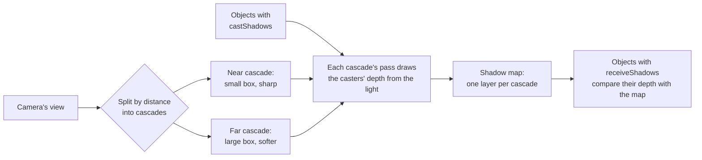
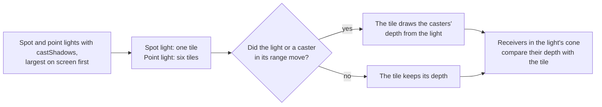

# Shadows

> Ships in null3D 0.1. The API is experimental, so it can still change between versions. In this version the first directional light, spot lights and point lights cast shadows. Instance batches neither cast nor receive shadows yet. A masked material's map does not cut holes in its shadow yet, so it casts its mesh's whole shape. The quality presets set the filter and the far cascades' update rate, but not the cascade count or the map size yet. Coding agents must not rely on these parts.



A directional light casts shadows when you create it with `castShadows: true` or call `setCastShadows(true)`. An object casts shadows with `castShadows: true`, and shadows fall on it with `receiveShadows: true`. All three are false by default, as in three.js.

The engine splits the camera's view by distance into cascades. Each cascade is a box along the light that holds one slice of the view. Near slices are short and far slices long, so each cascade covers about the same share of the screen. Shadows near the camera then stay sharp. When a cascade draws, it culls the casters in its box and draws their depth from the light into its layer of the shadow map. A surface that receives shadows then finds its cascade by its distance from the camera. It compares its depth from the light with the depth in the map.

```ts
import { defineSketch } from '@null3d/engine';

export default defineSketch(({ scene, geometry, materials }) => {
  const camera = scene.createPerspectiveCamera({ position: [0, 5, 12], target: [0, 0, 0] });
  scene.setActiveCamera(camera);
  scene.createDirectionalLight({
    direction: [-1, -1.5, -0.5],
    intensity: 3,
    castShadows: true,
    shadow: { cascades: 3, mapSize: 2048, distance: 100 },
  });
  scene.createAmbientLight({ intensity: 0.4 });

  // The ground receives shadows. The box casts them and receives them.
  scene.createMesh({
    mesh: geometry.box({ width: 50, height: 0.2, depth: 50 }),
    material: materials.standard({ color: '#9aa0a8' }),
    position: [0, -0.1, 0],
    receiveShadows: true,
  });
  scene.createMesh({
    mesh: geometry.box(),
    material: materials.standard({ color: '#e8554e' }),
    position: [0, 0.5, 0],
    castShadows: true,
    receiveShadows: true,
  });
});
```

## Spot and point light shadows



A spot or point light casts shadows when you create it with `castShadows: true` or call `setCastShadows(true)`. Casters and receivers need `castShadows` and `receiveShadows`, as for the directional light.

Spot and point lights share one shadow atlas: a depth texture of equal tiles. A spot light takes one tile, a view from the light that holds its cone. A cone wider than 85 degrees from its direction casts shadows over its middle part alone. A point light takes six tiles, one for each face of a cube around it. A surface reads the tile of the face that its direction from the light points through.

Point light shadows cost six times as much as a spot light's, so the quality preset's `pointLightShadows` setting turns them on for High and Ultra alone. The `pointLightShadows` option of `createEngine` turns them on or off on any preset. Where they are off, point lights still light surfaces.

```ts
import { defineSketch } from '@null3d/engine';

export default defineSketch(({ scene, geometry, materials }) => {
  const camera = scene.createPerspectiveCamera({ position: [0, 5, 10], target: [0, 0, 0] });
  scene.setActiveCamera(camera);
  scene.createSpotLight({
    position: [-3, 6, 2],
    target: [0, 0, 0],
    range: 15,
    angle: 0.6,
    penumbra: 0.2,
    intensity: 100,
    castShadows: true,
  });
  scene.createAmbientLight({ intensity: 0.2 });

  scene.createMesh({
    mesh: geometry.box({ width: 20, height: 0.2, depth: 20 }),
    material: materials.standard({ color: '#9aa0a8' }),
    position: [0, -0.1, 0],
    receiveShadows: true,
  });
  scene.createMesh({
    mesh: geometry.box(),
    material: materials.standard({ color: '#e8554e' }),
    position: [0, 0.5, 0],
    castShadows: true,
    receiveShadows: true,
  });
});
```

### Which lights get tiles

The quality preset's `shadowTiles` setting caps the tiles, and `shadowTileSize` sets the texels on each side of each tile. [Quality presets](quality-presets.md) lists their values. The atlas has only as many tiles as the lights that cast shadows can fill.

Each frame, the spot and point lights in the camera's view compete for the tiles. A light's size on screen is its range over its distance from the camera, and the largest lights get tiles first. A point light needs six free tiles, so a smaller spot light can take the last tile that a point light cannot use. A light keeps its tile from frame to frame while it still gets one. The other lights cast no shadows in that frame, and they still light surfaces.

### When a tile draws

A tile keeps its depth from frame to frame. It draws again only when:

- it goes to another light;
- its light moves or turns, or its range, cone or layers change (a point light's tiles do not change when it turns);
- a caster within the light's range moves, turns, scales, shows or hides, or leaves the range;
- objects are created or destroyed, or their meshes, materials or shadow flags change.

A scene whose casters and lights stand still draws no tile. Make static casters static, and keep moving objects out of the ranges of shadowed spot and point lights when you can.

## Settings

The `shadow` option of `createDirectionalLight` and the light's `setShadow` call take these settings. Each one has a default, and `setShadow` changes only the settings you give it.

| Setting | Default | What it does |
| --- | --- | --- |
| `cascades` | 3 | The cascades, from 1 to 4. More cascades keep shadows sharp further from the camera, and each draws the casters once more. |
| `mapSize` | 2,048 | Texels on each side of each cascade's layer: 256, 512, 1,024, 2,048 or 4,096. |
| `distance` | 200 | How far from the camera, in meters along its view, shadows fall. The camera's far plane ends them sooner. Shadows fade out over the last tenth of the distance. |
| `bias` | 0.01 | How far each receiving surface moves toward the light before its test, in meters, up to one texel of its cascade, scaled by its angle to the light. |
| `normalBias` | 0.02 | How far each receiving surface moves along its normal before its test, in meters, up to one texel of its cascade, scaled by its angle to the light. |

A shorter `distance` gives the cascades smaller boxes, so shadows get sharper. Set it to the distance at which shadows still matter in your scene.

A new cascade count or map size makes the shadow map again, so set them at setup. The other settings cost nothing to change, so a sketch can change them in any frame.

The `shadow` option and `setShadow` of spot and point lights take `bias` and `normalBias` alone, with the same defaults. Both are in meters, up to one texel of the light's tile at the receiving surface's distance from the light. The preset sets the tile size.

## Where the cascades split

The split distances blend two spreads. An even spread gives each cascade the same length. A logarithmic spread makes each cascade a fixed number of times longer than the one before it. The engine leans 65% toward the logarithmic spread. This is a balance between two kinds of view:

- A camera at eye height sees the ground a few meters ahead. Shadows there need the finest texels.
- A camera high above a town, as in the S4 benchmark scene 42 m up, sees no ground nearer than about 40 m.

With the default settings, a 60 degree view and a 16:9 canvas, one texel of each cascade covers this much of the ground:

| Lean toward logarithmic | First cascade | Second cascade | Third cascade |
| --- | --- | --- | --- |
| 80% | 0.1 to 14 m: 1.7 cm | 14 to 39 m: 4.5 cm | 39 to 200 m: 23 cm |
| 65%, the engine's split | 0.1 to 24 m: 2.8 cm | 24 to 57 m: 6.6 cm | 57 to 200 m: 23 cm |
| 50%, as three.js's cascaded shadows split | 0.1 to 34 m: 3.9 cm | 34 to 75 m: 8.6 cm | 75 to 200 m: 23 cm |

At 80%, the town's ground from 40 to 57 m gets 23 cm texels, and its shadow edges show steps. At 50%, the shadows at the feet of a camera at eye height are more than twice as coarse, and they look soft and streaked. The engine's 65% keeps them less than twice as coarse as at 80%, and gives the town most of the texels that 50% gives it.

The last cascade always ends at `distance`, so its texels depend only on `distance` and `mapSize`. For a view that sees mostly far ground, shorten `distance` or add a cascade.

## Stable cascades

Shadow edges stay still while the camera turns and moves. Each cascade's box holds a sphere around its slice of the view, so the box keeps its size as the camera turns. The box also moves only in steps of whole texels of the shadow map, on a grid fixed to the world. So a caster always covers the same texels, and its shadow's edge does not crawl or shimmer. To see it, draw the `'shadows'` debug view from a still camera while `debug.shadowCamera` places the cascades from a moving one ([Debug drawing and stats](../api/debug.md#watch-the-shadow-cascades-from-elsewhere)).

The sphere wastes some of each layer's texels, so these shadows are a little softer than a box fitted tightly to each frame. Shorten `distance` or raise `mapSize` for sharper shadows.

A surface picks its cascade by its distance from the camera, which a turn on the spot does not change. So a surface keeps its cascade while the camera turns, and its shadow keeps the same texels. A surface near the side of a wide view can then read a coarser cascade, so its shadow is a little softer. Behind an orthographic camera, whose cascades all have texels of one size, a surface uses its distance along the camera's view instead.

## Update rates

The nearest cascade draws in every frame. The far cascades draw once every few frames, in turn, and keep their layers of the shadow map in between. Each frame then draws fewer casters. In S4 on a MacBook Pro, with far cascades every 2nd frame, that saves 0.19 ms of GPU time per frame.

A kept layer shows each caster where it stood when the layer drew. So a far cascade draws in every frame while a moving caster touches its box: a dynamic object, or an object under a dynamic one. Its shadow then follows it in every frame. The cascade draws once more after the caster leaves, so no old shadow stays behind. Far cascades that hold only still casters keep their turns. A town whose cars drive through every cascade, as in S4, draws every cascade in every frame, as three.js's cascaded shadows always do. A character near the camera keeps the far cascades' saving.

A static object that a setter moves does not make its cascade draw. Its far shadow follows it within a few frames.

The `farCascadeInterval` quality setting sets the frames between two draws of a far cascade, from 1 to 8. Low uses 4, Medium 3, and High and Ultra 2. A value of 1 draws every cascade in every frame. It changes during play:

```ts
import { defineSketch } from '@null3d/engine';

export default defineSketch(({ quality }) => {
  // Static objects that move often far away: draw every cascade in every frame.
  quality.set({ farCascadeInterval: 1 });
});
```

A cascade that waits keeps the box it drew with. When the camera turns quickly, part of the view can leave that box for a frame or two. Those surfaces then read the next cascade, whose box is larger.

## Filtering

The filter softens each shadow's edge over a square of shadow map texels. The `shadowFilter` quality setting gives the texels on each side: 3 on Low and Medium, and 5 on High and Ultra. Each read compares the depth with four texels and blends them. So a 3 x 3 square takes 4 reads, and a 5 x 5 square takes 9. A larger square gives softer edges and costs more on every pixel that receives shadows. `quality.set({ shadowFilter: 3 })` changes it during play. The tiles of spot and point lights use the same filter, over texels of the tile.

Each read weights the texels by where the point falls between them, so an edge moves smoothly as the point moves. But each texel holds only "lit" or "shadowed". Where one texel covers several pixels, an edge at a shallow angle to the texel grid still shows soft steps, one texel apart. The 5 x 5 filter makes the steps fainter, and no filter of a few texels removes them. More texels per meter remove them. For the directional light, use a shorter `distance`, a larger `mapSize` or another cascade. For spot and point lights, use a larger `shadowTileSize`.

## Bias

A surface that casts and receives shadows can shadow itself in stripes, which is called shadow acne. It comes from the finite size of the map's texels. Both biases move the surface before its test, in meters:

- `bias` moves the surface toward the light. The move is the setting times the tangent of the angle between the surface and the light, up to twice the setting.
- `normalBias` moves the surface along its normal, by the setting times the sine of that angle.

A surface that faces the light takes little of either. A surface at a steep angle takes more, because its depth changes faster across each texel. The casters draw only the faces that point away from the light, as three.js's shadows draw them. A closed mesh's lit faces then compare with its far side, which keeps acne off most surfaces. A caster that draws both faces, such as a plane with a double-sided material, is the likeliest to show acne.

A bias in meters keeps its size in every cascade. So where a shadow meets its caster does not change where one cascade gives way to the next. One texel of the surface's cascade caps each bias, as a fine map needs less. With the defaults, the cap acts only where a texel covers less than 2 cm.

The biases of spot and point lights work the same way, in meters. One texel of the light's tile at the surface's distance from the light caps them.

Values that are too large make shadows start a little away from their casters. A thin lit line then shows at each object's base. A box's bottom face lies on the ground and draws into the map. A receiver moved too far from the ground counts that face as below it. The filter then reads the ground under the box as lit. The defaults keep shadows against the base of a car-sized box from near the camera out to the last cascade. Take the ground just past a box's base in the last cascade, under S4's sun, seen from above. Biases of 0.2 and 0.3 texels of each cascade left it at 0.62 of its lit brightness. The defaults leave it at 0.57, and no bias at 0.56. Raise the biases in small steps if a surface shows acne. A bias above one texel acts as one texel.

## Which objects cast and receive

- The first directional light created casts the shadows, if it has `castShadows`. Other directional lights light surfaces, and cast none.
- Each spot light with `castShadows` casts shadows while it holds a tile of the atlas. Each point light with `castShadows` casts them while it holds six, where the preset's `pointLightShadows` is on.
- A caster draws into every cascade whose box it reaches, however far toward the light it stands.
- The light's layers choose the casters: an object casts only when its layer mask shares a bit with the light's. [Render layers](render-layers.md) explains masks.
- The standard material and [custom materials](../shaders/surface-functions.md) show shadows. The unlit material shows none, but unlit objects still cast them.
- `setCastShadows` and `setReceiveShadows` rebuild the engine's tables of what it draws, as `setMaterial` does. Set them at setup rather than in every frame.

## What shadows cost

Each cascade that draws in a frame has a render pass that draws its casters' depth. It culls its casters too:

- On WebGPU, a culling pass on the GPU runs before each cascade's render pass. The CPU does the same small amount of work per cascade whatever the number of casters.
- On WebGL2, the job workers test each caster against each cascade's box, as they test each object against the camera's view. They first skip the still casters of the grid cells out of the box. That CPU work grows with the number of casters.

Each layer of the shadow map takes 4 bytes per texel: 16 MB at 2,048 texels on each side. Surfaces that receive shadows read the map 4 or 9 times per pixel, as the filter's size says.

A tile costs a render pass and its culling, but only in the frames in which it draws. A point light draws six tiles when a caster in its range moves. Its culling runs on the GPU on WebGPU, and on the job workers on WebGL2. Each tile takes 4 bytes per texel: 4 MB at 1,024 texels on each side. A receiving surface reads one tile for each shadowed light that reaches it, 4 or 9 times per pixel, as for the cascades.

To make shadows cheaper, use fewer cascades, a smaller map, a shorter distance, a higher `farCascadeInterval` or a `shadowFilter` of 3. Mark only the objects whose shadows matter as casters. For spot and point lights, give shadows only to the lights that need them, and keep their ranges short. Prefer a spot light to a point light where a cone covers the area.

## On each GPU path

WebGPU and WebGL2 draw the same shadows. Both keep the shadow map and the shadow atlas as depth texture arrays of 32-bit floats, and read them with the GPU's depth comparison. Each comparison blends the tests of the four nearest texels, and the filter blends several comparisons. On WebGL2 the shaders read it as a `sampler2DArrayShadow` through a comparison sampler. [Depth on each tier](backends.md#depth-on-each-tier) explains how WebGL2 keeps WebGPU's depth values.

## Coming from three.js

- `renderer.shadowMap.enabled` has no equivalent: a light casts shadows when it has `castShadows`.
- `object.castShadow` and `object.receiveShadow` become `castShadows` and `receiveShadows`.
- `light.shadow.camera` has no equivalent. The cascades fit the camera's view by themselves, so delete the shadow camera's bounds.
- `light.shadow.mapSize` becomes one number, `mapSize`, the texels on each side.
- `light.shadow.normalBias` is in meters, as in three.js. `light.shadow.bias` is in meters too, where three.js counts depth units. Both scale with each surface's angle to the light, and one texel caps them. Start from the defaults.
- `renderer.shadowMap.type` becomes the `shadowFilter` quality setting: `PCFShadowMap` and `PCFSoftShadowMap` map to 3 or 5. `BasicShadowMap` and `VSMShadowMap` have no equivalent.
- `light.shadow.radius` and `light.shadow.blurSamples` become the `shadowFilter` setting too, for every light.
- The CSM addon is built in: set `cascades` on the directional light. Its `maxFar` and `shadowMapSize` become `distance` and `mapSize`.
- A spot or point light's `shadow.mapSize` has no equivalent. The quality preset sets the size of every tile. `shadow.camera` has none either, as the tiles fit the light by themselves.
- three.js draws a spot or point light's shadow map in every frame. null3D draws a tile only when its light or a caster in its range moves.

## Related pages

- [Lights](../api/lights.md): the directional light's options and calls.
- [Objects and transforms](../api/objects.md): `setCastShadows` and `setReceiveShadows`.
- [Lighting and environment](lighting.md): how lights reach surfaces.
- [Render graph](render-graph.md): the passes that draw each frame.
- [Quality presets](quality-presets.md): `shadowFilter`, `farCascadeInterval` and their values on each preset.
