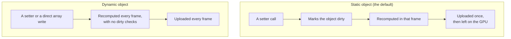

# Static and dynamic objects

> Planned for null3d 0.1. No release has these APIs yet, so coding agents must not use them.



Every scene object is static or dynamic. The engine recomputes a static object only when you change it, and recomputes a dynamic object in every frame. Mark each object by how often it moves, and the engine does the least work for it.

## The two kinds

| | Static | Dynamic |
| --- | --- | --- |
| Recomputed | Only in a frame where a setter marked it dirty | Every frame |
| GPU data | Uploaded once, then left alone | Uploaded every frame |
| How you change it | Setters only | Setters, or direct writes to its arrays |
| Best for | Scenery, buildings, a door that opens now and then | Characters, projectiles, anything that moves most frames |

Objects are static unless you create them with `dynamic: true`. You can change the kind later with `setDynamic`:

```ts
const door = scene.createMesh({ mesh: doorMesh, material: wood }); // static
door.setRotationEuler(0, Math.PI / 2, 0); // marks it dirty: recomputed and uploaded once

const hero = scene.createMesh({ mesh: heroMesh, material: skin, dynamic: true });
const rock = scene.createMesh({ mesh: rockMesh, material: stone });
rock.setDynamic(true); // it starts rolling
```

The loop over dynamic objects has no dirty checks and no branches, which suits objects that change in most frames. A static object costs nothing in a frame where it does not change.

## Setters and direct writes

Setters work on both kinds. For a static object they also set the dirty bit, which is how the engine learns about the change.

Direct array writes skip the setter, so the engine cannot see them. Use them only for dynamic objects and for instance batches. A development build hashes the static data in every frame and reports any write that did not go through a setter.

## Dirty ranges in instance batches

An instance batch is one mesh and one material drawn many times, with one row per copy. Your code writes the rows straight into the batch's typed arrays:

```ts
// A dynamic batch uploads every row in every frame.
const birds = scene.createInstances(birdMesh, 10_000, { dynamic: true });

// In onUpdate:
const p = birds.positions; // Float32Array, 3 floats per row
for (let i = 0; i < birds.count; i++) p[i * 3 + 1] += 0.5 * dt;
```

A static batch uploads only the rows you mark:

```ts
const trees = scene.createInstances(treeMesh, 5_000); // static

trees.positions[42 * 3 + 1] = 3; // move row 42
trees.markDirty(42, 1); // upload one row, starting at row 42
```

Each row has its own bounds, so culling works per instance.

Each moving row uploads its 48-byte world matrix in every frame. In the S1 benchmark on WebGPU, 100,000 moving boxes uploaded 4.8 MB per frame. The same boxes standing still in a static batch uploaded nothing per frame after the first.

## Why it matters on phones

On the WebGL2 path, which many phones use, static objects keep their data on the GPU. Each frame then uploads only a 4-byte index for each visible static instance. For 100,000 visible static instances that is about 0.4 MB per frame, where full matrices would be about 4.8 MB. Marking objects static when they do not move keeps that saving.

## Related pages

- [Handles and objects](handles.md): what a setter writes to.
- [Architecture: threads and the frame](architecture.md): where in the frame the engine recomputes objects.
- [GPU tiers and backends](backends.md): how each GPU path draws.
