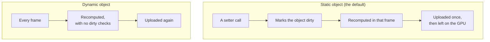

# Static and dynamic objects

> Ships in null3D 0.1. The API is experimental, so it can still change between versions. Direct array writes to a single object are not built yet: move a single object with its setters.



Every scene object is static or dynamic. The engine recomputes a static object only when you change it, and recomputes a dynamic object in every frame. Mark each object by how often it moves, and the engine does the least work for it.

## The two kinds

| | Static | Dynamic |
| --- | --- | --- |
| Recomputed | Only in a frame where a setter marked it dirty, or where its parent moved | Every frame |
| GPU data | Uploaded once, then left alone | Uploaded every frame |
| Culling in a scene over several grid cells | Skipped with its whole cell when the cell is out of view, unless a parent is dynamic | Tested in every view, every frame |
| Best for | Scenery, buildings, a door that opens now and then | Characters, projectiles, anything that moves most frames |

Objects are static unless you create them with `dynamic: true`. Cameras are the exception: they are dynamic unless you pass `dynamic: false`. `setDynamic` changes the kind from the next frame:

```ts
const door = scene.createMesh({ mesh: doorMesh, material: wood }); // static
door.setRotationEuler(0, Math.PI / 2, 0); // marks it dirty: recomputed and uploaded once

const hero = scene.createMesh({ mesh: heroMesh, material: skin, dynamic: true });
const rock = scene.createMesh({ mesh: rockMesh, material: stone });
rock.setDynamic(true); // it starts rolling
```

The loop over dynamic objects has no dirty checks and no branches, which suits objects that change in most frames. A static object costs nothing in a frame where it does not change.

## Setters and direct writes

Move a mesh, a camera or a group with its setters, such as `setPosition`. Every setter marks its object dirty, and the engine recomputes a static object only in a frame where a setter marked it.

Development builds check this rule in every frame. Before the engine recomputes objects, it compares the position, rotation, scale and bounding sphere of each static object with their values in the frame before. A change that no setter marked raises [E1110](../errors/E1110.md), which names the object. A live engine logs the error once and carries on. Hold mode stops at it, so a test fails at once. The check reads every static object in each frame. In the S2 benchmark, its 5,082 static objects cost about 0.05 ms per frame on a MacBook Pro. Release builds leave the check out.

Instance batches are where sketch code writes the engine's arrays directly. A loop writes a batch's rows into its typed arrays, with no call per row. Such a write skips every setter, so the engine cannot see it. A dynamic batch needs no mark, because it uploads every row in every frame. A static batch uploads only the rows you mark with `markDirty`. The development check does not read batch rows, so it cannot report a row that you forgot to mark.

## Dirty ranges in instance batches

An instance batch is one mesh and one material drawn many times, with one row per copy. Your code writes the rows straight into the batch's typed arrays:

```ts
// A dynamic batch uploads every row in every frame.
const birds = scene.createInstances(birdMesh, 10_000, { material: feathers, dynamic: true });

// In onUpdate:
const p = birds.positions; // Float32Array, 3 floats per row
for (let i = 0; i < birds.count; i++) p[i * 3 + 1] += 0.5 * dt;
```

A static batch uploads only the rows you mark:

```ts
const trees = scene.createInstances(treeMesh, 5_000, { material: bark }); // static

trees.positions[42 * 3 + 1] = 3; // move row 42
trees.markDirty(42, 1); // upload one row, starting at row 42
```

Each row has its own bounds, so culling works per instance.

Each moving row uploads its 48-byte world matrix in every frame. In the S1 benchmark on WebGPU, 100,000 moving boxes uploaded 4.8 MB per frame. The same boxes standing still in a static batch uploaded nothing per frame after the first.

## Why it matters on phones

On the WebGL2 path, which many phones use, static objects keep their data on the GPU. Each frame uploads only the list of what is visible. The list has a 4-byte entry for each visible object or batch row, where a full matrix takes 48 bytes. A static batch at rest takes one entry for each visible group of 64 nearby rows. So 100,000 visible rows of such a batch need about 1,600 entries, or about 6 KB. A frame whose list matches the previous frame's list uploads nothing. Marking objects static when they do not move keeps these savings.

## Related pages

- [Handles and objects](handles.md): what a setter writes to.
- [Instances and batching](instances.md): instance batches in full.
- [Architecture: threads and the frame](architecture.md): where in the frame the engine recomputes objects.
- [GPU tiers and backends](backends.md): how each GPU path draws.
