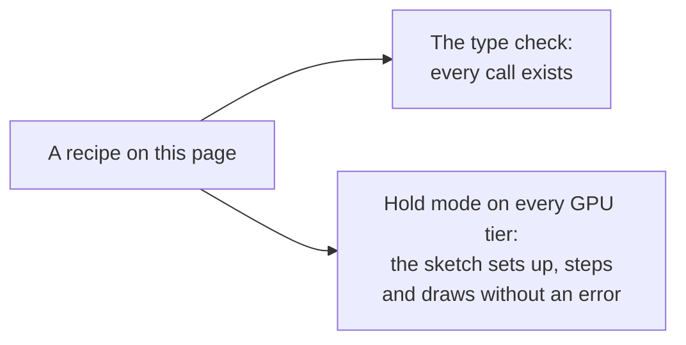

# Cookbook

> Roadmap step 0.2, first released in null3D 0.1.0. The APIs that the recipes use are experimental, so they can still change between versions.



Each recipe is a complete sketch for one common task. Copy it into your project's `sketch.ts` and change it from there. The engine's tests run every recipe on this page. They type check it against the engine, and draw it in [hold mode](../guides/testing.md) on every GPU tier. So each call that a recipe shows exists and runs in this version.

The recipes that load files name them as a project serves them from its `public` folder, such as `/models/knight.glb`. Put your own files there. The tests serve the [KayKit Knight](https://kaylousberg.itch.io/kaykit-adventurers) (CC0), a [Khronos glTF sample model](https://github.com/KhronosGroup/glTF-Sample-Assets) and a [Poly Haven](https://polyhaven.com/a/venice_sunset) sky (CC0) at those addresses.

## Select objects with the pointer

`object.on` casts a ray from the pointer for you, and calls the handler of the object under it. The pointer lights up the box under it, and a click outlines the box. A second click on it clears the outline.

```ts
import { defineSketch, type Mesh } from '@null3d/engine';

const COLORS = ['#e8554e', '#f2c14e', '#5bc27a', '#4a8cff'];

export default defineSketch(({ scene, geometry, materials, post }) => {
  scene.setBackground('#151a22');
  const camera = scene.createPerspectiveCamera({ position: [0, 3, 7], target: [0, 0, 0] });
  scene.setActiveCamera(camera);
  scene.createDirectionalLight({ direction: [-1, -2, -1], intensity: 2.5 });
  scene.createAmbientLight({ intensity: 0.4 });
  // The engine draws an outline around each mesh that setOutlined marks.
  post.set({ outline: { color: '#ffffff', width: 3 } });

  const box = geometry.box();
  let selected: Mesh | null = null;
  COLORS.forEach((color, k) => {
    const material = materials.standard({ color, emissive: color, emissiveIntensity: 0 });
    const crate = scene.createMesh({ mesh: box, material, position: [(k - 1.5) * 1.8, 0, 0] });
    crate.on('pointerenter', () => material.set({ emissiveIntensity: 0.4 }));
    crate.on('pointerleave', () => material.set({ emissiveIntensity: 0 }));
    crate.on('click', () => {
      selected?.setOutlined(false);
      selected = crate === selected ? null : crate;
      selected?.setOutlined(true);
    });
  });
  return {};
});
```

An event on a child also reaches its parents, so one handler on a model's copy hears clicks on every mesh in it. A click that outlines a mesh rebuilds the engine's draw tables once. That is fine for a click, but not for every frame. [Input](../api/input.md#pointer-events-on-objects) lists the events.

## Walk to the point that the user clicks

A ray of your own can test only some layers. Here the ground has a layer of its own, and the click's ray tests only that layer. So the ray never stops on the player or on the marker.

```ts
import { defineSketch, type RaycastHit, vec3 } from '@null3d/engine';

/** The ground's own layer, which the click's ray tests. */
const GROUND = 1 << 1;
/** Walking speed, in meters per second. */
const SPEED = 4;
/** A quarter turn about X, which lays a plane flat. */
const FLAT = [-Math.SQRT1_2, 0, 0, Math.SQRT1_2] as const;

export default defineSketch(({ scene, geometry, materials, input }) => {
  scene.setBackground('#1b2230');
  const camera = scene.createPerspectiveCamera({ position: [0, 10, 9], target: [0, 0, 0] });
  scene.setActiveCamera(camera);
  scene.createDirectionalLight({ direction: [-1, -2, -1], intensity: 2.5 });
  scene.createAmbientLight({ intensity: 0.4 });
  scene.createMesh({
    mesh: geometry.plane({ width: 20, height: 20 }),
    material: materials.standard({ color: '#3d4a60' }),
    rotation: FLAT,
    // Layer 0, which the camera draws, and the ground's own layer.
    layers: 1 | GROUND,
  });
  const player = scene.createMesh({
    mesh: geometry.capsule({ radius: 0.3, height: 0.8 }),
    material: materials.standard({ color: '#f2c14e' }),
    position: [0, 0.7, 0],
    dynamic: true,
  });
  const marker = scene.createMesh({
    mesh: geometry.cylinder({ radiusTop: 0.3, radiusBottom: 0.3, height: 0.02 }),
    material: materials.unlit({ color: '#ffffff' }),
    dynamic: true,
  });

  // Made once, and reused for every click.
  const ray = { origin: vec3.create(), direction: vec3.create() };
  const hit: RaycastHit = {
    object: null,
    instance: -1,
    point: vec3.create(),
    normal: vec3.create(),
    distance: 0,
    triangle: -1,
  };
  const options = { layers: GROUND };
  let x = 0;
  let z = 0;
  let targetX = 0;
  let targetZ = 0;

  return {
    onUpdate(dt) {
      if (input.wasPressed('Mouse0')) {
        camera.screenToRay(input.pointer.x, input.pointer.y, ray);
        if (scene.raycast(ray.origin, ray.direction, options, hit)) {
          targetX = hit.point[0] as number;
          targetZ = hit.point[2] as number;
          marker.setPosition(targetX, 0.01, targetZ);
        }
      }
      // Walk at a steady speed, and stop on the target.
      const away = Math.hypot(targetX - x, targetZ - z);
      const step = Math.min(away, SPEED * dt);
      if (away > 0) {
        x += ((targetX - x) / away) * step;
        z += ((targetZ - z) / away) * step;
      }
      player.setPosition(x, 0.7, z);
    },
  };
});
```

The pointer's place comes with the frame that was on screen when the user clicked. So `screenToRay` casts the ray that the user saw, even while the camera moves. [Raycasting](../api/raycast.md) covers rays, batches of rays and overlap queries.

## A third-person camera for an animated character

A character walks where the keys or the left stick point, relative to the camera. A drag turns the camera around the character. A 1D blend mixes the idle, walk and run clips by the character's speed, and keeps their steps in phase.

```ts
import { defineSketch, math } from '@null3d/engine';

/** The speed, in meters per second, at which each clip plays alone. */
const GAIT = Object.freeze({ Idle: 0, Walking_A: 1.4, Running_A: 4.5 });
/** The camera's distance behind the character, and its height. */
const DISTANCE = 6;
const HEIGHT = 3;
/** The Knight file holds every weapon of the set. The character carries none. */
const WEAPONS = ['1H_Sword', '1H_Sword_Offhand', '2H_Sword', 'Badge_Shield', 'Rectangle_Shield', 'Round_Shield', 'Spike_Shield'];

export default defineSketch(async ({ scene, assets, geometry, materials, input }) => {
  scene.setBackground('#8fb3cf');
  scene.createDirectionalLight({ direction: [-1, -2.5, -1.2], intensity: 3, castShadows: true });
  scene.createAmbientLight({ color: '#dbe8ff', intensity: 0.8 });
  scene.createMesh({
    mesh: geometry.circle({ radius: 60, segments: 64 }),
    material: materials.standard({ color: '#7c9a52' }),
    rotation: [-Math.SQRT1_2, 0, 0, Math.SQRT1_2],
    receiveShadows: true,
  });
  const camera = scene.createPerspectiveCamera({ fov: 50, position: [0, HEIGHT, DISTANCE] });
  scene.setActiveCamera(camera);

  const knight = await assets.loadGltf('/models/knight.glb');
  const hero = scene.instantiate(knight, { dynamic: true, castShadows: true });
  for (const name of WEAPONS) hero.find(name)?.setVisible(false);
  const animator = hero.animator();
  animator.playBlend(GAIT);

  input.actions.define({
    left: ['KeyA', 'ArrowLeft', 'GamepadLeftStickLeft'],
    right: ['KeyD', 'ArrowRight', 'GamepadLeftStickRight'],
    forward: ['KeyW', 'ArrowUp', 'GamepadLeftStickUp'],
    back: ['KeyS', 'ArrowDown', 'GamepadLeftStickDown'],
    run: ['ShiftLeft', 'GamepadA'],
  });

  let x = 0;
  let z = 0;
  let facing = 0;
  let speed = 0;
  let yaw = 0;
  let cameraX = 0;
  let cameraZ = DISTANCE;

  return {
    onUpdate(dt) {
      yaw -= input.pointer.dragDx * 0.008;
      const across = input.value('right') - input.value('left');
      const ahead = input.value('forward') - input.value('back');
      const push = Math.min(1, Math.hypot(across, ahead));
      const top = input.isDown('run') ? GAIT.Running_A : GAIT.Walking_A;
      speed = math.damp(speed, push * top, 6, dt);
      if (push > 0) {
        // Forward goes away from the camera. The Knight faces +Z at rest.
        const goal = Math.atan2(
          across * Math.cos(yaw) - ahead * Math.sin(yaw),
          -(across * Math.sin(yaw) + ahead * Math.cos(yaw)),
        );
        // Turn the short way round, quickly but not at once.
        facing += Math.atan2(Math.sin(goal - facing), Math.cos(goal - facing)) * Math.min(1, 10 * dt);
      }
      x += Math.sin(facing) * speed * dt;
      z += Math.cos(facing) * speed * dt;
      hero.setPosition(x, 0, z);
      hero.setRotationEuler(0, facing, 0);
      animator.setBlend(speed);

      // The camera eases to its place behind the character, so it never jerks.
      cameraX = math.damp(cameraX, x + Math.sin(yaw) * DISTANCE, 5, dt);
      cameraZ = math.damp(cameraZ, z + Math.cos(yaw) * DISTANCE, 5, dt);
      camera.setPosition(cameraX, HEIGHT, cameraZ);
      camera.lookAt(x, 1.2, z);
    },
  };
});
```

The job workers sample and blend the clips, so the sketch only sets the blend's value. `setBlend` allocates nothing, so call it in every frame. The blend's points sit in a frozen object, which the animator reads once. [Animation](../api/animation.md#1d-blends) explains blends, layers and clip events.

## A crowd of animated characters

Each copy of a model gets an animator of its own. Give each copy a start time and a speed of its own, so the crowd does not step in time.

```ts
import { defineSketch, math } from '@null3d/engine';

/** Characters along each side of the square. */
const SIDE = 8;
/** Meters between two characters. */
const SPACING = 1.6;
const CLIPS = ['Idle', 'Walking_A', 'Running_A', 'Cheer'];
/** The weapons of the set that the crowd does not carry. */
const HIDDEN = ['1H_Sword_Offhand', '2H_Sword', 'Badge_Shield', 'Rectangle_Shield', 'Spike_Shield'];

export default defineSketch(async ({ scene, assets, geometry, materials }) => {
  scene.setBackground('#8fb3cf');
  scene.createDirectionalLight({ direction: [-1, -2.5, -1.2], intensity: 3 });
  scene.createAmbientLight({ color: '#dbe8ff', intensity: 0.8 });
  scene.createMesh({
    mesh: geometry.plane({ width: 40, height: 40 }),
    material: materials.standard({ color: '#7c9a52' }),
    rotation: [-Math.SQRT1_2, 0, 0, Math.SQRT1_2],
  });
  const camera = scene.createPerspectiveCamera({ fov: 45, position: [0, 9, 16], target: [0, 0, 0] });
  scene.setActiveCamera(camera);

  const knight = await assets.loadGltf('/models/knight.glb');
  const half = ((SIDE - 1) * SPACING) / 2;
  for (let i = 0; i < SIDE * SIDE; i++) {
    const copy = scene.instantiate(knight, {
      position: [(i % SIDE) * SPACING - half, 0, Math.floor(i / SIDE) * SPACING - half],
    });
    for (const name of HIDDEN) copy.find(name)?.setVisible(false);
    copy.animator().play(CLIPS[i % CLIPS.length] as string, {
      time: math.randFloat(0, 2),
      speed: math.randFloat(0.85, 1.15),
    });
  }
  return {};
});
```

A copy costs one object for each mesh, and its joints cost no objects. The job workers animate the whole crowd, spread over every worker, and the sketch's thread does none of it. Instance batches draw a model in its rest pose only, so give each animated character a copy of its own. The [performance guide](../guides/performance.md) says what a crowd costs on each GPU path.

## A loading screen for models

The sketch downloads its files at once, and posts how far the downloads have come. Then it builds the scene and waits for the GPU's pipelines, so the first frame shows the whole scene.

```ts
import { defineSketch } from '@null3d/engine';

export default defineSketch(async ({ scene, assets, page }) => {
  assets.onProgress((loaded, total) => page.post('loading', loaded / total));
  await assets.preload(['/models/knight.glb', '/env/sunset.hdr']);

  // Both files come from memory now.
  const [knight, sunset] = await Promise.all([
    assets.loadGltf('/models/knight.glb'),
    assets.loadEnvironment('/env/sunset.hdr'),
  ]);
  scene.setEnvironment(sunset);
  scene.setBackground(sunset, { blur: 0.4 });
  const camera = scene.createPerspectiveCamera({ fov: 40, position: [0, 1.4, 4.5], target: [0, 1, 0] });
  scene.setActiveCamera(camera);
  scene.instantiate(knight).animator().play('Idle');

  // The GPU builds the pipelines of every object while the loading screen still shows.
  await scene.warmUp();
  return {};
});
```

The page shows the progress in its own HTML, and removes the loading screen when `engine.firstFrame` resolves. [Loading screens](../guides/loading-screens.md) shows the page's side, and how to load the shaders of skinning and other features before the first frame.

## Morph targets from a model

A glTF file's morph targets load with its meshes. Set each target's weight by its number, or by its name when the file names its targets.

```ts
import { defineSketch, type Mesh } from '@null3d/engine';

export default defineSketch(async ({ scene, assets, time }) => {
  scene.setBackground('#20242a');
  scene.setEnvironment(await assets.builtinEnvironment('room'));
  const camera = scene.createPerspectiveCamera({ fov: 40, position: [2.5, 2, 4], target: [0, 0, 0] });
  scene.setActiveCamera(camera);

  const model = await assets.loadGltf('/models/morph-cube.glb');
  const cube = scene.instantiate(model).find('AnimatedMorphCube') as Mesh;

  return {
    onUpdate() {
      // Two targets: one makes the cube thin, the other bends its top.
      cube.setMorphWeight(0, 0.5 + 0.5 * Math.sin(time.now * 2));
      cube.setMorphWeight(1, 0.5 + 0.5 * Math.cos(time.now * 1.3));
    },
  };
});
```

`setMorphWeight` allocates nothing, so call it in every frame. A clip of the file can animate the weights too, and it blends them with the weights that you set. [Morph targets](../api/animation.md#morph-targets) explains the blend, and what morphing costs on each GPU path.

## A sky with a moving sun and fog

The sky's sun and the scene's sun move together. Height fog lies low over the ground, and glows toward the sun.

```ts
import { defineSketch } from '@null3d/engine';

/** A quarter turn about X, which lays a plane flat. */
const FLAT = [-Math.SQRT1_2, 0, 0, Math.SQRT1_2] as const;

export default defineSketch(({ scene, geometry, materials, time }) => {
  const camera = scene.createPerspectiveCamera({ fov: 55, position: [0, 3, 18], target: [0, 4, 0] });
  scene.setActiveCamera(camera);
  scene.createAmbientLight({ color: '#c8d8ff', intensity: 0.3 });
  const sun = scene.createDirectionalLight({ intensity: 3, castShadows: true });
  scene.setFog({ color: '#c9d4de', density: 0.06, height: 0, heightFalloff: 0.4, sunGlow: 1.5 });

  scene.createMesh({
    mesh: geometry.plane({ width: 400, height: 400 }),
    material: materials.standard({ color: '#5f7a4a' }),
    rotation: FLAT,
    receiveShadows: true,
  });
  const stone = materials.standard({ color: '#9a9590', roughness: 0.9 });
  for (let k = 0; k < 9; k++) {
    const height = 2 + (k % 3) * 2;
    scene.createMesh({
      mesh: geometry.box(),
      material: stone,
      position: [(k - 4) * 4, height / 2, -k * 6],
      scale: [1.5, height, 1.5],
      castShadows: true,
      receiveShadows: true,
    });
  }

  // One settings object, changed in place each frame, so the calls allocate nothing.
  const toward: [number, number, number] = [0, 0, -1];
  const sky = { sky: { sunPosition: toward, turbidity: 4, time: 0 } };
  return {
    onUpdate() {
      const angle = 0.15 + 0.1 * Math.sin(time.now * 0.2);
      toward[1] = Math.sin(angle);
      toward[2] = -Math.cos(angle);
      sky.sky.time = time.now;
      scene.setBackground(sky);
      // The light shines from the sun, toward the scene.
      sun.setDirection(-toward[0], -toward[1], -toward[2]);
    },
  };
});
```

The fog covers objects but not the sky, so give the fog a color near the sky's color at the horizon. [Fog](../api/scene.md#fog) gives every fog setting, and [the sky](../api/scene.md#environments-cube-maps-and-the-sky) every sky setting.

## Glow and a custom effect

Bloom spreads the light of bright surfaces past their edges. A custom effect of your own WGSL then darkens every other row of pixels, as an old screen does.

```ts
import { defineSketch } from '@null3d/engine';

// Darkens every other row of pixels by the strength.
const scanLines = /* wgsl */ `
struct Uniforms { strength: f32 }

fn effect(input: EffectInput) -> vec4f {
    let row = floor(input.uv.y * input.size.y);
    let dark = 1.0 - uniforms.strength * (row % 2.0);
    return vec4f(input.color.rgb * dark, input.color.a);
}
`;

export default defineSketch(({ scene, geometry, materials, post, time }) => {
  scene.setBackground('#07080c');
  const camera = scene.createPerspectiveCamera({ fov: 45, position: [0, 0.5, 5], target: [0, 0, 0] });
  scene.setActiveCamera(camera);
  scene.createAmbientLight({ intensity: 0.3 });
  post.set({ bloom: { intensity: 0.4, threshold: 1 } });
  const effect = post.addEffect({ wgsl: scanLines, uniforms: { strength: 0.25 } });

  // Emissive light above 1 is bright enough to bloom.
  const ring = scene.createMesh({
    mesh: geometry.torus({ radius: 1.2, tube: 0.08, radialSegments: 16, tubularSegments: 96 }),
    material: materials.standard({ color: '#000000', emissive: '#36d6ff', emissiveIntensity: 6 }),
    dynamic: true,
  });

  return {
    onUpdate(dt) {
      ring.rotateY(0.6 * dt);
      // The lines fade in and out. The call allocates nothing.
      post.setEffectUniform(effect, 'strength', 0.15 + 0.1 * Math.sin(time.now * 3));
    },
  };
});
```

Effects run on the scene's HDR color, before bloom and the tone curve. On a device that has no HDR color, effects stay off. [Post effects](../api/post.md) gives every setting, and [Custom passes](../guides/custom-passes.md) says what an effect can read and what it costs.

## A screen that shows another camera

A scene pass draws the scene from a second camera into a texture, and a material shows that texture. This map screen shows the yard from above. The pass draws every third frame only, which saves two thirds of its cost.

```ts
import { defineSketch } from '@null3d/engine';

export default defineSketch(({ scene, geometry, materials, textures, render, time }) => {
  scene.setBackground('#8fb3cf');
  const camera = scene.createPerspectiveCamera({ fov: 50, position: [0, 4, 9], target: [0, 1, 0] });
  scene.setActiveCamera(camera);
  scene.createDirectionalLight({ direction: [-1, -2, -1], intensity: 3 });
  scene.createAmbientLight({ intensity: 0.6 });
  scene.createMesh({
    mesh: geometry.plane({ width: 30, height: 30 }),
    material: materials.standard({ color: '#7d8a6a' }),
    rotation: [-Math.SQRT1_2, 0, 0, Math.SQRT1_2],
  });
  const carts = ['#e8554e', '#f2c14e', '#4a8cff'].map((color) =>
    scene.createMesh({ mesh: geometry.box(), material: materials.standard({ color }), dynamic: true }),
  );

  // The map camera looks straight down on the yard.
  const above = scene.createOrthographicCamera({ height: 16, near: 1, far: 40, position: [0, 20, 0] });
  above.setRotationEuler(-Math.PI / 2, 0, 0);
  const map = render.addPass({ kind: 'scene', camera: above, writes: 'map', size: [256, 256] });
  scene.createMesh({
    mesh: geometry.plane({ width: 2.5, height: 2.5 }),
    material: materials.unlit({ map: textures.fromPass(map) }),
    position: [0, 2, -3],
  });

  let frame = 0;
  return {
    onUpdate() {
      carts.forEach((cart, k) => {
        const angle = time.now * 0.5 + (k * Math.PI * 2) / carts.length;
        cart.setPosition(Math.cos(angle) * 6, 0.5, Math.sin(angle) * 6);
      });
      frame++;
      render.setPassEnabled(map, frame % 3 === 0);
    },
  };
});
```

A pass never draws the objects that show its own texture, so the screen does not show itself. A pass that nothing shows costs nothing. [Render graph API](../api/render.md) says what a scene pass draws in this version.

## A trail behind a moving object

A dynamic line batch updates every point in every frame. Each frame, the sketch moves the trail's points one place back and puts the object's place at the front.

```ts
import { defineSketch } from '@null3d/engine';

/** Points along the trail. */
const POINTS = 120;

export default defineSketch(async ({ scene, geometry, materials, time }) => {
  scene.setBackground('#0a0c14');
  const camera = scene.createPerspectiveCamera({ fov: 50, position: [0, 5, 9], target: [0, 0, 0] });
  scene.setActiveCamera(camera);
  scene.createAmbientLight({ intensity: 1 });
  const comet = scene.createMesh({
    mesh: geometry.sphere({ radius: 0.15 }),
    material: materials.unlit({ color: '#ffd166' }),
    dynamic: true,
  });
  const trail = await scene.createLines({
    positions: new Float32Array(POINTS * 3),
    width: 4,
    color: '#ff8c42',
    dynamic: true,
  });

  return {
    onUpdate() {
      const x = Math.cos(time.now * 1.5) * 3;
      const y = Math.sin(time.now * 3) * 0.6;
      const z = Math.sin(time.now * 1.5) * 3;
      comet.setPosition(x, y, z);
      // Read the array from the batch each frame: the engine's memory can grow.
      const { positions } = trail;
      positions.copyWithin(3, 0, (POINTS - 1) * 3);
      positions[0] = x;
      positions[1] = y;
      positions[2] = z;
    },
  };
});
```

The width is in CSS pixels, so the trail looks the same on every screen. Give `worldUnits: true` for a width in meters instead. [Lines](../api/lines.md) covers dashes, lit lines and line hits.

## A field of stars

A point batch draws thousands of points in one draw. With `sizeAttenuation: false`, each point keeps its size in CSS pixels at every distance.

```ts
import { defineSketch, math } from '@null3d/engine';

const STARS = 5000;

export default defineSketch(async ({ scene, time }) => {
  scene.setBackground('#02030a');
  const camera = scene.createPerspectiveCamera({ fov: 60, far: 500 });
  scene.setActiveCamera(camera);

  // Random points on a large sphere around the camera.
  const positions = new Float32Array(STARS * 3);
  for (let i = 0; i < STARS; i++) {
    const y = math.randFloat(-1, 1);
    const angle = math.randFloat(0, Math.PI * 2);
    const ring = Math.sqrt(1 - y * y);
    positions.set([Math.cos(angle) * ring * 200, y * 200, Math.sin(angle) * ring * 200], i * 3);
  }
  await scene.createPoints({ positions, size: 2, sizeAttenuation: false });

  return {
    onUpdate() {
      camera.setRotationEuler(0.2, time.now * 0.05, 0);
    },
  };
});
```

A point batch that you never change is static, and costs no uploads after its first frame. [Points](../api/points.md) covers colors, round points and clicks on points. For points of many sizes, or particles that each have a picture, use [sprites](../api/sprites.md).

## Hide what walls hide

Mark large, solid objects as occluders. The engine then skips the objects that lie wholly behind them. Here a wall hides a field of crates from the camera. On WebGL2, every quality preset but Low turns occlusion culling on. On WebGPU, `createEngine`'s `gpuOcclusion` option turns it on.

```ts
import { defineSketch } from '@null3d/engine';

export default defineSketch(({ scene, geometry, materials }) => {
  scene.setBackground('#8fb3cf');
  const camera = scene.createPerspectiveCamera({ fov: 50, position: [0, 2, 12], target: [0, 2, 0] });
  scene.setActiveCamera(camera);
  scene.createDirectionalLight({ direction: [-1, -2, -1], intensity: 3 });
  scene.createAmbientLight({ intensity: 0.6 });

  const box = geometry.box();
  scene.createMesh({
    mesh: box,
    material: materials.standard({ color: '#a85a44' }),
    position: [0, 3, 0],
    scale: [20, 6, 0.5],
    occluder: true,
  });
  // 400 crates behind the wall, which the camera cannot see.
  const crate = materials.standard({ color: '#c49a5a' });
  for (let i = 0; i < 400; i++) {
    scene.createMesh({
      mesh: box,
      material: crate,
      position: [(i % 20) - 9.5, 0.5, -2 - Math.floor(i / 20)],
      scale: [0.6, 0.6, 0.6],
    });
  }
  return {};
});
```

Occlusion culling saves GPU time only where occluders hide many objects, such as the buildings along a street. Each occluder costs some work of its own. So measure your scene with occlusion culling on and off: `engine.measure()` counts the objects that it hid. [Culling](../concepts/culling.md) explains both methods, and which presets turn them on.

## Related pages

- [Loading screens](../guides/loading-screens.md): progress, warm-up and the preset check.
- [The asset pipeline](../guides/assets-pipeline.md): smaller, faster models and textures for your files.
- [Performance guide](../guides/performance.md): what each feature costs, and how to measure it.
- [UI, HTML overlays and labels](../guides/ui-overlays.md): name tags and health bars that follow objects.
- [Examples](https://github.com/null3d-engine/null3d/tree/main/examples): longer demos, each with its own sketch.
