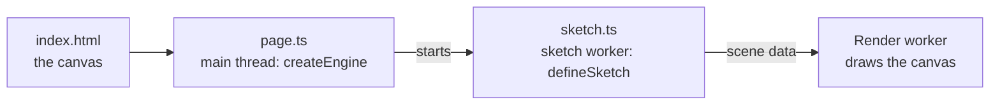

# Your first scene

> Ships in null3D 0.1. The API is experimental, so it can still change between versions.



A null3D project has two modules. The page module, `page.ts`, runs on the page's main thread: it creates the engine and keeps the HTML. The sketch module, `sketch.ts`, builds the 3D scene and updates it every frame, in a worker of its own. This page builds a turning box with a camera and two lights.

Put the four files below in one folder. The project needs the `@null3d/engine` package, and Vite with the `@null3d/vite-plugin` package: [Install null3D](install.md) lists them.

## The HTML page

```html
<!doctype html>
<html lang="en">
  <head>
    <meta charset="utf-8" />
    <title>My first scene</title>
    <style>
      html, body { margin: 0; height: 100%; }
      canvas { display: block; width: 100%; height: 100%; }
    </style>
  </head>
  <body>
    <canvas></canvas>
    <script type="module" src="./page.ts"></script>
  </body>
</html>
```

CSS sets the canvas's size. The engine draws at that size times the screen's pixel ratio, up to a cap that the [quality preset](../concepts/quality-presets.md) sets. The `maxPixelRatio` option of `createEngine` replaces the cap.

## The page module

```ts
// page.ts
import { createEngine } from '@null3d/engine';

const canvas = document.querySelector('canvas')!;
const engine = await createEngine({
  canvas,
  sketch: new URL('./sketch.ts', import.meta.url),
});
await engine.firstFrame; // the first frame is on the screen
```

`createEngine` picks the GPU path, starts the engine's threads and runs the sketch's setup. It resolves once the setup has run. `engine.firstFrame` resolves once the GPU has finished the first frame, which is the moment to remove a loading screen.

`createEngine` rejects with an `EngineError` when the browser cannot run the engine, for example without WebAssembly SIMD ([E1303](../errors/E1303.md)) or without a usable GPU path ([E1301](../errors/E1301.md)). Catch it, and show the page without the scene.

## The sketch module

```ts
// sketch.ts
import { defineSketch } from '@null3d/engine';

export default defineSketch(({ scene, geometry, materials }) => {
  scene.setBackground('#101418');

  const camera = scene.createPerspectiveCamera({ fov: 60, position: [0, 1.5, 4], target: [0, 0, 0] });
  scene.setActiveCamera(camera);

  scene.createDirectionalLight({ direction: [-1, -2, -1], intensity: 3 });
  scene.createAmbientLight({ intensity: 0.4 });

  const cube = scene.createMesh({
    mesh: geometry.box({ width: 1, height: 1, depth: 1 }),
    material: materials.standard({ color: '#4a8cff' }),
    dynamic: true, // it moves in every frame
  });

  let angle = 0;
  return {
    onUpdate(dt) {
      angle += dt * 0.8;
      cube.setRotationEuler(0, angle, 0);
    },
  };
});
```

The module's default export is `defineSketch(setup)`. The engine calls `setup` once, in the sketch worker, with the sketch context. The setup returns the sketch's callbacks: `onUpdate(dt)` runs once per frame, with the frame's step in seconds.

- The camera's `fov` is vertical, in degrees, and `target` turns the camera toward a point. `setActiveCamera` draws the scene from it.
- The directional light's `direction` is the way its light travels, like sunlight. The ambient light lights every surface equally.
- `geometry.box` takes the parameters and defaults of three.js's `BoxGeometry`. `materials.standard` shades with the physically based formulas of three.js's `MeshStandardMaterial`.
- `dynamic: true` says that the cube moves in most frames. Objects are static by default, and a static object costs nothing in a frame where it does not change.

The sketch worker has no `document` and no `window`. The page keeps the HTML, and the two sides talk through [messages](../api/page.md).

## The Vite config

```ts
// vite.config.ts
import { defineConfig } from 'vite';
import null3d from '@null3d/vite-plugin';

export default defineConfig({ plugins: [null3d()] });
```

The plugin sends the two headers that let the engine's threads share memory, and it builds the sketch module for the sketch worker. [Hosting and cross-origin isolation](hosting.md) explains the headers.

## Run it

```sh
bunx vite
```

Open the address that Vite prints. `bunx vite build` writes the production files, and `bunx vite preview` serves them with the same headers.

## Next steps

- [Objects and transforms](../api/objects.md): move, turn, parent and hide objects.
- [Static and dynamic objects](../concepts/static-dynamic.md): when to pass `dynamic: true`.
- [Instances and batching](../concepts/instances.md): draw thousands of copies of one mesh.
- [Messages between sketch and page](../api/page.md): connect the scene to the page's HTML.
