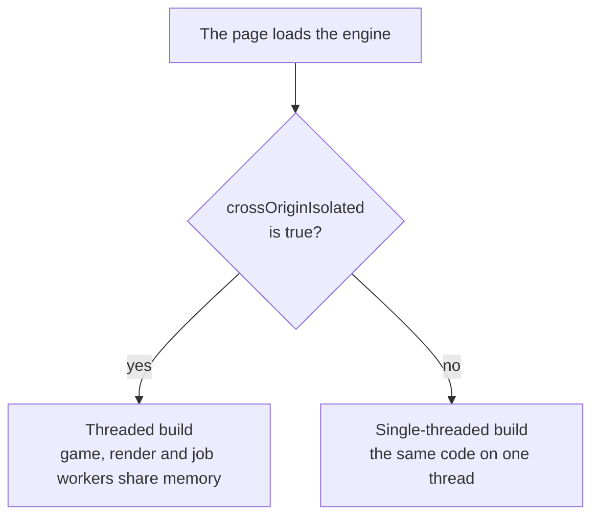

# Hosting and cross-origin isolation

> Planned for sokko3d 0.1. No release has these APIs yet, so coding agents must not use them.



sokko3d runs on worker threads that share memory, and browsers allow shared memory only on pages that are cross-origin isolated. A page becomes isolated when its server sends two HTTP headers. Without them the engine still runs, on one thread.

## The two headers

Send these on the HTML page's response:

```http
Cross-Origin-Opener-Policy: same-origin
Cross-Origin-Embedder-Policy: require-corp
```

Chrome and Firefox also accept `Cross-Origin-Embedder-Policy: credentialless`, which loads files from other sites without cookies instead of requiring each file to opt in. Safari does not support `credentialless`, so a page that must run threaded in Safari uses `require-corp`.

To check a page, open the browser console and read `crossOriginIsolated`. It is `true` on an isolated page. The engine also reports the mode in `engine.capabilities.threaded`.

## Files from other sites

With `require-corp`, the browser loads a file from another origin only when that file allows it. This covers models, textures, fonts and scripts from a CDN or a separate asset domain. Each such file needs one of these:

- A CORS response (`Access-Control-Allow-Origin`), requested in CORS mode. The engine's asset loaders request in CORS mode.
- The header `Cross-Origin-Resource-Policy: cross-origin`.

Files from the page's own origin need nothing. Serve the engine's own files, the `.wasm` builds and the worker scripts, from the same origin as the page, or give them the same headers.

## Two builds

A WebAssembly module built for shared memory cannot load on a page without it, so sokko3d ships two builds. The engine's loader reads `crossOriginIsolated` and fetches the matching one, so you never pick a build yourself.

| Build | Loaded when | What you get |
| --- | --- | --- |
| Threaded | The page is isolated | Game code and rendering in workers, with parallel job workers |
| Single-threaded | Any other case | The same API and features, on one thread |

The single-threaded build is fully supported. Use it where you cannot set headers, such as some game portals and embeds.

## Headers on common hosts

Netlify and Cloudflare Pages read a `_headers` file at the root of the site:

```text
/*
  Cross-Origin-Opener-Policy: same-origin
  Cross-Origin-Embedder-Policy: require-corp
```

Vercel reads `vercel.json`:

```json
{
  "headers": [
    {
      "source": "/(.*)",
      "headers": [
        { "key": "Cross-Origin-Opener-Policy", "value": "same-origin" },
        { "key": "Cross-Origin-Embedder-Policy", "value": "require-corp" }
      ]
    }
  ]
}
```

nginx:

```nginx
add_header Cross-Origin-Opener-Policy same-origin always;
add_header Cross-Origin-Embedder-Policy require-corp always;
```

GitHub Pages cannot send custom headers, so a sokko3d page there runs single-threaded.

## During development

The sokko3d dev server and the Vite plugin send both headers on every response, including `.wasm` files and worker scripts.

Shared memory and WebGPU also need a secure context: HTTPS, or `localhost`. To test on a phone over your local network, use `sokko3d dev --https`, which serves HTTPS with a local certificate. An Android phone connected by USB can instead reach your computer's `localhost` through `adb reverse`.

## What isolation changes

`Cross-Origin-Opener-Policy: same-origin` cuts the link between your page and any cross-origin window it opens. A sign-in flow that opens a popup on another site and waits for a message through `window.opener` stops working. Check such flows before you turn isolation on.

## Related pages

- [Architecture: threads and the frame](../concepts/architecture.md): what the worker threads do.
- [GPU tiers and backends](../concepts/backends.md): which browsers get WebGPU.
