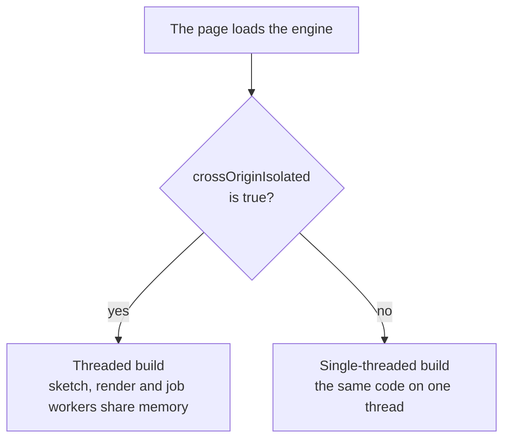

# Hosting and cross-origin isolation

> Ships in null3D 0.1. The API is experimental, so it can still change between versions.



null3D runs on worker threads that share memory, and browsers allow shared memory only on pages that are cross-origin isolated. A page becomes isolated when its server sends two HTTP headers. Without them the engine still runs, on one thread.

## The two headers

Send these on the HTML page's response:

```http
Cross-Origin-Opener-Policy: same-origin
Cross-Origin-Embedder-Policy: require-corp
```

Chrome and Firefox also accept `Cross-Origin-Embedder-Policy: credentialless`, which loads files from other sites without cookies instead of requiring each file to opt in. Safari does not support `credentialless`, so a page that must run threaded in Safari uses `require-corp`.

To check a page, open the browser console and read `crossOriginIsolated`. It is `true` on an isolated page. The engine also reports the mode in `engine.capabilities.threaded`.

## Files from other sites

With `require-corp`, the browser loads a file from another origin only when that file allows it. This covers models, textures, fonts and scripts from a CDN or a separate asset domain. Each such file needs one of these:

- A CORS response (`Access-Control-Allow-Origin`) to a request in CORS mode. `fetch` uses CORS mode for other origins by default.
- The header `Cross-Origin-Resource-Policy: cross-origin`.

Files from the page's own origin need nothing.

## Serve the build from the page's origin

Serve the files of the production build, `dist/` with its `assets/` folder, from the same origin as the HTML page. The engine's worker scripts are among them, and a browser starts a worker only from a script on the page's own origin. No header changes that rule. If Vite's `base` option points at a CDN, the browser refuses the engine's first worker, and `createEngine` rejects with [E1405](../errors/E1405.md).

Models, textures and other files that your sketch loads may come from a CDN, with CORS or CORP as above.

## Content-Security-Policy

The engine starts under a strict policy. Send this one, or add its parts to your own:

```http
Content-Security-Policy: default-src 'self'; script-src 'self' 'wasm-unsafe-eval'; worker-src 'self'
```

- `script-src 'self' 'wasm-unsafe-eval'`: the engine core, the meshopt decoder and the KTX2 transcoder are WebAssembly, and a policy blocks WebAssembly unless it holds `'wasm-unsafe-eval'`. This keyword allows WebAssembly and no JavaScript `eval`. Without it, `createEngine` rejects with [E1418](../errors/E1418.md).
- `worker-src 'self'`: the engine's sketch, render, job and probe workers, and the workers of the glTF loader and the KTX2 transcoder.
- `connect-src`: the engine downloads its `.wasm` files and your sketch module from the page's origin, which `default-src 'self'` allows. Add the origin of each CDN that your sketch loads models or textures from.

The engine needs no inline script and no inline style. It sets styles from code, which a policy does not block. A page's own inline `<style>` element needs `style-src 'self' 'unsafe-inline'`.

A worker follows the policy of its own script's response, not the page's. A host that sends the header on every file, as the examples below do for the isolation headers, applies the same policy to the workers.

## Two builds

A WebAssembly module built for shared memory cannot load on a page without it, so null3D ships two builds. The engine's loader reads `crossOriginIsolated` and fetches the matching one, so you never pick a build yourself.

| Build | Loaded when | What you get |
| --- | --- | --- |
| Threaded | The page is isolated | Sketch code and rendering in workers, with parallel job workers |
| Single-threaded | Any other case | The same API and features, on one thread |

The single-threaded build is fully supported. Use it where you cannot set headers, such as some game portals and embeds.

## Headers on common hosts

Netlify and Cloudflare Pages read a `_headers` file at the root of the site:

```text
/*
  Cross-Origin-Opener-Policy: same-origin
  Cross-Origin-Embedder-Policy: require-corp
```

Vercel reads `vercel.json`:

```json
{
  "headers": [
    {
      "source": "/(.*)",
      "headers": [
        { "key": "Cross-Origin-Opener-Policy", "value": "same-origin" },
        { "key": "Cross-Origin-Embedder-Policy", "value": "require-corp" }
      ]
    }
  ]
}
```

nginx:

```nginx
add_header Cross-Origin-Opener-Policy same-origin always;
add_header Cross-Origin-Embedder-Policy require-corp always;
```

GitHub Pages cannot send custom headers, so a null3D page there runs single-threaded.

## Send the files with Brotli

The engine's shader text compresses well with Brotli, which finds text that repeats far apart. gzip finds only repeats that are close together. So the host's compression changes what a page downloads at its start. In this version, a pipelined page's start downloads about:

| The host sends | The engine's JavaScript at the start |
| --- | --- |
| Brotli | 118 KB |
| gzip at level 9 | 153 KB |
| gzip at level 6, a common setting for compression on the fly | about 155 KB |
| Files as they are | 0.7 MB |

Netlify, Cloudflare Pages and Vercel send Brotli to browsers that accept it. GitHub Pages sends gzip only. nginx sends gzip with its own module, and Brotli with the `ngx_brotli` module. With nginx, compress the files once when you deploy them, with `brotli -q 11` on each file in `dist/assets/`, and send the compressed files with `brotli_static on;`.

## Publish the third-party notices

The engine ships code from other projects:

- the Basis Universal transcoder for KTX2 files, with the Zstandard code inside it
- the meshoptimizer decoder for meshopt-compressed glTF files
- a table of values from three.js, in the engine core
- the Rust crates in the engine core

Their licences ask each copy to carry their notices. A production build with the null3D Vite plugin writes these notices to `null3d-third-party-notices.txt` beside the page. Keep that file with the build when you publish it, or show its text in your game's credits. The same text is in `node_modules/@null3d/engine/THIRD-PARTY-NOTICES.txt`.

## Let browsers keep the build files

Every engine thread loads its own copy of its script and of the core's loader. When the host lets the browser keep those files, each copy after the first comes from the cache. When the host asks the browser to check each file again, the copies wait for one another, one round trip each. A computer with many cores starts many threads, and on a slow phone connection one round trip can take more than half a second.

With worker threads, the page also downloads the sketch module while the engine core downloads. The sketch worker then takes the module from the cache when it runs it. That saves a round trip only when the host lets the browser keep the file.

Vite names the files in `assets/` with a hash of their content, so a file under a given name never changes. Serve them with a long cache lifetime, and serve the HTML page so that browsers check it each time:

```text
/assets/*
  Cache-Control: public, max-age=31536000, immutable
/*.html
  Cache-Control: no-cache
```

That is the `_headers` form for Netlify and Cloudflare Pages. In nginx, add `add_header Cache-Control "public, max-age=31536000, immutable" always;` inside a `location /assets/` block.

## During development

The null3D Vite plugin sends both isolation headers on every response from `vite` and `vite preview`. That includes the `.wasm` files and the worker scripts. `vite preview` also lets the browser keep the hashed files in `assets/`, as a well-set host does.

Shared memory and WebGPU also need a secure context: HTTPS, or `localhost`. An Android phone connected by USB can reach your computer's `localhost` through `adb reverse tcp:5173 tcp:5173`.

To test on a phone or tablet over your local network, serve HTTPS with a local certificate. Make one with [mkcert](https://github.com/FiloSottile/mkcert), for `localhost` and your computer's network name:

```sh
mkdir certs
mkcert -cert-file certs/cert.pem -key-file certs/key.pem localhost my-computer.local
```

Keep the `certs` folder out of version control, because it holds a private key. Turn on the plugin's `https` option, and the dev server serves HTTPS on your local network:

```ts
// vite.config.ts
export default defineConfig({ plugins: [null3d({ https: true, certDir: 'certs' })] });
```

The plugin serves this HTTPS over HTTP/1.1. Over HTTP/2, Safari on an iPad sometimes stops while a worker loads its modules. The dev server sends each module as its own file, and every engine thread loads its own copy of each.

The device must trust mkcert's root certificate. `mkcert -CAROOT` prints its folder. Copy `rootCA.pem` to the device and install it. On an iPhone or iPad, also turn on full trust in Settings > General > About > Certificate Trust Settings.

## What isolation changes

`Cross-Origin-Opener-Policy: same-origin` cuts the link between your page and any cross-origin window it opens. A sign-in flow that opens a popup on another site and waits for a message through `window.opener` stops working. Check such flows before you turn isolation on.

## Related pages

- [Architecture: threads and the frame](../concepts/architecture.md): what the worker threads do.
- [GPU tiers and backends](../concepts/backends.md): which browsers get WebGPU.
