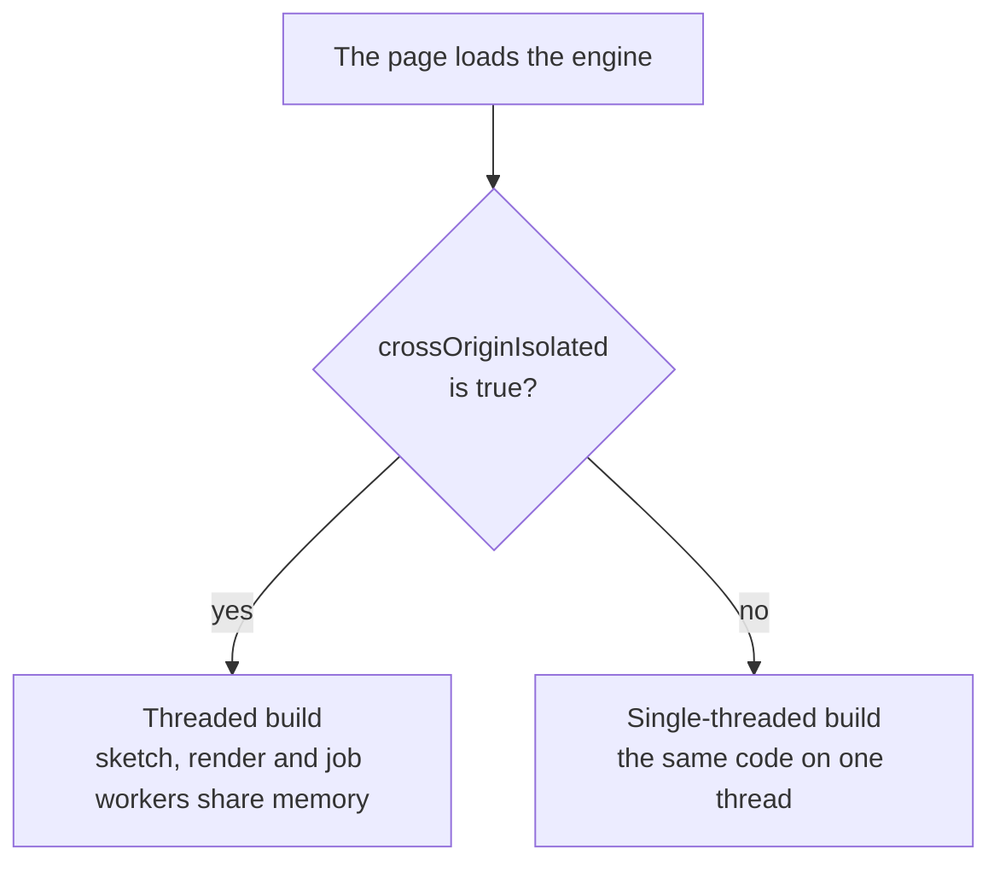

# Hosting and cross-origin isolation

> Ships in null3D 0.1. The API is experimental, so it can still change between versions.



null3D runs on worker threads that share memory, and browsers allow shared memory only on pages that are cross-origin isolated. A page becomes isolated when its server sends two HTTP headers. Without them the engine still runs, on one thread.

## The two headers

Send these on the HTML page's response:

```http
Cross-Origin-Opener-Policy: same-origin
Cross-Origin-Embedder-Policy: require-corp
```

Chrome and Firefox also accept `Cross-Origin-Embedder-Policy: credentialless`, which loads files from other sites without cookies instead of requiring each file to opt in. Safari does not support `credentialless`, so a page that must run threaded in Safari uses `require-corp`.

To check a page, open the browser console and read `crossOriginIsolated`. It is `true` on an isolated page. The engine also reports the mode in `engine.capabilities.threaded`.

## Files from other sites

With `require-corp`, the browser loads a file from another origin only when that file allows it. This covers models, textures, fonts and scripts from a CDN or a separate asset domain. Each such file needs one of these:

- A CORS response (`Access-Control-Allow-Origin`) to a request in CORS mode. `fetch` uses CORS mode for other origins by default.
- The header `Cross-Origin-Resource-Policy: cross-origin`.

Files from the page's own origin need nothing.

## Content-Security-Policy

The engine starts under a strict policy. Send this one, or add its parts to your own:

```http
Content-Security-Policy: default-src 'self'; script-src 'self' 'wasm-unsafe-eval'; worker-src 'self'
```

- `script-src 'self' 'wasm-unsafe-eval'`: the engine core, the meshopt and Draco decoders and the KTX2 transcoder are WebAssembly, and a policy blocks WebAssembly unless it holds `'wasm-unsafe-eval'`. This keyword allows WebAssembly and no JavaScript `eval`. Without it, `createEngine` rejects with [E1418](../errors/E1418.md). The engine needs no `'unsafe-eval'`.
- `worker-src 'self'`: the engine's sketch, render, job and probe workers, and the glTF loader's worker.
- `connect-src`: the engine downloads its `.wasm` files and your sketch module from the page's origin, which `default-src 'self'` allows. Add the origin of each CDN that your sketch loads models or textures from.

The engine needs no inline script and no inline style. It sets styles from code, which a policy does not block. A page's own inline `<style>` element needs `style-src 'self' 'unsafe-inline'`.

A worker follows the policy of its own script's response, not the page's. A host that sends the header on every file, as the examples below do for the isolation headers, applies the same policy to the workers.

## The engine's files on a CDN

The production build's files, `dist/assets/`, may come from another origin than the HTML page, such as a CDN. Point Vite's `base` option at the CDN, and serve the HTML page from your own origin:

```ts
// vite.config.ts
export default defineConfig({ base: 'https://cdn.example.com/my-game/', plugins: [null3d()] });
```

A browser starts a worker only from a script of the page's own origin. So for each worker, the engine makes a small script in the page's memory, at a `blob:` address, which has the page's origin. That script imports the worker's real script from the CDN. You copy no worker file to your own origin.

The CDN must send this header on every file of the build: the scripts, the workers' scripts and the `.wasm` files.

```http
Access-Control-Allow-Origin: *
```

It may name the page's origin in place of `*`. `Cross-Origin-Resource-Policy` alone does not serve, because the engine imports modules and downloads `.wasm` files in CORS mode. The HTML page still sends the two isolation headers. Without them the engine runs single-threaded, as on any host.

A worker that starts from a `blob:` address follows the page's policy. Add these parts to the page's policy, with your CDN's origin:

```http
Content-Security-Policy: default-src 'self'; script-src 'self' https://cdn.example.com 'wasm-unsafe-eval'; worker-src 'self' blob: https://cdn.example.com; connect-src 'self' https://cdn.example.com
```

- `blob:` in `worker-src`: the engine starts each worker from a `blob:` address.
- The CDN in `worker-src`: Firefox checks the modules that a worker imports, such as your sketch, against `worker-src`.
- The CDN in `script-src`: the page's and the workers' scripts come from there.
- The CDN in `connect-src`: the engine downloads its `.wasm` files from there.

When an item is missing, `createEngine` rejects with a code that names it, or a load that needs a file from the CDN does:

| Missing | Error |
| --- | --- |
| `blob:` or the CDN in `worker-src`, or the CDN in `connect-src` | [E1422](../errors/E1422.md), which names the directive |
| `Access-Control-Allow-Origin` on a file | [E1423](../errors/E1423.md), which names the CDN |
| `'wasm-unsafe-eval'` in `script-src` | [E1418](../errors/E1418.md) |

Without the CDN in `script-src`, the browser blocks the page's own script before the engine runs, and the browser's console names the directive.

## Two builds

A WebAssembly module built for shared memory cannot load on a page without it, so null3D ships two builds. The engine's loader reads `crossOriginIsolated` and fetches the matching one, so you never pick a build yourself.

| Build | Loaded when | What you get |
| --- | --- | --- |
| Threaded | The page is isolated | Sketch code and rendering in workers, with parallel job workers |
| Single-threaded | Any other case | The same API and features, on one thread |

The single-threaded build is fully supported. Use it where you cannot set headers, such as some game portals and embeds.

## Headers on common hosts

Netlify and Cloudflare Pages read a `_headers` file at the root of the site:

```text
/*
  Cross-Origin-Opener-Policy: same-origin
  Cross-Origin-Embedder-Policy: require-corp
```

Vercel reads `vercel.json`:

```json
{
  "headers": [
    {
      "source": "/(.*)",
      "headers": [
        { "key": "Cross-Origin-Opener-Policy", "value": "same-origin" },
        { "key": "Cross-Origin-Embedder-Policy", "value": "require-corp" }
      ]
    }
  ]
}
```

nginx:

```nginx
add_header Cross-Origin-Opener-Policy same-origin always;
add_header Cross-Origin-Embedder-Policy require-corp always;
```

GitHub Pages cannot send custom headers, so a null3D page there runs single-threaded.

## Send the files with Brotli

The engine's shader text compresses well with Brotli, which finds text that repeats far apart. gzip finds only repeats that are close together. So the host's compression changes what a page downloads at its start. In this version, a pipelined page's start downloads about:

| The host sends | The engine's JavaScript at the start |
| --- | --- |
| Brotli | 118 KB |
| gzip at level 9 | 153 KB |
| gzip at level 6, a common setting for compression on the fly | about 155 KB |
| Files as they are | 0.7 MB |

Netlify, Cloudflare Pages and Vercel send Brotli to browsers that accept it. GitHub Pages sends gzip only. nginx sends gzip with its own module, and Brotli with the `ngx_brotli` module. With nginx, compress the files once when you deploy them, with `brotli -q 11` on each file in `dist/assets/`, and send the compressed files with `brotli_static on;`.

## Publish the third-party notices

The engine ships code from other projects:

- the Basis Universal transcoder for KTX2 files, with the Zstandard code inside it
- the meshoptimizer decoder for meshopt-compressed glTF files
- Draco's decoder for Draco-compressed glTF files
- a table of values from three.js, in the engine core
- the Rust crates in the engine core

Their licences ask each copy to carry their notices. A production build with the null3D Vite plugin writes these notices to `null3d-third-party-notices.txt` beside the page. Keep that file with the build when you publish it, or show its text in your game's credits. The same text is in `node_modules/@null3d/engine/THIRD-PARTY-NOTICES.txt`.

## Let browsers keep the build files

Every engine thread loads its own copy of its script and of the core's loader. When the host lets the browser keep those files, each copy after the first comes from the cache. When the host asks the browser to check each file again, the copies wait for one another, one round trip each. A computer with many cores starts many threads, and on a slow phone connection one round trip can take more than half a second.

With worker threads, the page also downloads the sketch module while the engine core downloads. The sketch worker then takes the module from the cache when it runs it. That saves a round trip only when the host lets the browser keep the file.

Vite names the files in `assets/` with a hash of their content, so a file under a given name never changes. Serve them with a long cache lifetime, and serve the HTML page so that browsers check it each time:

```text
/assets/*
  Cache-Control: public, max-age=31536000, immutable
/*.html
  Cache-Control: no-cache
```

That is the `_headers` form for Netlify and Cloudflare Pages. In nginx, add `add_header Cache-Control "public, max-age=31536000, immutable" always;` inside a `location /assets/` block.

## Offline play

A game can play with no network after its first visit. Its own service worker caches the page and the build's files, and answers the page's requests from that cache. null3D ships no service worker. A production build with the null3D Vite plugin writes a list of the build's files for one, `null3d-files.json`, beside the page:

```json
{
  "version": "3f9c2a7d41e0b865",
  "start": ["index.html", "assets/index-B1x9Qd2e.js", "assets/null3d_bg-gnm1VqEU.wasm"],
  "features": {
    "skinning": ["assets/shaders-skinning-wgsl-Ck2dJx81.js"],
    "ktx2": ["assets/basis_transcoder-D165VYSC.wasm"]
  }
}
```

- `start` holds every file that a page may need to start. These are the pages and their scripts, the engine's workers, both engine builds and each GPU path's shaders.
- `features` holds the files that each feature downloads on its first use, by the feature's name. A page that does not use a feature never downloads its files, so a game caches only the features that it uses.
- `version` changes whenever a file of the build changes. Each address is relative to the list.

| Feature | Files | The game uses it when it calls |
| --- | --- | --- |
| `ao`, `background`, `bloom`, `lines`, `morph`, `occlusion`, `skinning`, `sky`, `sprites` | The feature's shaders, and the code of sprites and lines | The calls that `createEngine`'s `preload` lists for the same name ([Engine](../api/engine.md)) |
| `gltf` | The glTF loader, its worker, and the meshopt and Draco decoders | `assets.loadGltf` |
| `ktx2` | The KTX2 loader and the Basis Universal transcoder | `assets.loadTexture` or `assets.loadGltf` with a KTX2 texture |
| `environment` | The readers of environment maps, the built-in environments and the code that prefilters them | `assets.loadEnvironment` or `assets.builtinEnvironment` |
| `lut` | The readers of color grading tables | `assets.loadLut` |

Each feature's shaders come in a file for each GPU path and each device's settings. A device can need another of them during play, for example when bloom turns on HDR color, so a feature's list holds them all. In this version, the start's files take about 6.7 MB, the skinning shaders 5.2 MB and the whole build 17.8 MB. These are the sizes of the files as they are, which the cache keeps. With compression, the downloads are about a fifth of that.

This service worker caches the page, the start's files and the features that the game names:

```js
// public/sw.js
const FEATURES = ['skinning', 'gltf', 'ktx2'];
const PREFIX = 'game-';

self.addEventListener('install', (event) => event.waitUntil(update()));

self.addEventListener('fetch', (event) => {
  if (event.request.mode === 'navigate') event.waitUntil(update().catch(() => {}));
  event.respondWith(
    caches.match(event.request, { ignoreSearch: true }).then((hit) => hit ?? fetch(event.request)),
  );
});

/** Caches the build that the server holds now, once, and deletes the caches of older builds. */
async function update() {
  const list = await (await fetch('null3d-files.json', { cache: 'no-store' })).json();
  const name = PREFIX + list.version;
  const cache = await caches.open(name);
  if (await cache.match('./')) return;
  const features = FEATURES.flatMap((feature) => list.features[feature]);
  await cache.addAll(['./', ...list.start, ...features]);
  for (const old of await caches.keys())
    if (old.startsWith(PREFIX) && old !== name) await caches.delete(old);
}
```

The page registers it in production builds only, so the dev server's pages stay out of the cache:

```ts
if (import.meta.env.PROD) void navigator.serviceWorker?.register('./sw.js');
```

Put the game's own files that the build does not hold, such as its models in `public/`, in the list that `cache.addAll` takes. On each visit with a network, the worker checks the list. When the build changed, it caches the new build in one step and deletes the old caches. The new build then runs from the next visit.

### Keep the page isolated

The cache keeps each response with its headers, so the cached page keeps the two isolation headers and the engine starts threaded offline. A service worker that makes a new response for the page, instead of one from `fetch` or the cache, must copy those headers. Without them the page loses its isolation, and the engine starts its single-threaded build with no error. A development build of the engine warns in the console when a service worker controls a page that is not isolated. To check a production build, reload the page offline and read `crossOriginIsolated` in the console.

### The preload list and the cache

The cache decides where the files come from, and `preload` decides when they load. Cache each feature that the game lists in `preload`, or an offline start fails while it waits for that feature's shaders. A feature that the game caches but does not preload loads from the cache on its first use, with no network. A feature that the game neither caches nor preloads needs the network on its first use.

### Keep the engine's caches

The engine keeps the textures that it transcodes from KTX2 files in Cache Storage, in caches whose names start with `null3d-`. The worker above deletes only its own caches, which start with `game-`. A service worker that deletes every other cache makes the engine transcode those textures again.

## During development

The null3D Vite plugin sends both isolation headers on every response from `vite` and `vite preview`. That includes the `.wasm` files and the worker scripts. `vite preview` also lets the browser keep the hashed files in `assets/`, as a well-set host does.

Shared memory and WebGPU also need a secure context: HTTPS, or `localhost`. An Android phone connected by USB can reach your computer's `localhost` through `adb reverse tcp:5173 tcp:5173`.

To test on a phone or tablet over your local network, serve HTTPS with a local certificate. Make one with [mkcert](https://github.com/FiloSottile/mkcert), for `localhost` and your computer's network name:

```sh
mkdir certs
mkcert -cert-file certs/cert.pem -key-file certs/key.pem localhost my-computer.local
```

Keep the `certs` folder out of version control, because it holds a private key. Turn on the plugin's `https` option, and the dev server serves HTTPS on your local network:

```ts
// vite.config.ts
export default defineConfig({ plugins: [null3d({ https: true, certDir: 'certs' })] });
```

The plugin serves this HTTPS over HTTP/1.1. Over HTTP/2, Safari on an iPad sometimes stops while a worker loads its modules. The dev server sends each module as its own file, and every engine thread loads its own copy of each.

The device must trust mkcert's root certificate. `mkcert -CAROOT` prints its folder. Copy `rootCA.pem` to the device and install it. On an iPhone or iPad, also turn on full trust in Settings > General > About > Certificate Trust Settings.

## What isolation changes

`Cross-Origin-Opener-Policy: same-origin` cuts the link between your page and any cross-origin window it opens. A sign-in flow that opens a popup on another site and waits for a message through `window.opener` stops working. Check such flows before you turn isolation on.

## Related pages

- [Architecture: threads and the frame](../concepts/architecture.md): what the worker threads do.
- [GPU tiers and backends](../concepts/backends.md): which browsers get WebGPU.
