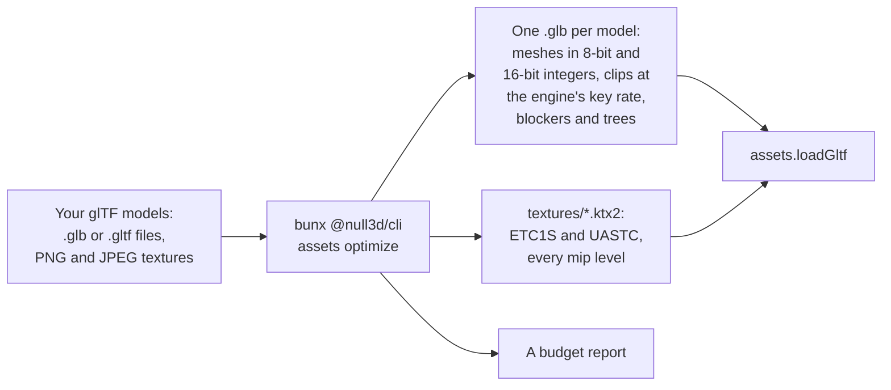
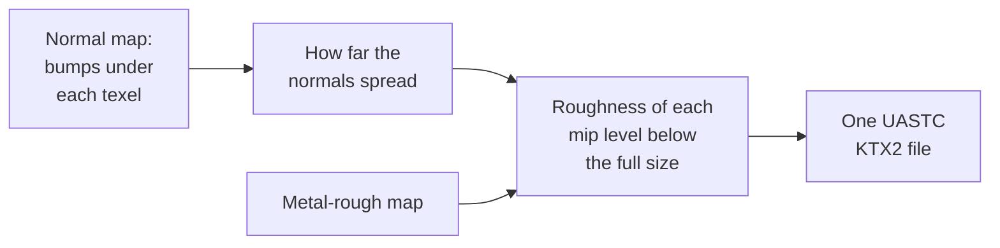

# The asset pipeline (the `assets` command)

> Ships in null3D 0.2. The command is experimental, so it can still change between versions. The engine does not draw levels of detail yet, so it draws the full mesh of a model made with `--lod`. Coding agents must not use that part.



The `assets optimize` command makes glTF models smaller and faster to load and draw. It stores each mesh's vertices as small integers, in the order that the GPU reads them fastest. It stores each animation clip in the form the engine keeps in memory. It encodes each texture as a KTX2 file, which the GPU keeps compressed. Your files download less, take less GPU memory and upload in fewer frames. The command runs on your computer before you publish, from npm, with nothing else to install. The same files give the same output bytes on every computer.

## Optimize a model

Give the command a model, or a folder of models, and a folder for the output:

```sh
bunx @null3d/cli assets optimize models/ public/models/
```

```text
BoomBox.glb: 10.1 MB to 2.2 MB (the model 107.0 KB), in 9.6 s
  draws 1 object of 1 part in 1 mesh: 6,036 triangles, 3,575 stored vertices
  size 0.0198 x 0.0195 x 0.0202
  4 textures: 2 of 2048x2048 etc1s srgb, 1 of 2048x2048 etc1s linear, 1 of 2048x2048 uastc linear
  texture memory: 13.3 MB with ETC2 and ASTC, 21.3 MB with BC7 only, 85.3 MB uncompressed
```

That is Khronos's BoomBox sample model, whose four PNG textures of 2048 x 2048 made most of its 10.1 MB.

Each `.glb` and `.gltf` file in the input folder and its subfolders becomes one `.glb` file in the output folder, at the same place. The textures of every model go into one `textures` folder in the output folder. Each texture file takes its name from its contents. So models that share a texture share its file, and a host can let browsers keep the files for good. Then load a model as any other:

```ts
// sketch.ts
const ship = await assets.loadGltf('/models/ship.glb');
scene.instantiate(ship);
```

| Option | Effect | Without it |
| --- | --- | --- |
| `--lod` | Adds levels of detail to each mesh of 64 triangles or more | No levels |
| `--simplify <share>` | Keeps this share of each mesh's triangles, from 0 to 1, as far as `--simplify-error` allows | 1: every triangle |
| `--simplify-error <share>` | The most that `--simplify` may move a mesh's surface, as a share of the mesh's size | 0.01 |
| `--max-texture-size <pixels>` | The largest side of a texture: a power of two up to 2048 | 2048 |
| `--texture-quality <size\|high>` | `high` encodes color and data maps in UASTC, several times larger than ETC1S, with less loss | `size` |
| `--no-roughness-bake` | Leaves the roughness levels of metal-rough maps as plain averages, with no detail from the normal maps | [The roughness bake](#the-roughness-bake) |
| `--compression <none\|meshopt>` | `none` leaves the file's buffers uncompressed | `meshopt` |
| `--no-blockers` | Gives no mesh a blocker for software occlusion culling | Blockers for meshes that enclose space |
| `--bvh <triangles>` | Stores the tree that raycasts walk for each mesh part of at least this many triangles, or for none with 0 | 20000 |
| `--jobs <count>` | The worker threads that encode textures | One per CPU core |
| `--report <file.json>` | Also writes the budget report as a JSON file | No file |

## What it does to meshes

| Data | In the output | Why |
| --- | --- | --- |
| Equal meshes, materials, textures and vertex data | One copy, which every node that used a copy then uses | The engine draws all objects of one mesh and material together, and uploads each mesh once |
| Triangle order | Reordered for the GPU's vertex cache, and vertices in the order that triangles use them | The GPU shades fewer vertices and reads memory in order |
| Positions | 16-bit integers in 16,384 steps across each mesh, with `KHR_mesh_quantization`, unless the mesh's extras keep them as floats | Half the size of floats. A mesh 100 m long gets steps of 6 mm |
| Normals and tangents | 8-bit integers | A quarter of the size. Directions stay within about 1 degree |
| Texture coordinates | 16-bit integers when every value lies from 0 to 1, else floats | Values past 1 would need a texture transform per material |
| Vertex colors, joint weights | 8-bit integers | Weights still add up to one |
| Indices | 16 bits when a mesh has at most 65,535 vertices | Half the size |
| Buffers | Compressed with meshopt (`EXT_meshopt_compression`) | Smaller downloads. The engine decodes them on load, with no loss, and fetches the decoder only for such files |

The integers need a transform that turns them back into positions. The command puts it in the mesh's node when nothing else moves with the node. A node with children, a light, a camera or an animation keeps its transform. Its mesh then moves to a new child node of the same name. Each instance of an instancing node takes the transform too, and so do the bind matrices of a skin.

The steps follow the mesh's longest side. So a mesh that spreads small parts over a large space gets coarse steps. One mesh that holds a city's buildings of one material, 760 m across, gets steps of 4.6 cm, and buildings that meet can open gaps. The extras `"quantizePositions": false` keep that mesh's positions as 32-bit floats. Its other vertex data still takes integers, and meshopt still compresses its buffers.

Models with Draco or meshopt compression load too. The command writes their meshes with meshopt, or with no compression when you give `--compression none`.

## What it does to clips

The engine keeps each animation clip at one fixed rate of keys, so it never searches for the keys around a time. A file from another tool can hold keys at any times, so the loader resamples its clips on the job workers. The command stores each clip at the engine's rate already, and the loader then copies the keys instead.

| Data | In the output | Why |
| --- | --- | --- |
| Key times | One list of evenly spaced times per clip. The file's own spacing when every key lies on one grid of up to 30 keys a second, else 30 keys a second | The rate that the engine picks for the clip at load |
| Rotations that change | One key per time, as 16-bit integers, compressed with meshopt's quaternion filter | A quarter of the size of floats. The engine keeps rotations in 16 bits as well |
| Translations, scales and morph weights that change | One key per time, as 32-bit floats | glTF asks for floats. meshopt compresses them with no loss |
| A track whose value never changes, or moves by under a millionth of its size | One key, at the clip's last time | The clip keeps its length, in null3D and in three.js. Exporters leave rounding noise of that size in tracks that do not move, and the engine counts such a track as constant in every file |
| Step tracks | Step tracks, with a key at each time | The engine steps at the same times |
| Cubic spline tracks | Linear keys on the curve | The engine stores the same keys from the curve at load |

The command drops no key and no track. A clip blends only where it has tracks, as in three.js, so a dropped track would change how the clip blends. Poses stay within the engine's tolerance of three.js. The KayKit Knight's skinning matrices differ by at most 7e-5, the same as from its source file.

For the Knight and its 76 clips, the file's binary part falls from 838 KB to 405 KB after Brotli. On the engine's test page, its clips were ready in 8 ms on two job workers, against 16.5 ms for the source file.

## Blockers and stored trees

On WebGL2, objects that block the view hide the objects behind them from the GPU, as [Culling](../concepts/culling.md#software-occlusion-culling-on-webgl2) explains. The command gives each mesh that encloses space a blocker: one or two boxes that fill its inside, joined into one closed surface. The engine draws the blocker in place of the mesh, for the cost of a few dozen triangles. A copy of the model blocks with those meshes from the start.

A blocker that bulged out of its mesh would hide objects that show. So the command checks each blocker against the mesh's triangles, and drops one that fails:

- The blocker is closed and faces outward.
- No blocker triangle touches or crosses a triangle of the mesh.
- Each corner of the blocker, and points spread over its faces, lie inside the mesh. From each point, rays in 48 directions meet the mesh, and the last face that each ray meets faces away from the point.

The command takes the ground into account. The ground hides a model that stands upright from below. So a mesh that is open at its bottom still gets a blocker. Most buildings are open at the bottom. Such a blocker stops a little above the mesh's lowest point. A model that is turned or tipped gets no help from the ground.

| Mesh | Blocker |
| --- | --- |
| Closed, such as a building, a rock or a wall | Yes, when one fills at least 5% of the mesh's box |
| Open at its bottom, standing upright | Yes, as above |
| Flat, thin or open to the sky, such as a floor, a sign or a fence | None, and the report says why |
| Skinned, with morph targets, blended or with an alpha mask | None: its drawn shape can change or have gaps |

A mesh's glTF extras can override the choice. The extras `"occluder": false` give the mesh no blocker. The extras `"occluder": true` make a mesh without a blocker block with its own triangles, up to 4,096 of them. That suits a mesh that is solid but too thin for a box. In the scene, `scene.instantiate(model, { occluder: false })` keeps a copy's meshes from blocking. Later, `setOccluder` changes an object.

Raycasts walk a tree over each mesh's triangles. The engine builds a mesh's tree on the job workers on the first query, in about 0.2 to 0.3 µs per triangle. The `--bvh` option stores the trees in the file instead, for each mesh part of at least that many triangles. A stored tree takes about 20 bytes per triangle, as much as the mesh's positions and indices together. meshopt compresses it to about 12. So a stored tree pays only for large meshes, whose build would hold up the first raycast. The engine checks each stored tree against the mesh in about a tenth of the time of a build. It builds its own tree where a stored one does not fit.

The file keeps both in extensions of the engine's own, which other loaders ignore: `NULL3D_occluder` and `NULL3D_mesh_bvh`. A file optimized again gets new ones.

## Textures

The command encodes each PNG and JPEG texture of a model as a KTX2 file of Basis Universal data, with every mip level. KTX2 images that the model already had move to files of their own, unchanged. The engine turns each file into the compressed format that the device supports, as [Textures](../api/textures.md) lists.

| Texture | Format | Color space |
| --- | --- | --- |
| Base color and emissive maps | ETC1S, or UASTC with `--texture-quality high` | sRGB |
| Normal maps | UASTC always, since ETC1S blurs their detail | Linear |
| Metal-rough maps of materials with normal maps | UASTC, with [the roughness bake](#the-roughness-bake) | Linear |
| Other metal-rough, occlusion and other maps | ETC1S, or UASTC with `--texture-quality high` | Linear |

Each side of a texture becomes its nearest power of two, and then both halve together until the longer side fits `--max-texture-size`. A 1000 x 600 image becomes 1024 x 512. Every level of a mip chain then halves exactly. A side is never less than 4 texels, so each texture is whole blocks of 4 x 4 texels. A texture in part blocks would load uncompressed, at 4 to 8 times the GPU memory. The command cannot resize a KTX2 image that the model already had. When such an image is not whole blocks, the report names it and counts it as uncompressed. Give the command its PNG or JPEG source instead.

Textures are at most 2048 x 2048. The encoder is a 32-bit WebAssembly build, which refuses 4096 x 4096 images.

In 40 sets of photographed materials at 1024 x 1024, each ETC1S color map took about 110 KB to download. Each UASTC normal map took about 670 KB. On the GPU, ETC1S takes an eighth of the memory of RGBA8 where the device has ETC2, and UASTC takes a quarter.

### The roughness bake

A normal map adds small bumps to a surface. Far away, many bumps fall in one pixel. The GPU then reads a lower mip level of the normal map, which averages the bumps into one flat normal. The surface looks smooth and sharp, and its highlights flicker as the camera moves. A real surface of tiny bumps looks rougher from far away.

So when a material has both a normal map and a metal-rough map, the command makes the metal-rough map's mip levels itself. In each level below the full size, it measures how far the normal map's normals under each texel spread. It adds that spread to the texel's roughness, the green channel. A smooth texel becomes at most 0.4 rough, and a rough texel gains less. Occlusion and metalness keep their plain averages. The full size stays as you made it, because up close the GPU reads the normal map's own bumps.



The added roughness takes the material's normal scale and roughness factor into account. A bumpier normal map adds more. A metal-rough map that two materials read with different normal maps, or one with a normal map and one without, gets one file for each.

A baked map is always UASTC. ETC1S stores all mip levels with one shared set of colors, so the command cannot write its own levels in ETC1S. UASTC also keeps the three channels of a metal-rough map apart, which ETC1S blurs together. The command shrinks the UASTC data for Zstandard, at a cost of about one step of 255 in roughness. The file is still larger: BoomBox's 2048 x 2048 metal-rough map takes 1.65 MB, against 269 KB in ETC1S.

The bake skips a material, and the report says why, when:

- its normal map and metal-rough map read different texture coordinates, or different texture transforms;
- its roughness factor is 0, since no texture value can change its roughness;
- one of the two maps is a KTX2 image that the model already had.

`--no-roughness-bake` turns the bake off.

## Levels of detail

`--lod` adds levels of detail to each mesh of 64 triangles or more. Each level has about half the triangles of the level above. The levels stop when a level would keep more than three quarters of the triangles above it. Each level shares the mesh's vertices, so only its indices add to the file.

The command plans the levels as follows:

1. It welds the vertices of each mesh part for planning. Copies of a vertex at one place merge when their texture coordinates and colors match and their normals lie within 20 degrees. Exporters often leave such copies, and they stop the simplifier.
2. It simplifies with meshoptimizer, with the normals and the vertex colors in the error. Texture seams and the borders between mesh parts stay in place. Normal seams may move, so a model of flat faces still simplifies.
3. A skinned mesh simplifies in its skeleton's rest pose, as it draws. Meshes with joints or morph targets keep their triangles more even, so they bend well.
4. Each level stores its error: the largest distance between its surface and the full mesh's, in the units of the mesh's positions. Each level's error is at least 1.5 times the error of the level above, so the levels change at distances well apart.

The levels go into the file with `MSFT_lod`. Each node with levels stores the errors in its extras, as `NULL3D_lod_error`. A level is good enough where its error covers less than one pixel. The engine can then pick the level from the real screen height and the render scale. The extras also hold `MSFT_screencoverage` for other readers of `MSFT_lod`, made for a screen 1080 pixels high. A model whose file already has levels keeps them.

Over the 213 models of four Kenney city kits, `--lod` gives levels to 162. The 45 models of under 64 triangles get none, and so do six flat road pieces that cannot lose a quarter of their triangles.

The engine does not draw levels of detail yet, and draws the full mesh. three.js's `GLTFLoader` also ignores `MSFT_lod`.

### Fewer triangles in the full mesh

`--simplify` lowers the full mesh itself, as gltfpack's `-si` does. `--simplify 0.5` aims to keep half of each mesh's triangles. The surface may move by no more than `--simplify-error` times the mesh's size, so a mesh may keep more. A mesh that cannot lose triangles within that limit keeps them all. The vertices that no triangle uses then leave the file.

The default limit, a hundredth of each mesh's size, changes little that a viewer can see. A model that draws small on the screen, such as the characters of a crowd, can take a larger limit.

## The budget report

| Line | What it says |
| --- | --- |
| First line | The model's files before and after, the `.glb` file alone, and the time the command took |
| `draws` | The objects that the scene draws, with each instance of an instancing node, the parts and meshes they draw, the triangles at full detail, and the vertices the file stores |
| `size` | The scene's size in its own units, from the meshes' bounds |
| `levels of detail` | The meshes that got levels, and their triangles at each level, the full meshes first |
| `merged copies` | The meshes, materials, textures and vertex data that merged into an equal copy |
| Textures | Each group of textures that share a size, a format and a color space |
| `texture memory` | The textures' GPU memory with every mip level: where the GPU takes ETC2 and ASTC, as phones, tablets and Macs do; where it takes only BC7, as most Windows PCs do; and with no compressed format |
| `roughness levels baked` | The metal-rough maps that took the roughness bake |
| `no roughness bake` | Each material with a normal map and a metal-rough map that got no bake, with the reason |
| Textures not in whole blocks | Each KTX2 image of the model whose sides are not whole blocks of 4 texels, which the engine loads uncompressed |
| `blockers` | The meshes that got blockers, and their triangles |
| `no blocker` | Each mesh that could block but got no blocker, with the reason |
| `stored trees` | The mesh parts whose trees the file stores, and their bytes before compression |

`--report` writes the same figures as JSON, with each texture's source size, output size and encode time.

## In a Vite project

The null3D Vite plugin runs the same steps on a model that a module imports with `?optimized`. The import gives the address of the optimized model:

```ts
// sketch.ts
import shipUrl from './models/ship.glb?optimized';

const ship = await assets.loadGltf(shipUrl);
```

The plugin uses the tool of `@null3d/cli`, so add the command-line tool to your project first:

```sh
bun add -d @null3d/cli
```

The first import of a model encodes it. The plugin keeps the result in `node_modules/.cache/null3d-assets`, keyed by the model's files, the tool's version and the options. Later starts and builds take it from there, until one of those changes. A production build writes the files into its assets folder. The plugin's `assets` option takes the command's options: `lod`, `simplify`, `simplifyError`, `maxTextureSize`, `textureQuality`, `roughnessBake` (false for `--no-roughness-bake`), `meshopt` (false for `--compression none`), `blockers` (false for `--no-blockers`) and `bvh`:

```ts
// vite.config.ts
import null3d from '@null3d/vite-plugin';
import { defineConfig } from 'vite';

export default defineConfig({
  plugins: [null3d({ assets: { lod: true, maxTextureSize: 1024, bvh: 5000 } })],
});
```

For TypeScript, add `@null3d/vite-plugin/client` to the `types` of your `tsconfig.json`, so `?optimized` imports have the type `string`.

## Convert other formats

The engine loads glTF files only. The `assets convert` command turns models of other formats into binary glTF (`.glb`) files:

```sh
bunx @null3d/cli assets convert models/hero.fbx models/hero.glb
```

```text
models/hero.fbx to models/hero.glb: 51.5 KB to 11.4 KB, in 0.0 s
  1 mesh, 34 triangles, 2 materials, 1 texture, 1 skin, 1 clip
```

| Input | What the output holds |
| --- | --- |
| `.gltf` | The file, its buffers and its images, in one `.glb` file, as they are |
| `.glb` with Draco | The meshes with meshopt compression instead of Draco |
| `.obj` | The meshes by object and material, with the materials of the MTL files that the file names, and their textures |
| `.fbx` | Binary and text FBX from version 3000 (FBX 2006 on): meshes, materials, textures, skins, blend shapes as morph targets, and clips |
| `.stl` | Binary and text STL: one mesh for each solid, with Materialise's face colors |
| `.ply` | Text and binary PLY, with normals, colors and texture coordinates. A file without faces becomes points |

Then run `assets optimize` on the output, which quantizes the meshes and encodes the textures for the GPU. `convert` changes the format only and keeps the texture images. The same input gives the same bytes on every computer.

FBX and OBJ files read with [ufbx](https://github.com/ufbx/ufbx), the reader that Blender and Godot use, built into the command as WebAssembly. Nothing else needs installing:

- Units become meters, and Y points up, as in glTF. A model made in centimeters, with Z up, keeps its size and stands up.
- Each clip of the file becomes a glTF clip. Curves that glTF cannot hold, such as Bézier and step keys, get keys at up to 30 a second.
- Cameras and lights are left out, and the command says so.

FBX and MTL materials become glTF's metal-rough materials:

| Source | glTF |
| --- | --- |
| Diffuse color and its texture | Base color. A texture replaces the color, as in the program that made the file |
| Physically based roughness and metalness, and their textures | Roughness and metalness. Separate roughness, glossiness, metalness and occlusion textures join into one texture, as [`pack-orm`](#pack-occlusion-roughness-and-metalness) packs them |
| A Phong exponent (FBX Phong, MTL's `Ns`), without physically based values | Roughness of `(2 / (exponent + 2))^(1/4)`, the roughness whose highlight matches the exponent's |
| Normal map | Normal map |
| Bump map, and a gray image in a normal map's place | A normal map made from the heights, as [`normal-from-bump`](#normal-maps-from-bump-maps) makes one, with the file's bump factor as its scale |
| Opacity | Base color alpha, blended. An opacity texture other than the base color's alpha is left out |
| Emissive color and its texture | Emission, with `KHR_materials_emissive_strength` above 1 |

Textures go into the file as PNG and JPEG images. TGA images become PNG. The command looks for each texture file where the model names it, then by its name in the model's folder. A missing file gets a note, and the material keeps its other maps.

STL files hold facets with no other data. The command joins corners at the same place and leaves the facets' normals out, so glTF readers shade the faces flat, as the facets say. PLY and STL colors in bytes are sRGB, and the output stores them as linear values, as glTF requires. The engine does not draw glTF points yet, so a PLY point cloud loads with nothing to draw. three.js draws it.

| Option | Effect | Without it |
| --- | --- | --- |
| `--compression <none\|meshopt>` | `meshopt` stores vertices as integers and compresses the buffers, as `assets optimize` does. `none` leaves them as floats | `meshopt` for a Draco or meshopt input, else `none` |

## Pack occlusion, roughness and metalness

glTF reads a material's roughness from the green channel of one texture and its metalness from the blue. Its occlusion map may share the texture, in the red. Many texture sets come as separate gray maps. `assets pack-orm` packs them:

```sh
bunx @null3d/cli assets pack-orm textures/brick_orm.ktx2 \
  --occlusion textures/brick_ao.png --roughness textures/brick_rough.png --metalness textures/brick_metal.png
```

Each map is a PNG, JPEG or TGA image, read from its red channel. Give at least one. A missing occlusion map is white, for no occlusion. A missing roughness map is white, so the material's roughness factor applies as it is. A missing metalness map is black, for no metal. The texture takes the size of the largest map, and the others stretch to it, so the maps must have one shape.

A `.ktx2` output is UASTC with every mip level, each side at its nearest power of two, as `assets optimize` encodes data maps. A `.png` output keeps the size of the largest map, for a model that `assets optimize` then encodes. Use the texture as the material's metal-rough map and, when you packed occlusion, as its occlusion map too:

```ts
const orm = await assets.loadTexture('/textures/brick_orm.ktx2', { colorSpace: 'linear' });
const brick = materials.standard({ metalnessRoughnessMap: orm, aoMap: orm });
```

| Option | Effect | Without it |
| --- | --- | --- |
| `--occlusion <image>` | The occlusion map | White |
| `--roughness <image>` | The roughness map | White |
| `--metalness <image>` | The metalness map | Black |
| `--max-texture-size <pixels>` | The largest side of a `.ktx2` texture: a power of two up to 2048 | 2048 |

## Normal maps from bump maps

A bump map gives each texel a height. A normal map gives the slope that the heights make, which the GPU reads with no extra work. The engine reads normal maps only. `assets normal-from-bump` makes one from a bump map, such as a three.js material's `bumpMap`:

```sh
bunx @null3d/cli assets normal-from-bump textures/stone_bump.png textures/stone_normal.ktx2 --scale 2
```

White stands high and black low. The height map is a PNG, JPEG or TGA image, read from its red channel. A 16-bit PNG keeps its full depth, so gentle slopes do not show steps. The normal map follows glTF: X to the right and Y up the image.

`--scale` works as three.js's `bumpScale`. At 1, a slope of the whole height range per texel tilts the surface 45 degrees. three.js measures the slope per pixel of the screen, so its bumps look stronger when a texel covers less than a pixel. The normal map keeps the strength that three.js shows where one texel covers one pixel. Give the three.js material's `bumpScale` as `--scale`, and check the look up close.

The map tiles: the texels at each edge take their neighbors from the opposite edge. `--clamp` stops that, for a map that does not tile.

| Option | Effect | Without it |
| --- | --- | --- |
| `--scale <number>` | The strength of the slopes, as three.js's `bumpScale` | 1 |
| `--clamp` | The edge texels take no neighbors from the opposite edge | The map tiles |
| `--max-texture-size <pixels>` | The largest side of a `.ktx2` texture: a power of two up to 2048 | 2048 |

A `.ktx2` output is UASTC with every mip level, as `assets optimize` encodes normal maps. A `.png` output keeps the height map's size.

## Environment maps

The `assets env` command turns an HDR image of the light around a point into an environment map. Metal and glossy surfaces reflect it, and every surface takes its diffuse light. The image is an equirectangular Radiance (`.hdr`) or OpenEXR (`.exr`) file, such as those of [Poly Haven](https://polyhaven.com/hdris):

```sh
bunx @null3d/cli assets env hdri/venice_sunset_2k.hdr public/env/venice.ktx2
```

```text
hdri/venice_sunset_2k.hdr to public/env/venice.ktx2, in 4.7 s
  cube map: 256 x 256 faces, rgb9e5ufloat, 6 levels for roughness 0.00, 0.11, 0.23, 0.37, 0.55, 1.00
  file: 2.0 MB; GPU memory: 2.0 MB
  average light: 0.509, 0.480, 0.611 (red, green, blue)
```

The output is one KTX2 file:

- A cube map. Level 0 holds the image. Each smaller level holds the light that a rougher surface reflects, filtered with the GGX distribution of the engine's materials. The smallest level has faces of 8 x 8 texels. More levels go to low roughness, where reflections change fastest.
- Nine spherical harmonics coefficients of the light, for diffuse surfaces, in the file's key-value data.

| Option | Effect | Without it |
| --- | --- | --- |
| `--size <texels>` | The width of the largest faces: a power of 2 from 32 to 2048 | 256 |
| `--format <format>` | `rgba16float` stores half floats, at twice the memory | `rgb9e5ufloat` |
| `--builtin room` | Writes the engine's built-in room instead of reading an image | An input file |

| Size | GPU memory, `rgb9e5ufloat` | For |
| --- | --- | --- |
| 128 | 512 KB | Rough and diffuse surfaces only |
| 256 | 2.0 MB | Most scenes |
| 512 | 8.0 MB | Mirror reflections that fill the screen |

Both formats filter on every GPU the engine supports. `rgb9e5ufloat` stores three 9-bit values with one shared exponent, in half the memory of `rgba16float`. In tests, the two formats differed by under a tenth of a step of 255 after tone mapping. Both hold light up to about 65,000, and the command clamps brighter texels, such as the middle of an unclipped sun.

three.js prefilters an HDR file in the browser on every visit, with `PMREMGenerator`. The command does it once, before you publish. Your page then downloads the filtered file and does no work before it draws. The same file gives the same bytes on every computer.

`assets.loadEnvironment` also takes the HDR file itself, for maps that change, such as files that users upload. A worker reads the file, and the GPU filters it at load with this command's steps, so the two maps match. [Assets](../api/assets.md#environments) gives what it reads and costs.

`--builtin room` writes the room that three.js's `RoomEnvironment` builds: a white room with six boxes, six glowing panels and one point light. It blurs the room by 0.04 radians first, as three.js's examples do with `fromScene(room, 0.04)`. The engine makes the same room on the GPU when `assets.builtinEnvironment('room')` asks for it, so its package ships no file. The engine's tests compare its map with this command's.

A sketch loads the file with `assets.loadEnvironment`, and lights the scene with it through `scene.setEnvironment`:

```ts
import { defineSketch } from '@null3d/engine';

export default defineSketch(async ({ scene, assets }) => {
  scene.setEnvironment(await assets.loadEnvironment('/env/venice.ktx2'));
  return {};
});
```

[Lighting and environment](../concepts/lighting.md#environment-maps) says how the environment lights each surface.

## Encode time

Each texture encodes on its own worker thread, so a set of textures uses every CPU core. On a MacBook Pro with 18 cores, those 40 sets, 144 textures in all, took 18 to 26 seconds. A texture of 2048 x 2048 takes several seconds on its core. The command prints each model's time.
