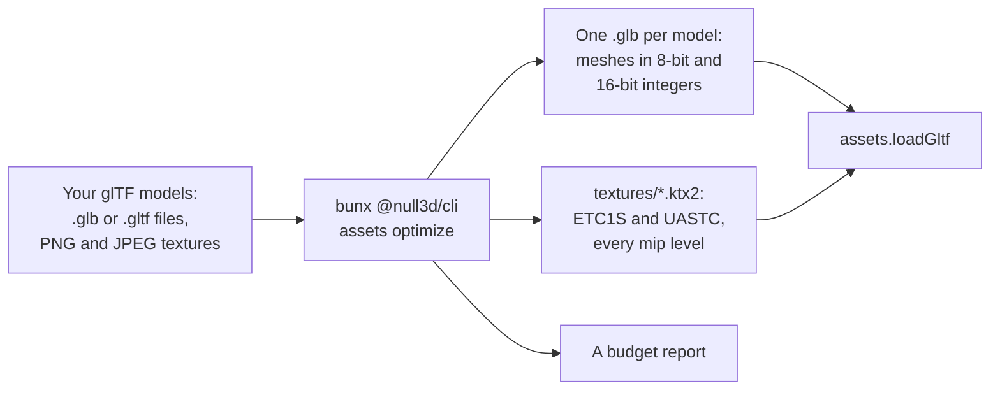

# The asset pipeline (the `assets` command)

> Ships in null3D 0.2. The command is experimental, so it can still change between versions. `assets optimize` and `assets env` are built. Not built yet: `assets convert`, `assets pack-orm` and `assets normal-from-bump`, and blocker meshes and prebuilt BVHs in the files. The engine does not draw levels of detail yet, so it draws the full mesh of a model made with `--lod`. The engine does not light scenes with the environment maps of `assets env` yet. Coding agents must not use these parts.



The `assets optimize` command makes glTF models smaller and faster to load and draw. It stores each mesh's vertices as small integers, in the order that the GPU reads them fastest. It encodes each texture as a KTX2 file, which the GPU keeps compressed. Your files download less, take less GPU memory and upload in fewer frames. The command runs on your computer before you publish, from npm, with nothing else to install. The same files give the same output bytes on every computer.

## Optimize a model

Give the command a model, or a folder of models, and a folder for the output:

```sh
bunx @null3d/cli assets optimize models/ public/models/
```

```text
BoomBox.glb: 10.1 MB to 2.2 MB (the model 107.0 KB), in 9.6 s
  draws 1 object of 1 part in 1 mesh: 6,036 triangles, 3,575 stored vertices
  size 0.0198 x 0.0195 x 0.0202
  4 textures: 2 of 2048x2048 etc1s srgb, 1 of 2048x2048 etc1s linear, 1 of 2048x2048 uastc linear
  texture memory: 13.3 MB with ETC2 and ASTC, 21.3 MB with BC7 only, 85.3 MB uncompressed
```

That is Khronos's BoomBox sample model, whose four PNG textures of 2048 x 2048 made most of its 10.1 MB.

Each `.glb` and `.gltf` file in the input folder and its subfolders becomes one `.glb` file in the output folder, at the same place. The textures of every model go into one `textures` folder in the output folder. Each texture file takes its name from its contents. So models that share a texture share its file, and a host can let browsers keep the files for good. Then load a model as any other:

```ts
// sketch.ts
const ship = await assets.loadGltf('/models/ship.glb');
scene.instantiate(ship);
```

| Option | Effect | Without it |
| --- | --- | --- |
| `--lod` | Adds levels of detail to each mesh of 256 triangles or more | No levels |
| `--max-texture-size <pixels>` | The largest side of a texture: a power of two up to 2048 | 2048 |
| `--texture-quality <size\|high>` | `high` encodes color and data maps in UASTC, several times larger than ETC1S, with less loss | `size` |
| `--compression <none\|meshopt>` | `none` leaves the file's buffers uncompressed | `meshopt` |
| `--jobs <count>` | The worker threads that encode textures | One per CPU core |
| `--report <file.json>` | Also writes the budget report as a JSON file | No file |

## What it does to meshes

| Data | In the output | Why |
| --- | --- | --- |
| Triangle order | Reordered for the GPU's vertex cache, and vertices in the order that triangles use them | The GPU shades fewer vertices and reads memory in order |
| Positions | 16-bit integers in 16,384 steps across each mesh, with `KHR_mesh_quantization` | Half the size of floats. A mesh 100 m long gets steps of 6 mm |
| Normals and tangents | 8-bit integers | A quarter of the size. Directions stay within about 1 degree |
| Texture coordinates | 16-bit integers when every value lies from 0 to 1, else floats | Values past 1 would need a texture transform per material |
| Vertex colors, joint weights | 8-bit integers | Weights still add up to one |
| Indices | 16 bits when a mesh has at most 65,535 vertices | Half the size |
| Buffers | Compressed with meshopt (`EXT_meshopt_compression`) | Smaller downloads. The engine decodes them on load, with no loss, and fetches the decoder only for such files |

The integers need a transform that turns them back into positions. The command puts it in the mesh's node when nothing else moves with the node. A node with children, a light, a camera or an animation keeps its transform. Its mesh then moves to a new child node of the same name. Each instance of an instancing node takes the transform too, and so do the bind matrices of a skin.

Models with Draco or meshopt compression load too. The command writes their meshes with meshopt, or with no compression when you give `--compression none`.

## Textures

The command encodes each PNG and JPEG texture of a model as a KTX2 file of Basis Universal data, with every mip level. KTX2 images that the model already had move to files of their own, unchanged. The engine turns each file into the compressed format that the device supports, as [Textures](../api/textures.md) lists.

| Texture | Format | Color space |
| --- | --- | --- |
| Base color and emissive maps | ETC1S, or UASTC with `--texture-quality high` | sRGB |
| Normal maps | UASTC always, since ETC1S blurs their detail | Linear |
| Metal-rough, occlusion and other maps | ETC1S, or UASTC with `--texture-quality high` | Linear |

Each side of a texture becomes its nearest power of two, and then both halve together until the longer side fits `--max-texture-size`. A 1000 x 600 image becomes 1024 x 512. Every level of a mip chain then halves exactly.

Textures are at most 2048 x 2048. The encoder is a 32-bit WebAssembly build, which refuses 4096 x 4096 images.

In 40 sets of photographed materials at 1024 x 1024, each ETC1S color map took about 110 KB to download. Each UASTC normal map took about 670 KB. On the GPU, ETC1S takes an eighth of the memory of RGBA8 where the device has ETC2, and UASTC takes a quarter.

## Levels of detail

`--lod` adds three levels to each mesh of 256 triangles or more, with about a half, a quarter and an eighth of its triangles. Each level shares the mesh's vertices, so only its indices add to the file. The levels go into the file with `MSFT_lod`, with the screen coverage at which each level's error falls under one pixel of a 1080-pixel screen. A level that would save little is left out.

The engine does not draw levels of detail yet, and draws the full mesh. three.js's `GLTFLoader` also ignores `MSFT_lod`.

## The budget report

| Line | What it says |
| --- | --- |
| First line | The model's files before and after, the `.glb` file alone, and the time the command took |
| `draws` | The objects that the scene draws, with each instance of an instancing node, the parts and meshes they draw, the triangles at full detail, and the vertices the file stores |
| `size` | The scene's size in its own units, from the meshes' bounds |
| Textures | Each group of textures that share a size, a format and a color space |
| `texture memory` | The textures' GPU memory with every mip level: where the GPU takes ETC2 and ASTC, as phones, tablets and Macs do; where it takes only BC7, as most Windows PCs do; and with no compressed format |

`--report` writes the same figures as JSON, with each texture's source size, output size and encode time.

## In a Vite project

The null3D Vite plugin runs the same steps on a model that a module imports with `?optimized`. The import gives the address of the optimized model:

```ts
// sketch.ts
import shipUrl from './models/ship.glb?optimized';

const ship = await assets.loadGltf(shipUrl);
```

The plugin uses the tool of `@null3d/cli`, so add the command-line tool to your project first:

```sh
bun add -d @null3d/cli
```

The first import of a model encodes it. The plugin keeps the result in `node_modules/.cache/null3d-assets`, keyed by the model's files, the tool's version and the options. Later starts and builds take it from there, until one of those changes. A production build writes the files into its assets folder. The plugin's `assets` option takes the command's options:

```ts
// vite.config.ts
import null3d from '@null3d/vite-plugin';
import { defineConfig } from 'vite';

export default defineConfig({
  plugins: [null3d({ assets: { lod: true, maxTextureSize: 1024 } })],
});
```

For TypeScript, add `@null3d/vite-plugin/client` to the `types` of your `tsconfig.json`, so `?optimized` imports have the type `string`.

## Environment maps

The `assets env` command turns an HDR image of the light around a point into an environment map. Metal and glossy surfaces reflect it, and every surface takes its diffuse light. The image is an equirectangular Radiance (`.hdr`) or OpenEXR (`.exr`) file, such as those of [Poly Haven](https://polyhaven.com/hdris):

```sh
bunx @null3d/cli assets env hdri/venice_sunset_2k.hdr public/env/venice.ktx2
```

```text
hdri/venice_sunset_2k.hdr to public/env/venice.ktx2, in 4.7 s
  cube map: 256 x 256 faces, rgb9e5ufloat, 6 levels for roughness 0.00, 0.11, 0.23, 0.37, 0.55, 1.00
  file: 2.0 MB; GPU memory: 2.0 MB
  average light: 0.509, 0.480, 0.611 (red, green, blue)
```

The output is one KTX2 file:

- A cube map. Level 0 holds the image. Each smaller level holds the light that a rougher surface reflects, filtered with the GGX distribution of the engine's materials. The smallest level has faces of 8 x 8 texels. More levels go to low roughness, where reflections change fastest.
- Nine spherical harmonics coefficients of the light, for diffuse surfaces, in the file's key-value data.

| Option | Effect | Without it |
| --- | --- | --- |
| `--size <texels>` | The width of the largest faces: a power of 2 from 32 to 2048 | 256 |
| `--format <format>` | `rgba16float` stores half floats, at twice the memory | `rgb9e5ufloat` |
| `--builtin room` | Writes the engine's built-in room instead of reading an image | An input file |

| Size | GPU memory, `rgb9e5ufloat` | For |
| --- | --- | --- |
| 128 | 512 KB | Rough and diffuse surfaces only |
| 256 | 2.0 MB | Most scenes |
| 512 | 8.0 MB | Mirror reflections that fill the screen |

Both formats filter on every GPU the engine supports. `rgb9e5ufloat` stores three 9-bit values with one shared exponent, in half the memory of `rgba16float`. In tests, the two formats differed by under a tenth of a step of 255 after tone mapping. Both hold light up to about 65,000, and the command clamps brighter texels, such as the middle of an unclipped sun.

three.js prefilters an HDR file in the browser on every visit, with `PMREMGenerator`. The command does it once, before you publish. Your page then downloads the filtered file and does no work before it draws. The same file gives the same bytes on every computer.

`--builtin room` writes the room that three.js's `RoomEnvironment` builds: a white room with six boxes, six glowing panels and one point light. The engine's package holds that file.

## Encode time

Each texture encodes on its own worker thread, so a set of textures uses every CPU core. On a MacBook Pro with 18 cores, those 40 sets, 144 textures in all, took 18 to 26 seconds. A texture of 2048 x 2048 takes several seconds on its core. The command prints each model's time.
