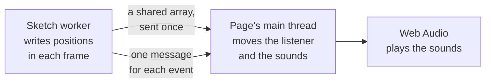

# Audio with Web Audio

> Roadmap step 0.1, first released in null3D 0.1.0. The API is experimental, so it can still change between versions.



null3D has no audio API of its own. Use the browser's Web Audio API on the page. This page shows how the sketch tells the page where the sounds are.

## Why audio stays on the page

A worker cannot create an `AudioContext`: the browser offers Web Audio on the page's main thread only. So the page plays the sound, and the sketch tells it where each sound is. The browser mixes the sound on a thread of its own, so the page's audio code has little to do. It moves the listener and the sounds to where the sketch put them.

The sketch tells the page two kinds of facts, in two ways:

| Fact | How it travels | Examples |
| --- | --- | --- |
| Positions that change in each frame | A shared array, which the sketch sends once | The camera, the engine of a moving car |
| Events | One message for each event | A footstep or an explosion |

## The sketch: write positions into a shared array

This sketch flies a drone in a circle in front of the camera. In each frame it writes the camera's position and direction, and the drone's position, into an array that the page also reads. Once per lap, it asks the page for a chime at the drone.

```ts
// sketch.ts
import { defineSketch, quat, vec3 } from '@null3d/engine';

const AHEAD = [0, 0, -1]; // a camera looks down its own -Z axis
const UP = [0, 1, 0];

export default defineSketch(({ scene, geometry, materials, page, time }) => {
  const camera = scene.createPerspectiveCamera({ fov: 60, position: [0, 2, 8], target: [0, 1, 0] });
  scene.setActiveCamera(camera);
  scene.createDirectionalLight({ direction: [-1, -2, -1], intensity: 3 });
  scene.createAmbientLight({ intensity: 0.4 });
  const drone = scene.createMesh({
    mesh: geometry.sphere({ radius: 0.3 }),
    material: materials.standard({ color: '#e8554e' }),
    dynamic: true,
  });

  // 12 numbers for the page: the listener's position, forward and up, then the drone's position.
  const bytes = 12 * Float32Array.BYTES_PER_ELEMENT;
  const positions = new Float32Array(
    crossOriginIsolated ? new SharedArrayBuffer(bytes) : new ArrayBuffer(bytes),
  );
  const listener = positions.subarray(0, 3);
  const forward = positions.subarray(3, 6);
  const up = positions.subarray(6, 9);
  const source = positions.subarray(9, 12);
  page.post('audio', positions); // sent once, in the setup

  const turn = quat.create();
  let laps = 0;
  return {
    onUpdate() {
      const angle = time.now * 0.8;
      drone.setPosition(Math.cos(angle) * 4, 1, Math.sin(angle) * 4);
      drone.getPosition(source);
      camera.getPosition(listener);
      camera.getRotation(turn);
      vec3.transformQuat(forward, AHEAD, turn);
      vec3.transformQuat(up, UP, turn);

      if (angle / (Math.PI * 2) >= laps + 1) {
        laps++;
        page.post('chime', [source[0], source[1], source[2]]); // one message for each event
      }
    },
  };
});
```

- In the threaded build, the page is cross-origin isolated, and the array lives in a `SharedArrayBuffer`. The page and the sketch worker then read and write the same memory, and no message travels in each frame.
- In the single-threaded build, the sketch runs on the page's thread, and messages are not copied. So a plain `ArrayBuffer` reaches the page as the same array. [Messages between sketch and page](../api/page.md) explains both builds.
- The `subarray` views are made once, in the setup. `onUpdate` writes through them and allocates nothing.
- `getPosition` and `getRotation` give values relative to the parent. This camera has no parent. For a camera under a parent, use `getWorldPosition` and `getWorldQuaternion`, which give the world transform of the last frame.

## The page: move the listener and the sounds

The page receives the array in the `onSketchMessage` option of `createEngine`, which hears the sketch's messages from the start of its setup. In each display frame, it moves the listener and the drone's hum.

```ts
// page.ts
import { createEngine } from '@null3d/engine';

let positions: Float32Array | undefined; // the sketch's array
let audio: AudioContext | undefined;
let hum: PannerNode | undefined; // follows the drone

// Browsers play sound only after the user interacts with the page.
addEventListener('pointerdown', () => {
  audio = new AudioContext();
  hum = new PannerNode(audio, { panningModel: 'HRTF', refDistance: 2 });
  hum.connect(audio.destination);
  const motor = new OscillatorNode(audio, { type: 'sawtooth', frequency: 110 });
  motor.connect(new GainNode(audio, { gain: 0.1 })).connect(hum);
  motor.start();
}, { once: true });

/** Plays a short tone at a point in the scene. */
function chime([x, y, z]: number[]) {
  if (!audio) return;
  const panner = new PannerNode(audio, { panningModel: 'HRTF', positionX: x, positionY: y, positionZ: z });
  panner.connect(audio.destination);
  const tone = new OscillatorNode(audio, { frequency: 880 });
  tone.connect(panner);
  tone.start();
  tone.stop(audio.currentTime + 0.2);
}

await createEngine({
  canvas: document.querySelector('canvas')!,
  sketch: new URL('./sketch.ts', import.meta.url),
  onSketchMessage(name, data) {
    if (name === 'audio') positions = data as Float32Array;
    if (name === 'chime') chime(data as number[]);
  },
});

// Once per display frame, move the listener and the hum to where the sketch put them.
function follow() {
  const p = positions;
  if (p && audio && hum) {
    audio.listener.setPosition(p[0], p[1], p[2]);
    audio.listener.setOrientation(p[3], p[4], p[5], p[6], p[7], p[8]);
    hum.positionX.value = p[9];
    hum.positionY.value = p[10];
    hum.positionZ.value = p[11];
  }
  requestAnimationFrame(follow);
}
requestAnimationFrame(follow);
```

- The browser does not let a page start sound before the user clicks, taps or presses a key. So the page makes its `AudioContext` on the first press.
- Firefox has no `positionX` on the listener, so the example uses `setPosition` and `setOrientation`, which every browser has. `PannerNode` has `positionX` in every browser.
- The page reads the array at any moment, so it can read some numbers from one frame and some from the next. That difference is too small to hear.
- The oscillators stand in for recorded sounds. For a recorded sound, decode the file once with `decodeAudioData`. Then play it through an `AudioBufferSourceNode` for each event.

## Pauses and hidden pages

`engine.setPaused(true)` stops the sketch's frames, but not the sound. Call `audio.suspend()` beside it, and `audio.resume()` when the engine resumes. The browser stops the engine's frames while the page is hidden, and Web Audio keeps playing then too. To mute a hidden page, suspend the context in a `visibilitychange` handler.

## Related pages

- [Messages between sketch and page](../api/page.md): `page.post`, `onSketchMessage` and the single-threaded build.
- [Using a physics library](physics.md): events from a physics world, such as a bounce.
- [Objects and transforms](../api/objects.md): `getPosition`, `getRotation` and their world forms.
- [Hosting and cross-origin isolation](../getting-started/hosting.md): when a page gets shared memory.
