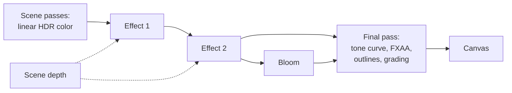

# Custom passes and render targets

> Ships in null3D 0.2. The API is experimental, so it can still change between versions. Custom effects and custom tone curves are built. Custom passes with `render.addPass`, render targets and `textures.fromPass` are not built yet, so coding agents must not use them.



A custom effect is a full-screen pass of your own WGSL. It reads the scene's color, and its depth if it asks for it, and writes a new color for each pixel. Effects run after the scene passes, on linear HDR color, before bloom and the tone curve. A custom tone curve takes the place of the built-in curves in the final pass.

## Custom effects

An effect's WGSL declares one function, which the engine calls for each pixel:

```ts
const tint = /* wgsl */ `
struct Uniforms { color: vec3f, amount: f32 }

fn effect(input: EffectInput) -> vec4f {
    let tinted = mix(input.color.rgb, input.color.rgb * uniforms.color, uniforms.amount);
    return vec4f(tinted, input.color.a);
}
`;

// In the setup:
const effect = post.addEffect({ wgsl: tint, uniforms: { color: '#ffb070', amount: 0.5 } });

// Later, as often as every frame:
post.setEffectUniform(effect, 'amount', 0.8);

// To stop it:
post.removeEffect(effect);
```

The null3D Vite plugin compiles the WGSL, as it compiles custom materials ([Custom shaders](custom-shaders.md)). Write it in a template literal right after a `/* wgsl */` comment, or import it from a `.wgsl` file. The plugin stops the build at the line and column of a problem. WGSL as plain text throws E1215.

### What an effect reads

The function takes an `EffectInput`:

| Field | Type | Meaning |
| --- | --- | --- |
| `color` | `vec4f` | The pixel's color: linear HDR color after the exposure, multiplied by its coverage, which alpha holds. |
| `uv` | `vec2f` | The pixel's place on the image, from (0, 0) at the top left to (1, 1) at the bottom right. |
| `pixel` | `vec2f` | The pixel's center in pixels, from the top left. |
| `size` | `vec2f` | The image's size in pixels, at the render scale. |
| `time` | `f32` | The sketch time in seconds. |

It returns the new color in the same form: linear, and multiplied by coverage. Keep alpha as `input.color.a` unless the effect changes what covers the pixel.

The effect can also call these functions:

| Function | Returns |
| --- | --- |
| `effectColor(uv: vec2f) -> vec4f` | The image's color at `uv`, read with a linear filter. Places outside the image read its edge. |
| `effectPixel(pixel: vec2i) -> vec4f` | The color of one pixel, counted from the top left. A pixel outside the image reads the nearest one inside. |
| `effectDepth(uv: vec2f) -> f32` | The scene's depth at `uv`: 1 at the camera's near plane, 0 at its far plane, and 0 where nothing drew. |
| `effectViewPosition(uv: vec2f) -> vec3f` | The position of the surface at `uv` in view space. Its z is negative in front of the camera, as in three.js. |
| `effectDistance(uv: vec2f) -> f32` | How far in front of the camera the surface at `uv` lies, in world units. |

An effect that calls one of the depth functions reads the scene's depth on every GPU path. An effect that calls none costs no depth read.

Effects import from the shader library as materials do, such as `#import null3d::noise::{random2}`. Do not declare `uniforms`, or a name that starts with `effect`: the engine's effect template uses them.

### Uniforms

Declare uniforms as `struct Uniforms`, and read them as `uniforms.name`. The rules are those of custom materials:

- The types are `f32`, `i32`, `u32`, `vec2f`, `vec3f` and `vec4f`, in at most 32 numbers. Each `vec3f` and `vec4f` starts a group of four.
- A `vec3f` also takes a color string or a hex number, which the engine converts from sRGB to linear.
- The `uniforms` option gives the first values, and a uniform without one starts at 0.
- TypeScript types the `uniforms` option and `setEffectUniform` from the struct, so a wrong name fails the type check. At run time a wrong name or value throws E1216.
- `setEffectUniform` allocates nothing, so a sketch can call it every frame. Keep a vector's values in one array that the sketch changes in place, rather than a new array each frame.

Effects take no textures.

### Order

Effects run from the lowest `order` to the highest. Effects of the same order run in the order the sketch added them. The default order is 0.

```ts
post.addEffect({ wgsl: fog, order: 1 });
post.addEffect({ wgsl: grain, order: 2 }); // runs after the fog
```

At most 8 effects run at once. A ninth throws E1213.

### Example: fog by distance

This effect reads the scene's depth and fades each pixel toward a color with its distance from the camera:

```ts
const fog = /* wgsl */ `
struct Uniforms { color: vec3f, density: f32 }

fn effect(input: EffectInput) -> vec4f {
    let fade = 1.0 - exp(-effectDistance(input.uv) * uniforms.density);
    return vec4f(mix(input.color.rgb, uniforms.color * input.color.a, fade), input.color.a);
}
`;

post.addEffect({ wgsl: fog, uniforms: { color: '#b0c4d8', density: 0.04 } });
```

The background has no depth, so its distance is infinite and it takes the fog's full color. Built-in fog from `scene.setFog` costs less, because it needs no pass. Use an effect when the fog needs a rule of its own.

### Example: a color split

This effect reads the pixels beside each pixel, so it shifts red one way and blue the other:

```ts
const split = /* wgsl */ `
struct Uniforms { shift: f32 }

fn effect(input: EffectInput) -> vec4f {
    let step = vec2f(uniforms.shift / input.size.x, 0.0);
    let red = effectColor(input.uv + step).r;
    let blue = effectColor(input.uv - step).b;
    return vec4f(red, input.color.g, blue, input.color.a);
}
`;

post.addEffect({ wgsl: split, uniforms: { shift: 3 } });
```

### Cost

- A full-screen pass reads and writes 8 bytes per pixel of the render size, in `rgba16float`. On a phone at full resolution each pass costs tens of megabytes of memory traffic per frame.
- The engine joins effects to save passes. An effect that reads only its own pixel joins the pass of the effect before it: the pass runs both, one after the other, for each pixel. So you need not join such effects into one function yourself.
- An effect that calls `effectPixel` or `effectColor` reads other pixels of the color before it. So it starts a pass of its own. The effects after it can join it. Depth reads do not stop an effect from joining.
- The last pass of effects folds into the final pass when nothing reads the image between them. That needs bloom and FXAA off, and a render scale of 1. One effect that reads only its own pixel then costs no pass of its own.
- A joined pass needs a shader that the engine makes from the effects' WGSL. It builds in the background after the effects' own shaders. Until it is built, each effect draws a pass of its own, so no frame waits for it.
- Some browsers cannot compile WebGL2 shaders in the background, such as Chrome on the Android phones tested. On WebGL2 they join only the effects that are there before the first frame. Effects added or reordered later draw a pass each there. A joined shader would hold up a frame while it compiles. Add your effects before the first frame to get the joined passes on those devices. Development builds tell you once in the console when this happens.
- Between joined effects the color keeps 32-bit precision instead of the 16 bits of a target. So the image can differ from separate passes in the last bits.
- The effects share two targets, whatever their number. They follow the render scale, so a new scale makes no new target.
- A depth read costs one texture read per call. The scene's render pass then keeps its depth in memory.
- Adding or removing an effect changes the frame's passes. A new effect's pipeline builds while the last image stays on screen, as a custom material's does.

### Devices without HDR color

Effects need HDR color, as bloom does. In WebGPU's compatibility mode with MSAA, the first effect moves the engine to HDR color with FXAA, for the rest of its life. On a WebGL2 device whose float targets fail the engine's test, effects stay off, and development builds warn once. [The post-processing chain](../concepts/post-processing.md#effects-on-devices-without-hdr-color) explains both cases.

A debug view, such as `debug.view('normals')`, turns effects off while it draws.

## Custom tone curves

A custom tone curve replaces the built-in curves (`'aces'`, `'agx'`, `'neutral'` and `'none'`). Its WGSL declares one function, and `post.set` takes it as `toneMapping`:

```ts
// Reinhard's curve, as three.js's ReinhardToneMapping draws it.
const reinhard = /* wgsl */ `
fn toneCurve(color: vec3f) -> vec3f {
    return color / (vec3f(1.0) + color);
}
`;

post.set({ toneMapping: reinhard });
// Back to a built-in curve:
post.set({ toneMapping: 'aces' });
```

- The final pass calls the curve for each pixel, with its linear color after the exposure and bloom. It clamps what the curve returns to 0 to 1. Then it encodes sRGB, dithers, paints outlines and applies the color grading table and the vignette.
- A curve takes no uniforms. The exposure from `post.set` already scales its input.
- A curve needs HDR color, as effects do. On a device with no HDR target, the built-in curve stays.
- The final pass builds again with the curve, so the first frame with a new curve waits for its pipeline.

## Errors

| Code | Cause |
| --- | --- |
| E1215 | WGSL that the null3D Vite plugin did not compile, or compiled WGSL of another kind, such as a material's. |
| E1216 | A uniform that the WGSL does not declare, or a value of the wrong kind. |
| E1213 | A ninth effect. |
| E1203 | An `order` that is not a number. |
| E1101 | `setEffectUniform` on an effect that `removeEffect` removed. |

## Related pages

- [Post-processing API](../api/post.md): `post.addEffect`, `post.setEffectUniform`, `post.removeEffect` and `post.set`.
- [The post-processing chain](../concepts/post-processing.md): where effects run, and the built-in effects.
- [Custom shaders](custom-shaders.md): the WGSL build, uniforms and the shader library.
- [Porting post-processing](../porting/threejs-postprocessing.md): three.js's `ShaderPass` and effect passes.
