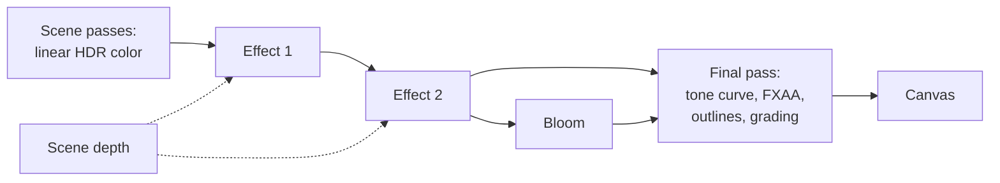
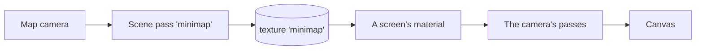

# Custom passes and render targets

> Ships in null3D 0.2. The API is experimental, so it can still change between versions. Custom effects, custom tone curves, and scene and reflection passes that draw into textures with `render.addPass` and `textures.fromPass` are built. Full-screen passes of your own WGSL with `render.addPass` are not built yet, so coding agents must not use them.



A custom effect is a full-screen pass of your own WGSL. It reads the scene's color, and its depth if it asks for it, and writes a new color for each pixel. Effects run after the scene passes, on linear HDR color, before bloom and the tone curve. A custom tone curve takes the place of the built-in curves in the final pass. A scene pass draws the scene from another camera into a texture, which materials show: see [Render to a texture](#render-to-a-texture).

## Custom effects

An effect's WGSL declares one function, which the engine calls for each pixel:

```ts
const tint = /* wgsl */ `
struct Uniforms { color: vec3f, amount: f32 }

fn effect(input: EffectInput) -> vec4f {
    let tinted = mix(input.color.rgb, input.color.rgb * uniforms.color, uniforms.amount);
    return vec4f(tinted, input.color.a);
}
`;

// In the setup:
const effect = post.addEffect({ wgsl: tint, uniforms: { color: '#ffb070', amount: 0.5 } });

// Later, as often as every frame:
post.setEffectUniform(effect, 'amount', 0.8);

// To stop it:
post.removeEffect(effect);
```

The null3D Vite plugin compiles the WGSL, as it compiles custom materials ([Custom shaders](custom-shaders.md)). Write it in a template literal right after a `/* wgsl */` comment, or import it from a `.wgsl` file. The plugin stops the build at the line and column of a problem. WGSL as plain text throws E1215.

### What an effect reads

The function takes an `EffectInput`:

| Field | Type | Meaning |
| --- | --- | --- |
| `color` | `vec4f` | The pixel's color: linear HDR color after the exposure, multiplied by its coverage, which alpha holds. |
| `uv` | `vec2f` | The pixel's place on the image, from (0, 0) at the top left to (1, 1) at the bottom right. |
| `pixel` | `vec2f` | The pixel's center in pixels, from the top left. |
| `size` | `vec2f` | The image's size in pixels, at the render scale. |
| `time` | `f32` | The sketch time in seconds. |

It returns the new color in the same form: linear, and multiplied by coverage. Keep alpha as `input.color.a` unless the effect changes what covers the pixel.

The effect can also call these functions:

| Function | Returns |
| --- | --- |
| `effectColor(uv: vec2f) -> vec4f` | The image's color at `uv`, read with a linear filter. Places outside the image read its edge. |
| `effectPixel(pixel: vec2i) -> vec4f` | The color of one pixel, counted from the top left. A pixel outside the image reads the nearest one inside. |
| `effectDepth(uv: vec2f) -> f32` | The scene's depth at `uv`: 1 at the camera's near plane, 0 at its far plane, and 0 where nothing drew. |
| `effectViewPosition(uv: vec2f) -> vec3f` | The position of the surface at `uv` in view space. Its z is negative in front of the camera, as in three.js. |
| `effectDistance(uv: vec2f) -> f32` | How far in front of the camera the surface at `uv` lies, in world units. |

An effect that calls one of the depth functions reads the scene's depth on every GPU path. An effect that calls none costs no depth read.

Effects import from the shader library as materials do, such as `#import null3d::noise::{random2}`. Do not declare `uniforms`, or a name that starts with `effect`: the engine's effect template uses them.

### Uniforms

Declare uniforms as `struct Uniforms`, and read them as `uniforms.name`. The rules are those of custom materials:

- The types are `f32`, `i32`, `u32`, `vec2f`, `vec3f` and `vec4f`, in at most 32 numbers. Each `vec3f` and `vec4f` starts a group of four.
- A `vec3f` also takes a color string or a hex number, which the engine converts from sRGB to linear.
- The `uniforms` option gives the first values, and a uniform without one starts at 0.
- TypeScript types the `uniforms` option and `setEffectUniform` from the struct, so a wrong name fails the type check. At run time a wrong name or value throws E1216.
- `setEffectUniform` allocates nothing, so a sketch can call it every frame. Keep a vector's values in one array that the sketch changes in place, rather than a new array each frame.

Effects take no textures.

### Order

Effects run from the lowest `order` to the highest. Effects of the same order run in the order the sketch added them. The default order is 0.

```ts
post.addEffect({ wgsl: fog, order: 1 });
post.addEffect({ wgsl: grain, order: 2 }); // runs after the fog
```

At most 8 effects run at once. A ninth throws E1213.

### Example: fog by distance

This effect reads the scene's depth and fades each pixel toward a color with its distance from the camera:

```ts
const fog = /* wgsl */ `
struct Uniforms { color: vec3f, density: f32 }

fn effect(input: EffectInput) -> vec4f {
    let fade = 1.0 - exp(-effectDistance(input.uv) * uniforms.density);
    return vec4f(mix(input.color.rgb, uniforms.color * input.color.a, fade), input.color.a);
}
`;

post.addEffect({ wgsl: fog, uniforms: { color: '#b0c4d8', density: 0.04 } });
```

The background has no depth, so its distance is infinite and it takes the fog's full color. Built-in fog from `scene.setFog` costs less, because it needs no pass. Use an effect when the fog needs a rule of its own.

### Example: a color split

This effect reads the pixels beside each pixel, so it shifts red one way and blue the other:

```ts
const split = /* wgsl */ `
struct Uniforms { shift: f32 }

fn effect(input: EffectInput) -> vec4f {
    let step = vec2f(uniforms.shift / input.size.x, 0.0);
    let red = effectColor(input.uv + step).r;
    let blue = effectColor(input.uv - step).b;
    return vec4f(red, input.color.g, blue, input.color.a);
}
`;

post.addEffect({ wgsl: split, uniforms: { shift: 3 } });
```

### Cost

- A full-screen pass reads and writes 8 bytes per pixel of the render size, in `rgba16float`. On a phone at full resolution each pass costs tens of megabytes of memory traffic per frame.
- The engine joins effects to save passes. An effect that reads only its own pixel joins the pass of the effect before it: the pass runs both, one after the other, for each pixel. So you need not join such effects into one function yourself.
- An effect that calls `effectPixel` or `effectColor` reads other pixels of the color before it. So it starts a pass of its own. The effects after it can join it. Depth reads do not stop an effect from joining.
- The last pass of effects folds into the final pass when nothing reads the image between them. That needs bloom and FXAA off, and a render scale of 1. One effect that reads only its own pixel then costs no pass of its own.
- A joined pass needs a shader that the engine makes from the effects' WGSL. It builds in the background after the effects' own shaders. Until it is built, each effect draws a pass of its own, so no frame waits for it.
- Some browsers cannot compile WebGL2 shaders in the background, such as Chrome on the Android phones tested. On WebGL2 they join only the effects that are there before the first frame. Effects added or reordered later draw a pass each there. A joined shader would hold up a frame while it compiles. Add your effects before the first frame to get the joined passes on those devices. Development builds tell you once in the console when this happens.
- Between joined effects the color keeps 32-bit precision instead of the 16 bits of a target. So the image can differ from separate passes in the last bits.
- The effects share two targets, whatever their number. They follow the render scale, so a new scale makes no new target.
- A depth read costs one texture read per call. The scene's render pass then keeps its depth in memory.
- Adding or removing an effect changes the frame's passes. A new effect's pipeline builds while the last image stays on screen, as a custom material's does.

### Devices without HDR color

Effects need HDR color, as bloom does. In WebGPU's compatibility mode with MSAA, the first effect moves the engine to HDR color with FXAA, for the rest of its life. On a WebGL2 device whose float targets fail the engine's test, effects stay off, and development builds warn once. [The post-processing chain](../concepts/post-processing.md#effects-on-devices-without-hdr-color) explains both cases.

A debug view, such as `debug.view('normals')`, turns effects off while it draws.

## Custom tone curves

A custom tone curve replaces the built-in curves (`'aces'`, `'agx'`, `'neutral'` and `'none'`). Its WGSL declares one function, and `post.set` takes it as `toneMapping`:

```ts
// Reinhard's curve, as three.js's ReinhardToneMapping draws it.
const reinhard = /* wgsl */ `
fn toneCurve(color: vec3f) -> vec3f {
    return color / (vec3f(1.0) + color);
}
`;

post.set({ toneMapping: reinhard });
// Back to a built-in curve:
post.set({ toneMapping: 'aces' });
```

- The final pass calls the curve for each pixel, with its linear color after the exposure, bloom and the vignette. It clamps what the curve returns to 0 to 1. Then it encodes sRGB, paints outlines, applies the color grading table and dithers.
- A curve takes no uniforms. The exposure from `post.set` already scales its input.
- A curve needs HDR color, as effects do. On a device with no HDR target, the built-in curve stays.
- The final pass builds again with the curve, so the first frame with a new curve waits for its pipeline.

## Render to a texture

A scene pass draws the scene from a camera of your own into a texture, as three.js's `WebGLRenderTarget` with `renderer.setRenderTarget` does. `textures.fromPass` gives the texture to any material or sprite.



```ts
const mapCamera = scene.createOrthographicCamera({ height: 40, near: 1, far: 100, position: [0, 50, 0] });
mapCamera.setRotationEuler(-Math.PI / 2, 0, 0);

const map = render.addPass({ kind: 'scene', camera: mapCamera, writes: 'minimap', size: [256, 256] });
const screen = materials.unlit({ map: textures.fromPass(map) });
scene.createMesh({ mesh: geometry.plane({ width: 2, height: 2 }), material: screen, position: [0, 1, -4] });
```

The pass is a declaration. No sketch code runs while it draws, and the render graph orders it before the passes that show its texture. [Render graph API](../api/render.md) lists every option. The [security camera demo](https://github.com/null3d-engine/null3d/tree/main/examples/security-camera) shows a camera's view on a monitor this way, with a camera that turns every frame.

### Layers and what a pass shows

- A pass draws the objects on its camera's layers, or on the layers of its `layers` option. Put the player's own model on a layer that a security camera does not draw, for example.
- A pass never draws an object whose material shows its own texture. A minimap's screen, inside the map camera's view, does not appear in the minimap.
- An object that shows another pass's texture draws in a pass only when that pass names the texture in `reads`. The pass then runs after the other one.

```ts
const hall = render.addPass({ kind: 'scene', camera: hallCamera, writes: 'hall', size: [512, 288] });
// The guard room's camera sees the monitor that shows the hall.
const guard = render.addPass({
  kind: 'scene',
  camera: guardCamera,
  writes: 'guardRoom',
  size: [512, 288],
  reads: ['hall'],
});
```

A pass reads only the textures of passes added before it, so passes cannot read each other in a loop. A pass that names its own texture in `reads` throws E1504.

### Drawing less often

A pass that need not change every frame can draw every few frames. Its texture keeps the last image while the pass is off:

```ts
let frame = 0;
return {
  onUpdate() {
    frame++;
    render.setPassEnabled(map, frame % 4 === 0);
  },
};
```

### What a scene pass draws

A scene pass draws with the scene's materials, the sun and its shadows where the camera's shadow cascades reach. It draws the ambient and hemisphere lights, the environment's light and the fog. It also draws the point and spot lights that its camera sees. In this version it draws no ambient occlusion and no sky background. Its texture clears to `clearColor`, or to the scene's background color.

A point or spot light casts its shadow in a pass when the camera's view gives it a shadow. The engine gives shadows only to the lights that the camera sees. So a light that only the pass sees lights the pass without a shadow. Reflection passes draw these lights the same way. A pass that sees a point or spot light keeps its own list of lights, as the camera's view does. The list takes under 1 MB of memory. A pass that sees none keeps no list.

The texture holds linear color after the exposure, so a material that shows it gives the camera the light that the pass saw. On devices that draw 8-bit color, each material tone maps its own color. In compatibility mode with MSAA, the texture holds that color turned back to linear, so the tone curve applies twice and the image looks a little lighter in the middle tones. On WebGL2 devices without float targets, the texture holds display color, which looks brighter and flatter.

## Reflections

A reflection pass draws the camera's view mirrored across a plane into a texture, as three.js's `Reflector` add-on does. Everything below the plane is clipped. A custom material reads the texture where its surface shows on the screen, so water and polished floors reflect what stands on them. [Render graph API](../api/render.md#reflection-passes) lists the options, and [Surface functions](../shaders/surface-functions.md#reflections) the WGSL side.

```ts
const pass = render.addPass({ kind: 'reflection', writes: 'water', plane: { point: [0, 0, 0] } });
const water = materials.shader({ wgsl: waterWgsl, textures: { mirror: textures.fromPass(pass) } });
```

- The pass follows the active camera. The quality preset sets its size: half the render size each way on Medium and High.
- The surface function puts the pass's color in the surface's `reflection`. The engine's lighting then weighs it with the material's Fresnel, so water reflects little straight down and much at a low angle.
- `scale: 1` gives a sharp mirror. `every: 2` draws the reflection in every other frame, for a camera that moves slowly.
- A reflection draws the scene's background and the sun's light and shadows. It draws no point or spot lights and no ambient occlusion yet.

### A water recipe

This surface function makes a stream. It has ripples that move, a tint that deepens with the depth, foam at the banks, and the reflection of the banks and the sky. It needs the height of the bed under each point of the water. A terrain made in code gives it with the same function that shapes the terrain. A loaded terrain gives it with a height map texture, which the function samples instead.

```ts
const waterWgsl = /* wgsl */ `
#import null3d::noise::{fbm2}
#import null3d::reflection::{reflection_uv}

var mirror: texture_2d<f32>;

struct Uniforms {
    shallow: vec3f,
    level: f32,
    deep: vec3f,
    clarity: f32,
    foam: vec3f,
    ripple: f32,
}

/// The height of the bed under a point of the water: here a channel 1.5 m deep in its middle.
/// Use the function that shapes your terrain, or sample its height map.
fn bedHeight(p: vec2f) -> f32 {
    return -1.5 * exp(-p.x * p.x * 0.08);
}

/// The water's normal at a point: the slopes of three sine waves that cross it as time passes.
fn ripples(p: vec2f, time: f32) -> vec3f {
    let waves = array<vec4f, 3>(
        vec4f(0.8, 0.6, 3.1, 1.3),
        vec4f(-0.5, 0.9, 4.7, 1.9),
        vec4f(0.95, -0.3, 7.3, 2.6),
    );
    var slope = vec2f(0.0);
    for (var k = 0u; k < 3u; k++) {
        let along = normalize(waves[k].xy);
        let phase = dot(along, p) * waves[k].z + time * waves[k].w;
        slope += along * cos(phase) / waves[k].z;
    }
    slope *= material.ripple;
    return normalize(vec3f(-slope.x, 1.0, -slope.y));
}

fn surface(input: SurfaceInput) -> Surface {
    var s = defaultSurface(input);
    let p = input.worldPosition.xz;
    s.normal = ripples(p, frame.time);
    // Shallow water shows the bed's color, and deep water its own.
    let depth = max(material.level - bedHeight(p), 0.0);
    s.baseColor = mix(material.shallow, material.deep, 1.0 - exp(-depth * material.clarity));
    // Foam where the water thins at the banks, broken up by noise that drifts.
    let edge = 1.0 - smoothstep(0.0, 0.3, depth);
    let froth = edge * smoothstep(0.1, 0.4, fbm2(p * 3.0 + frame.time * 0.4, 3u));
    s.baseColor = mix(s.baseColor, material.foam, froth);
    s.roughness = mix(s.roughness, 0.9, froth);
    // The reflection, moved by the ripples' tilt, and hidden under the foam.
    let clip = camera.viewProjection * vec4f(input.relativePosition, 1.0);
    let uv = reflection_uv(clip, s.normal.xz * 0.05);
    s.reflection = vec4f(textureSampleLevel(mirror, mirrorSampler, uv, 0.0).rgb, 1.0 - froth);
    return s;
}
`;

// In the setup:
const level = 0;
const pass = render.addPass({ kind: 'reflection', writes: 'stream', plane: { point: [0, level, 0] } });
const stream = materials.shader({
  wgsl: waterWgsl,
  roughness: 0.05,
  uniforms: {
    shallow: '#5a7a5c',
    deep: '#0b2a33',
    foam: '#e8eef0',
    level,
    clarity: 1.2,
    ripple: 0.25,
  },
  textures: { mirror: textures.fromPass(pass) },
});
const surface = scene.createMesh({ mesh: geometry.plane({ width: 8, height: 40 }), material: stream });
surface.setRotationEuler(-Math.PI / 2, 0, 0);
```

- `level` is the water's height, the same as the plane's point. `clarity` sets how fast the tint deepens. A larger value makes shallow water darker.
- `ripple` sets how far the waves tilt the normal. The tilt bends the reflection and the sun's highlights.
- The foam hides the reflection where it lies, through the reflection's share in `a`.
- The water is opaque, so the bed does not show through it. The shallow tint stands in for the bed's color.
- Waves that move the surface's vertices need `setBounds`, as [Culling](../concepts/culling.md) explains. The reflection's plane stays flat, which suits small waves.

## Errors

| Code | Cause |
| --- | --- |
| E1215 | WGSL that the null3D Vite plugin did not compile, or compiled WGSL of another kind, such as a material's. |
| E1216 | A uniform that the WGSL does not declare, or a value of the wrong kind. |
| E1213 | A ninth effect. |
| E1203 | An `order` that is not a number. |
| E1101 | `setEffectUniform` on an effect that `removeEffect` removed, or a call on a render pass that `render.removePass` removed. |
| E1220 | Options that `render.addPass` does not take, such as a reflection's plane without a point, or a texture name that another pass writes. |
| E1502 | A name in `reads` that no pass writes. |
| E1503 | A `writes` name that the engine's own passes write, such as `sceneColor`. |
| E1504 | A pass that reads its own texture. |

## Related pages

- [Post-processing API](../api/post.md): `post.addEffect`, `post.setEffectUniform`, `post.removeEffect` and `post.set`.
- [Render graph API](../api/render.md): `render.addPass`, `render.setPassEnabled`, `render.removePass` and `render.dumpGraph`.
- [The security camera demo](https://github.com/null3d-engine/null3d/tree/main/examples/security-camera): a scene pass whose texture a monitor shows.
- [The post-processing chain](../concepts/post-processing.md): where effects run, and the built-in effects.
- [Custom shaders](custom-shaders.md): the WGSL build, uniforms and the shader library.
- [Porting post-processing](../porting/threejs-postprocessing.md): three.js's `ShaderPass` and effect passes.
