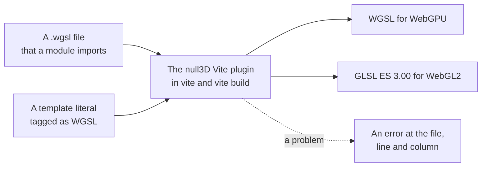

# Custom shaders

> Ships in null3D 0.1, with typed uniforms, textures and hot reload in 0.2. The API is experimental, so it can still change between versions. Custom materials with surface functions, vertex offsets, uniforms, textures and full shaders are built, and so is hot reload on the dev server.



You write each null3D shader once, in WGSL. The null3D Vite plugin compiles the WGSL in your code while Vite serves or builds the project. Each shader becomes WGSL for WebGPU and GLSL ES 3.00 for WebGL2, so the page never downloads a shader translator.

## Custom materials

A custom material keeps the engine's lighting and changes how its surface looks. Its WGSL declares a surface function, which fills a surface record for each pixel. `materials.shader` takes the compiled WGSL and every option of `materials.standard`:

```ts
// sketch.ts
const rings = /* wgsl */ `
fn surface(input: SurfaceInput) -> Surface {
    var s = defaultSurface(input);
    let ring = step(0.5, fract(input.uv.y * 6.0));
    s.baseColor = mix(s.baseColor, vec3f(1.0), ring);
    return s;
}
`;

// In the setup:
const red = materials.shader({ wgsl: rings, color: '#e04040', roughness: 0.5 });
```

The WGSL can declare uniforms as `struct Uniforms`, which `set()` changes at any time. It can declare textures as `var name: texture_2d<f32>;`, which the `textures` option gives. A vertex offset, `fn vertexOffset`, moves the mesh's vertices. [Surface functions](../shaders/surface-functions.md) describes the surface input, the surface record, `defaultSurface`, uniforms, textures and vertex offsets. [Built-in shader inputs](../shaders/builtins.md) lists the values that every custom material reads, such as `frame.time`.

## Full shaders

A full shader draws a custom material with WGSL of your own from end to end: a `@vertex` and a `@fragment` entry point. Use it for a look that the engine's lighting cannot give, such as a hologram. The engine gives a full shader its meshes, its instances and the frame's values, but no lighting, shadows or fog.

```ts
// sketch.ts
const hologram = /* wgsl */ `
#import null3d::builtins::{fill_builtins, frame}
#import null3d::mesh::{InstanceIn, clip_position, find_instance, finish}
#import null3d::mesh::{relative_position, world_normal}
#import null3d::vertex::{mesh_position}

struct Varyings {
    @builtin(position) clip: vec4f,
    @location(0) relative: vec3f,
    @location(1) normal: vec3f,
}

@vertex
fn vs(@location(0) position: vec3f, @location(1) normal: vec3f, i: InstanceIn) -> Varyings {
    let found = find_instance(i);
    let p = mesh_position(position);
    var out: Varyings;
    out.relative = relative_position(found, p);
    out.clip = clip_position(found, p);
    out.normal = world_normal(found, normal);
    return out;
}

@fragment
fn fs(in: Varyings) -> @location(0) vec4f {
    fill_builtins(vec3f(0.0));
    let rim = 1.0 - abs(dot(normalize(in.normal), normalize(-in.relative)));
    let lines = step(0.5, fract(in.relative.y * 8.0 - frame.time));
    return finish(vec3f(0.2, 0.8, 1.0) * (rim * rim * 1.5 + lines * 0.25), in.clip.xy);
}
`;

// In the setup:
const ghost = materials.shader({ wgsl: hologram, doubleSided: true });
```

The plugin takes WGSL as a full shader when its `@vertex` entry point takes an `InstanceIn`. The shader follows these rules:

- It has one `@vertex` and one `@fragment` entry point.
- The vertex entry point reads the mesh at the engine's locations. The position is at 0, the normal at 1, the first texture coordinates at 2 and the second at 3. The tangent is at 4, and the color at 5. The joints are at 6, as a `vec4u`, and the weights at 7. A mesh draws only when it has every attribute that the shader reads.
- Pass the position through `mesh_position`, and texture coordinates through `mesh_uv` and `mesh_second_uv`, from `null3d::vertex`. They give the values that the mesh holds on every GPU path. WebGPU reads plain integer attributes as fractions, and these functions scale them back. Floats and normalized integers pass through unchanged.
- It finds its instance with `InstanceIn` and `find_instance` from `null3d::mesh`. On each GPU path, the engine gives each instance's transform in its own way, and these hide the difference.
- `null3d::mesh` also gives `clip_position(found, position)`, `relative_position(found, position)` and `world_normal(found, normal)`. Positions are relative to the camera, as in the engine's own shaders.
- The fragment entry point writes its linear color through `finish(color, clip.xy)` from `null3d::mesh`, which prepares it for the engine's output. `finish` multiplies the color by the exposure, as the engine does with an unlit material's color. The engine exposes the frame's lights already. So a shader that adds their light writes that sum through `finish_exposed` instead.
- `fill_builtins(origin)` from `null3d::builtins` fills `frame`, `camera` and `object` in a stage. Pass the object's origin relative to the camera, or zero when the shader does not read `object`.
- The fixed options for faces and depth apply, such as `doubleSided` and `depthBias`. The standard values, uniforms and textures do not reach a full shader. `vertexColors` and the `mask` alpha mode change nothing. The shader reads the colors and discards pixels itself. The build stops at a texture that a full shader declares.

## WGSL in sketch code

The plugin compiles WGSL in two forms. The first is a `.wgsl` file that a module imports:

```ts
// sketch.ts
import glow from './shaders/glow.wgsl';
```

The import gives the compiled shader. To import the file's text instead, add `?raw` to the path, as Vite allows for any file.

The second form is a template literal after a `/* wgsl */` comment:

```ts
// sketch.ts
const glow = /* wgsl */ `
#import null3d::color

@vertex
fn vs_main(@builtin(vertex_index) index: u32) -> @builtin(position) vec4f {
    let corner = vec2f(f32((index << 1u) & 2u), f32(index & 2u));
    return vec4f(corner * 2.0 - 1.0, 0.0, 1.0);
}

@fragment
fn fs_main() -> @location(0) vec4f {
    return vec4f(null3d::color::linear_to_srgb(vec3f(0.5)), 1.0);
}
`;
```

The plugin puts the compiled shader where the literal was. Your code therefore receives a compiled shader, although TypeScript still sees a string. TypeScript reads the uniforms from that string, as [Typed uniforms](#typed-uniforms) explains. The tag follows these rules:

- The comment comes directly before the literal. Spaces and line breaks may come between them.
- The literal cannot hold `${...}`. The plugin compiles the WGSL before any of your code runs, so write each value in the WGSL itself.
- The plugin compiles every tagged literal in your own files, and leaves the packages in `node_modules` alone. Remove the tag from WGSL that null3D does not draw, such as WGSL for another library.

## What the plugin compiles

The plugin compiles two kinds of WGSL:

- WGSL without entry points that declares `fn surface`, `fn vertexOffset` or both is a custom material's WGSL. The plugin builds it into the standard material's shader, once for each of that shader's variants.
- WGSL whose `@vertex` entry point takes an `InstanceIn` is a [full shader](#full-shaders) of a custom material. The plugin builds it for WebGPU, and for WebGL2 with and without multi-draw.
- Other WGSL with entry points is a whole shader. It has one `@vertex` entry point and one or more `@fragment` entry points. Each `@fragment` entry point makes one render pipeline, named after it, with the `@vertex` entry point. A shader with only `@compute` entry points builds for WebGPU alone, because WebGL2 has no compute shaders.

WGSL that is neither stops the build with an error that says how to fix it.

A shader can import the engine's library modules, such as `#import null3d::math`. The plugin resolves each import. [Shader library and imports](../shaders/library.md) lists the modules.

Each shader builds twice. The WebGPU build is WGSL. The WebGL2 build holds one GLSL ES 3.00 program for each render pipeline, and it sets the shader def `WEBGL2`:

```wgsl
#ifdef WEBGL2
    // Code for WebGL2 alone.
#else
    // Code for WebGPU alone.
#endif
```

Both builds follow the [WGSL rules for portable shaders](../shaders/wgsl-rules.md). The rules page says what the build rejects, and what you must test on each path yourself.

You can use arrays in every form that WGSL allows. A function can return an array, and an array can take values that are not constants, such as `array<vec3f, 2>(a, b)`. Some Android GPUs reject these forms in GLSL, so the WebGL2 build rewrites them. A function that returns an array gives it through an extra `out` parameter, and an array built from values fills one element at a time. Your WGSL does not change, and the WebGPU build keeps it as you wrote it.

## Shader errors

When WGSL does not compile, the plugin stops with the file, line and column of each problem. It shows the code around the first problem, and a fix where the rules give one. For a tagged literal, the place is its line and column in your script file:

```text
null3D could not compile the WGSL:
src/sketch.ts:14:23: expected `;`, found "2.0"
```

- On the dev server, the error shows in Vite's overlay on the page and in the terminal. The engine's start fails too, with [E1410](../errors/E1410.md), because the sketch module did not load.
- In `vite build`, the build fails with the same message.

## Hot reload

On the dev server, the plugin sends a shader that you change to the running page. The page does not reload, so the sketch keeps its state, its camera and its time:

1. You save a `.wgsl` file, or a script file in which only the WGSL of tagged literals changed.
2. The plugin compiles the new WGSL and sends it to each page of the dev server.
3. The engine builds the new shader's pipelines in the background. The old shader draws until they are ready, so no frame loses an object.

On a desktop computer, an edit shows within about a second. Most of that time is the compile, which builds every variant of a custom material for both GPU paths.

These rules apply:

- A change to other code in the script file runs the module again, so Vite reloads the page as it does for any module.
- WGSL that does not compile shows in Vite's overlay and in the terminal. The page keeps drawing with the last shader that compiled. The overlay closes when your fix compiles.
- A change to the uniforms, the textures or the vertex attributes of a custom material reloads the page. So does a change between a surface function and a full shader. The materials keep their values in a layout that these set.
- A whole shader reloads the page, because your own code draws it.
- A change to the WGSL of a custom post effect or a custom tone curve reloads the page.
- Spot and point light shadows of a still scene keep the old shape of a vertex offset until something in their view moves.

The plugin compiles WGSL on worker threads, so the dev server answers the page's other requests while a shader compiles. It starts one thread for each core but one, at most 8, and each takes about 20 MB. It splits each custom material's variants among the threads.

## TypeScript

The plugin's client types tell TypeScript what a `.wgsl` import gives. Add them to the `types` of your `tsconfig.json`:

```json
{
  "compilerOptions": {
    "types": ["@null3d/vite-plugin/client"]
  }
}
```

### Typed uniforms

TypeScript knows the uniforms of a custom material's WGSL. The `uniforms` option of `materials.shader` and the material's `set()` take only the names that `struct Uniforms` declares. Each name takes a value of the kind that its type takes. A wrong name or a value of the wrong kind fails the type check, before the page runs:

```ts
// sketch.ts
const rings = /* wgsl */ `
struct Uniforms { tint: vec3f, width: f32, offset: vec2f }

fn surface(input: SurfaceInput) -> Surface {
    var s = defaultSurface(input);
    let ring = step(1.0 - material.width, fract(input.uv.y * 6.0 + material.offset.y));
    s.baseColor = mix(s.baseColor, material.tint, ring);
    return s;
}
`;

// In the setup:
const banded = materials.shader({ wgsl: rings, uniforms: { tint: '#ff6a00', width: 0.5 } });
banded.set({ width: 0.3, roughness: 0.4 });
banded.set({ widht: 0.3 }); // Type error: widht is not a uniform. Did you mean width?
banded.set({ offset: [0, 1, 2] }); // Type error: a vec2f takes two numbers.
```

| Uniform type | Value in TypeScript |
| --- | --- |
| `f32` | A number |
| `i32`, `u32` | A whole number |
| `vec2f` | Two numbers, `[x, y]` |
| `vec3f` | Three numbers, or a color as `color` takes it |
| `vec4f` | Four numbers |

TypeScript finds the uniforms in each form of WGSL in its own way:

- For a template literal tagged `/* wgsl */`, TypeScript reads `struct Uniforms` from the literal's text. Keep the literal in a `const`, or write it in the call. A variable of type `string` hides the text, and then any name passes the type check.
- For a `.wgsl` file, the plugin writes a declaration beside the file each time it compiles it, such as `glow.wgsl.d.ts` beside `glow.wgsl`. Commit the declarations with your WGSL, so that a type check without Vite sees them. Until the plugin writes a file's declaration, its import takes any name. The `wgslDeclarations: false` option of the plugin turns the declarations off, for a project without TypeScript.

The `textures` option takes the names of the WGSL's texture declarations in the same way. A name that the WGSL does not declare fails the type check.

The engine also checks each name and value when the call runs, so JavaScript gets the same checks. It throws [E1216](../errors/E1216.md) for a name that is not a uniform or a texture of the WGSL, and for a value of the wrong kind.

A list of values for several materials needs a type. In a plain array, TypeScript makes `[0, 1]` a list of any length. `UniformValues<typeof rings>` types the `uniforms` option, and `ShaderValues<typeof rings>` types what `set()` takes:

```ts
import type { ShaderValues, UniformValues } from '@null3d/engine';

const looks: UniformValues<typeof rings>[] = [
  { tint: '#ff6a00', offset: [0, 0.5] },
  { tint: '#4080ff', width: 0.8 },
];
const changes: ShaderValues<typeof rings>[] = [{ width: 0.2, roughness: 0.3 }];
```

## Related pages

- [Surface functions](../shaders/surface-functions.md): custom materials that keep the engine's lighting.
- [WGSL rules for portable shaders](../shaders/wgsl-rules.md): what the build rejects, and what it cannot check.
- [Shader library and imports](../shaders/library.md): the engine's modules that a shader can import.
- [Install null3D](../getting-started/install.md): the Vite plugin and its other jobs.
