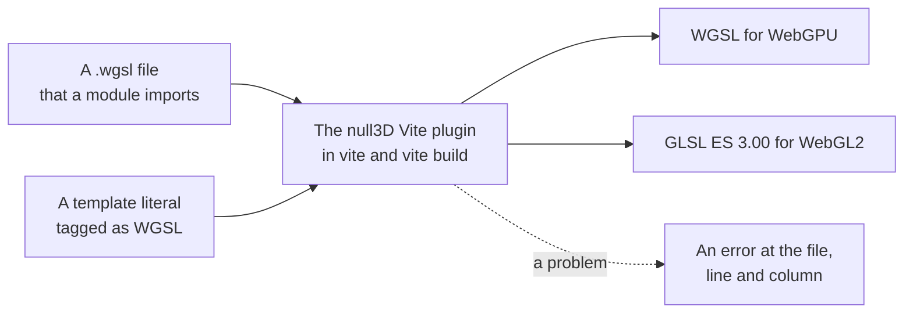

# Custom shaders

> Ships in null3D 0.1. The API is experimental, so it can still change between versions. Custom materials with surface functions, vertex offsets, uniforms and full shaders are built. Textures in custom materials are not built yet, so coding agents must not use them. Hot reload that keeps the page running comes in null3D 0.2.



You write each null3D shader once, in WGSL. The null3D Vite plugin compiles the WGSL in your code while Vite serves or builds the project. Each shader becomes WGSL for WebGPU and GLSL ES 3.00 for WebGL2, so the page never downloads a shader translator.

## Custom materials

A custom material keeps the engine's lighting and changes how its surface looks. Its WGSL declares a surface function, which fills a surface record for each pixel. `materials.shader` takes the compiled WGSL and every option of `materials.standard`:

```ts
// sketch.ts
const rings = /* wgsl */ `
fn surface(input: SurfaceInput) -> Surface {
    var s = defaultSurface(input);
    let ring = step(0.5, fract(input.uv.y * 6.0));
    s.baseColor = mix(s.baseColor, vec3f(1.0), ring);
    return s;
}
`;

// In the setup:
const red = materials.shader({ wgsl: rings, color: '#e04040', roughness: 0.5 });
```

The WGSL can declare uniforms as `struct Uniforms`, which `set()` changes at any time, and a vertex offset, `fn vertexOffset`, which moves the mesh's vertices. [Surface functions](../shaders/surface-functions.md) describes the surface input, the surface record, `defaultSurface`, uniforms and vertex offsets. [Built-in shader inputs](../shaders/builtins.md) lists the values that every custom material reads, such as `frame.time`.

## Full shaders

A full shader draws a custom material with WGSL of your own from end to end: a `@vertex` and a `@fragment` entry point. Use it for a look that the engine's lighting cannot give, such as a hologram. The engine gives a full shader its meshes, its instances and the frame's values, but no lighting, shadows or fog.

```ts
// sketch.ts
const hologram = /* wgsl */ `
#import null3d::builtins::{fill_builtins, frame}
#import null3d::mesh::{InstanceIn, clip_position, find_instance, finish}
#import null3d::mesh::{relative_position, world_normal}

struct Varyings {
    @builtin(position) clip: vec4f,
    @location(0) relative: vec3f,
    @location(1) normal: vec3f,
}

@vertex
fn vs(@location(0) position: vec3f, @location(1) normal: vec3f, i: InstanceIn) -> Varyings {
    let found = find_instance(i);
    var out: Varyings;
    out.relative = relative_position(found, position);
    out.clip = clip_position(found, position);
    out.normal = world_normal(found, normal);
    return out;
}

@fragment
fn fs(in: Varyings) -> @location(0) vec4f {
    fill_builtins(vec3f(0.0));
    let rim = 1.0 - abs(dot(normalize(in.normal), normalize(-in.relative)));
    let lines = step(0.5, fract(in.relative.y * 8.0 - frame.time));
    return finish(vec3f(0.2, 0.8, 1.0) * (rim * rim * 1.5 + lines * 0.25), in.clip.xy);
}
`;

// In the setup:
const ghost = materials.shader({ wgsl: hologram, doubleSided: true });
```

The plugin takes WGSL as a full shader when its `@vertex` entry point takes an `InstanceIn`. The shader follows these rules:

- It has one `@vertex` and one `@fragment` entry point.
- The vertex entry point reads the mesh at the engine's locations. The position is at 0, the normal at 1, the first texture coordinates at 2 and the second at 3. The tangent is at 4, and the color at 5. A mesh draws only when it has every attribute that the shader reads.
- It finds its instance with `InstanceIn` and `find_instance` from `null3d::mesh`. On each GPU path, the engine gives each instance's transform in its own way, and these hide the difference.
- `null3d::mesh` also gives `clip_position(found, position)`, `relative_position(found, position)` and `world_normal(found, normal)`. Positions are relative to the camera, as in the engine's own shaders.
- The fragment entry point writes its linear color through `finish(color, clip.xy)` from `null3d::mesh`, which prepares it for the engine's output.
- `fill_builtins(origin)` from `null3d::builtins` fills `frame`, `camera` and `object` in a stage. Pass the object's origin relative to the camera, or zero when the shader does not read `object`.
- The fixed options for faces and depth apply, such as `doubleSided` and `depthBias`. The standard values and uniforms do not reach a full shader, and `vertexColors` and the `mask` alpha mode change nothing: the shader reads the colors and discards pixels itself.

## WGSL in sketch code

The plugin compiles WGSL in two forms. The first is a `.wgsl` file that a module imports:

```ts
// sketch.ts
import glow from './shaders/glow.wgsl';
```

The import gives the compiled shader. To import the file's text instead, add `?raw` to the path, as Vite allows for any file.

The second form is a template literal after a `/* wgsl */` comment:

```ts
// sketch.ts
const glow = /* wgsl */ `
#import null3d::color

@vertex
fn vs_main(@builtin(vertex_index) index: u32) -> @builtin(position) vec4f {
    let corner = vec2f(f32((index << 1u) & 2u), f32(index & 2u));
    return vec4f(corner * 2.0 - 1.0, 0.0, 1.0);
}

@fragment
fn fs_main() -> @location(0) vec4f {
    return vec4f(null3d::color::linear_to_srgb(vec3f(0.5)), 1.0);
}
`;
```

The plugin puts the compiled shader where the literal was. Your code therefore receives a compiled shader, although TypeScript still sees a string. The tag follows these rules:

- The comment comes directly before the literal. Spaces and line breaks may come between them.
- The literal cannot hold `${...}`. The plugin compiles the WGSL before any of your code runs, so write each value in the WGSL itself.
- The plugin compiles every tagged literal in your own files, and leaves the packages in `node_modules` alone. Remove the tag from WGSL that null3D does not draw, such as WGSL for another library.

## What the plugin compiles

The plugin compiles two kinds of WGSL:

- WGSL without entry points that declares `fn surface`, `fn vertexOffset` or both is a custom material's WGSL. The plugin builds it into the standard material's shader, once for each of that shader's variants.
- WGSL whose `@vertex` entry point takes an `InstanceIn` is a [full shader](#full-shaders) of a custom material. The plugin builds it for WebGPU, and for WebGL2 with and without multi-draw.
- Other WGSL with entry points is a whole shader. It has one `@vertex` entry point and one or more `@fragment` entry points. Each `@fragment` entry point makes one render pipeline, named after it, with the `@vertex` entry point. A shader with only `@compute` entry points builds for WebGPU alone, because WebGL2 has no compute shaders.

WGSL that is neither stops the build with an error that says how to fix it.

A shader can import the engine's library modules, such as `#import null3d::math`. The plugin resolves each import. [Shader library and imports](../shaders/library.md) lists the modules.

Each shader builds twice. The WebGPU build is WGSL. The WebGL2 build holds one GLSL ES 3.00 program for each render pipeline, and it sets the shader def `WEBGL2`:

```wgsl
#ifdef WEBGL2
    // Code for WebGL2 alone.
#else
    // Code for WebGPU alone.
#endif
```

Both builds follow the [WGSL rules for portable shaders](../shaders/wgsl-rules.md). The rules page says what the build rejects, and what you must test on each path yourself.

## Shader errors

When WGSL does not compile, the plugin stops with the file, line and column of each problem. It shows the code around the first problem, and a fix where the rules give one. For a tagged literal, the place is its line and column in your script file:

```text
null3D could not compile the WGSL:
src/sketch.ts:14:23: expected `;`, found "2.0"
```

- On the dev server, the error shows in Vite's overlay on the page and in the terminal. The engine's start fails too, with [E1410](../errors/E1410.md), because the sketch module did not load.
- In `vite build`, the build fails with the same message.

Editing a shader on the dev server reloads the page.

## TypeScript

The plugin's client types tell TypeScript what a `.wgsl` import gives. Add them to the `types` of your `tsconfig.json`:

```json
{
  "compilerOptions": {
    "types": ["@null3d/vite-plugin/client"]
  }
}
```

## Related pages

- [Surface functions](../shaders/surface-functions.md): custom materials that keep the engine's lighting.
- [WGSL rules for portable shaders](../shaders/wgsl-rules.md): what the build rejects, and what it cannot check.
- [Shader library and imports](../shaders/library.md): the engine's modules that a shader can import.
- [Install null3D](../getting-started/install.md): the Vite plugin and its other jobs.
