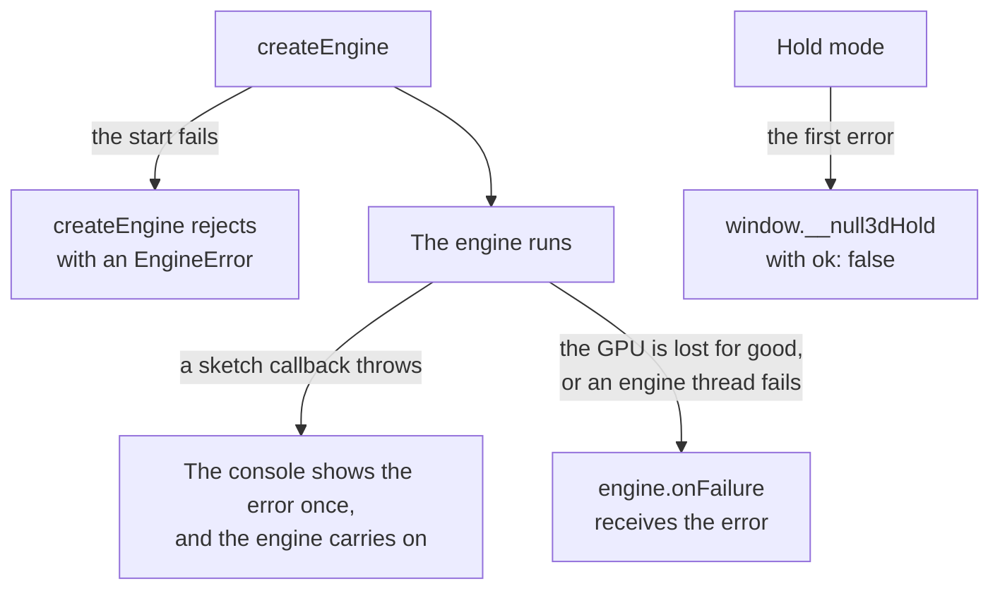

# Debugging

> Ships in null3D 0.1. The API is experimental, so it can still change between versions. The in-page inspector and the MCP server come in null3D 0.3, and the render-graph dump comes in 0.2, so coding agents must not use them.



The engine reports a problem in one of four places, as the diagram shows. Each message says what failed and how to fix it.

## Error messages

Every error that the engine throws is an `EngineError`. Its message starts with a code. It says what failed and how to fix it, and it links to the code's page:

```text
E1203: setPosition() got NaN for x on an object (slot 2). Check the value computed before this call. NaN often comes from dividing zero by zero, or from normalizing a zero-length vector. See https://github.com/null3d-engine/null3d/blob/main/docs/errors/E1203.md
```

The error also holds the code in `error.code` and the page's address in `error.docs`. [Error codes](../errors/index.md) lists every code with its cause and fix.

## Where problems appear

| When | What happens |
| --- | --- |
| The engine cannot start, for example without a usable GPU path ([E1301](../errors/E1301.md)) | `createEngine` rejects with an `EngineError` |
| The sketch module throws while it loads, for example when it reads `document` | `createEngine` rejects with [E1410](../errors/E1410.md), which quotes the module's error |
| The sketch module has no default export of `defineSketch(...)` | `createEngine` rejects with [E1401](../errors/E1401.md) |
| The setup function throws | `createEngine` rejects with [E1405](../errors/E1405.md), which quotes your error |
| During the start, an engine thread fails or the GPU is lost for good | `createEngine` stops the engine and rejects with [E1404](../errors/E1404.md) or [E1302](../errors/E1302.md) |
| A callback such as `onUpdate` throws | The console shows each distinct error once, with its stack. The engine carries on, and calls the callback again when it next runs |
| After the start, the GPU is lost and cannot come back, or an engine thread fails | `engine.onFailure` receives [E1302](../errors/E1302.md) or [E1404](../errors/E1404.md). Without a handler, the console shows it |
| Hold mode | The hold stops at the first error, and the result says why. [Testing your sketch](testing.md#when-a-hold-fails) lists the cases |

Catch the error of `createEngine`, and show the page without the scene:

```ts
// page.ts
import { createEngine, EngineError } from '@null3d/engine';

try {
  const engine = await createEngine({
    canvas: document.querySelector('canvas')!,
    sketch: new URL('./sketch.ts', import.meta.url),
  });
  engine.onFailure((error) => showFallback(error.message));
} catch (error) {
  showFallback(error instanceof EngineError ? error.message : String(error));
}
```

`showFallback` stands for your own code, such as a still image and a short message.

## Development checks

In the Vite dev server, the engine checks the arguments of each call. A value that is not a finite number throws [E1203](../errors/E1203.md). An object used after `destroy` throws [E1101](../errors/E1101.md). The error comes from the call itself, so its stack points at your line.

A production build from `bunx vite build` leaves the checks out, so it runs faster. Find problems in the dev server first. A bad value that reaches a production build draws a wrong frame, or no frame, and throws nothing.

## Logs and breakpoints in the sketch

The sketch runs in a worker. The browser shows a worker's console messages in the page's console, so `console.log` in the sketch works as usual. In the browser's developer tools, the sketch worker is a thread of its own. Set breakpoints in the sketch's file there, or put a `debugger` statement in the sketch's code.

To debug on one thread, add `?threads=off` to the page's address. The engine then runs the single-threaded build, and the sketch runs on the page's thread. Compare with a normal run to find a fault that only one build shows.

## How the engine runs on this device

The engine picks a GPU path and a thread mode at the start. Log what it picked:

```ts
console.log(engine.capabilities.tier, engine.mode);
// webgpu {build: 'threaded', latency: 'pipelined', renderThread: 'render-worker', jobWorkers: 6, hold: null}
console.log(JSON.stringify(engine.report)); // every result of the start's tests
```

Add `engine.report` to a bug report. It holds the result of every test, and the GPU's name where the browser shows one. [Page API: createEngine](../api/engine.md#what-the-engine-reports) describes each value.

Switches in the page's address force a choice, so you can find which path shows a fault. The engine reads them in development builds only:

| Switch | Effect |
| --- | --- |
| `?gpu=webgl2`, `?gpu=webgpu`, `?gpu=compat` | Draw with that GPU path, where the device has it |
| `?threads=off` | Run the single-threaded build |
| `?render=main` | Draw on the page's main thread |
| `?latency=low` | Use the low latency mode |

[Testing your sketch](testing.md#switches-for-tests) lists every switch.

## See the scene with debug drawing

`ctx.debug` draws lines over the scene for one frame. Use it to see positions, directions, bounds and cameras:

```ts
// sketch.ts, in onUpdate
debug.axes(player);                                  // the player's own axes
debug.sphere([0, 1, 0], 2, '#ff0000');               // a trigger zone
debug.arrow(muzzle, aim, 10);                        // where a shot goes, from two vectors of yours
```

Only development builds draw the lines. [Debug drawing and stats](../api/debug.md) lists every call.

To check normals, depth, overdraw, triangle edges or shadows, draw the whole scene with a debug view. In the sketch, `debug.view('wireframe')` draws every triangle's edges, and `debug.view('lit')` draws the materials again. [Debug views](../api/debug.md#debug-views) lists the views. To see whether shadow edges crawl as the camera moves, draw `'shadows'` from a still camera. Then let `debug.shadowCamera` place the cascades from the moving one ([Watch the shadow cascades from elsewhere](../api/debug.md#watch-the-shadow-cascades-from-elsewhere)).

## Reproduce a frame

A bug that shows at one moment is easier to fix when every run reaches it. Hold mode steps the sketch to a set time in fixed steps, with seeded random numbers and no input. The command `bunx @null3d/cli shot` holds your page in a headless browser. When the hold fails, it prints the sketch time and the frame of the first error:

```text
Drew no frame of /: E1408: hold mode stopped at 1 seconds, in frame 61: E1203: setPosition() got NaN for x on an object (slot 2). ...
```

It also saves the errors and warnings that the page logged, with their stacks, in a JSON file. [Testing your sketch](testing.md) explains hold mode.

## Measure

In the sketch, `debug.stats(true)` shows frame figures over the canvas. They are the frame rates, and the CPU time per frame of each thread and phase. The call `debug.frameStats()` gives the sketch the same figures, for logs and tests. Both work in production builds too. [Debug drawing and stats](../api/debug.md#stats-overlay-and-frame-figures) lists the figures.

`engine.measure(seconds)` measures the running engine from the page: CPU time per frame by thread and phase, GPU time, frame intervals, uploads, draw calls and memory. [Debug drawing and stats](../api/debug.md#frame-measurement) shows an example, and the [performance guide](performance.md) explains the numbers.

To test a page's handling of a lost GPU, call `engine.simulateGpuLoss()`. The engine starts a new GPU device and draws the whole scene again, as it does after a real loss. The `gpuLosses` figure of `engine.measure()` counts the losses that the engine carried on after since it started, the simulated ones included.

## Common failures

| What you see | Cause | Fix |
| --- | --- | --- |
| The canvas shows only the background | The sketch set no active camera | Call `scene.setActiveCamera(camera)` |
| An object that should show does not | It is behind the camera, or outside the camera's near and far distances (0.1 to 2,000 meters by default) | Draw its place with `debug.axes`, and check the camera's `near` and `far` |
| Objects are black | The scene has no light, and `materials.standard` needs light | Add a light, or use `materials.unlit` |
| `document is not defined` or `window is not defined` | The sketch's code uses the page's DOM, which a worker does not have | Keep DOM code in the page, and send the sketch [messages](../api/page.md) |
| `engine.mode.build` is `single` | The page is not cross-origin isolated | Send the two headers that [Hosting and cross-origin isolation](../getting-started/hosting.md) lists |
| Rows written to an instance batch do not move | The batch is static, and the rows are not marked | Call `markDirty`, or create the batch with `dynamic: true` ([Instances and batching](../concepts/instances.md)) |
| Writes to instance rows stop working in the single-threaded build | The sketch kept the batch's arrays from the setup, and the engine's memory grew | Read `batch.positions` and the other arrays each time you use them |
| A new texture shows only its material's color for a few frames | Texels go to the GPU over several frames | Keep the first view's textures small, or wait a few frames before you remove the loading screen ([Loading screens and warm-up](loading-screens.md)) |

## Related pages

- [Error codes](../errors/index.md): every code, with its cause and fix.
- [Testing your sketch](testing.md): hold mode, image tests and switches.
- [Debug drawing and stats](../api/debug.md): lines over the scene, the stats overlay, and `engine.measure`.
- [Performance guide](performance.md): what to do when frames take too long.
