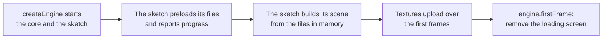

# Loading screens and warm-up

> Ships in null3D 0.1. The API is experimental, so it can still change between versions. `scene.warmUp` is not built yet, so coding agents must not use it.



A loading screen covers the canvas while the engine starts and the sketch loads its files. The page draws the screen in HTML, and the sketch tells it how far loading has come with messages.

## Report progress from the sketch

`assets.preload` downloads a list of files at once, and `assets.onProgress` counts them as they arrive. The loads that follow take the files from memory, so the scene builds without further waits.

```ts
// sketch.ts
import { defineSketch } from '@null3d/engine';

export default defineSketch(async ({ assets, page, scene }) => {
  assets.onProgress((loaded, total) => page.post('loading', loaded / total));
  await assets.preload(['/levels/one.json', '/tex/terrain.png', '/tex/rocks.png']);

  const level = await assets.loadJson('/levels/one.json');
  const terrain = await assets.loadTexture('/tex/terrain.png', { wrap: 'repeat', anisotropy: 8 });
  // Build the scene from the level and its textures here.
});
```

The handler gets the files downloaded so far and the files asked for so far. A file that fails counts as done, so the bar still reaches its end. The failed load rejects with an error that says what went wrong. [Assets](../api/assets.md) covers the loading calls and their errors.

## Show progress on the page

The page passes `onSketchMessage` to `createEngine`, so it hears the messages that the sketch sends during its setup. It removes the loading screen when `engine.firstFrame` resolves: until the GPU has finished the first frame, the canvas is blank.

```ts
// page.ts
import { createEngine } from '@null3d/engine';

const bar = document.querySelector<HTMLElement>('#bar')!;
let shown = 0;
const show = (progress: number) => {
  shown = Math.max(shown, progress); // the bar never moves back
  bar.style.width = `${Math.round(shown * 100)}%`;
};

const engine = await createEngine({
  canvas: document.querySelector('canvas')!,
  sketch: new URL('./sketch.ts', import.meta.url),
  onProgress: (stage) => { if (stage === 'core') show(0.1); },
  onSketchMessage: (name, loaded) => { if (name === 'loading') show(0.1 + 0.8 * (loaded as number)); },
});
await engine.firstFrame;
document.querySelector('#loading')?.remove();
```

A handler that `engine.onSketchMessage` adds after `createEngine` resolves hears the setup's messages late, once the setup ends. That is too late for a progress bar.

## Textures after the loading screen

A texture returns at once, and its texels go to the GPU over the frames that follow. Each frame uploads at most 4 MiB of texels, so a scene with many large textures does not stall a frame. Until a texture's texels arrive, its material draws with its color alone. [Textures](../api/textures.md) says how uploads work.

Keep the textures of the first view small, so the first frames show them. Or wait a few frames before you remove the loading screen.
