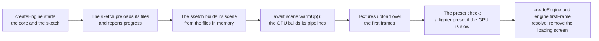

# Loading screens and warm-up

> Ships in null3D 0.1. The API is experimental, so it can still change between versions.



A loading screen covers the canvas while the engine starts and the sketch loads its files. It stays while the sketch builds its scene and the GPU gets ready to draw it. The page draws the screen in HTML, and the sketch tells it how far loading has come with messages. Then comes warm-up: the GPU builds a pipeline for each kind of object in the scene. When the engine chose the quality preset itself, it last checks that the GPU draws the scene fast enough at that preset.

## Report progress from the sketch

`assets.preload` downloads a list of files at once, and `assets.onProgress` counts them as they arrive. The loads that follow take the files from memory, so the scene builds without further waits.

```ts
// sketch.ts
import { defineSketch } from '@null3d/engine';

export default defineSketch(async ({ assets, page, scene }) => {
  assets.onProgress((loaded, total) => page.post('loading', loaded / total));
  await assets.preload(['/levels/one.json', '/tex/terrain.png', '/tex/rocks.png']);

  const level = await assets.loadJson('/levels/one.json');
  const terrain = await assets.loadTexture('/tex/terrain.png', { wrap: 'repeat', anisotropy: 8 });
  // Build the scene from the level and its textures here.
  await scene.warmUp();
});
```

The handler gets the files downloaded so far and the files asked for so far. A file that fails counts as done, so the bar still reaches its end. The failed load rejects with an error that says what went wrong. [Assets](../api/assets.md) covers the loading calls and their errors.

## Show progress on the page

The page passes `onSketchMessage` to `createEngine`, so it hears the messages that the sketch sends during its setup. It removes the loading screen when `engine.firstFrame` resolves: until the GPU has finished the first frame, the canvas is blank.

```ts
// page.ts
import { createEngine } from '@null3d/engine';

const bar = document.querySelector<HTMLElement>('#bar')!;
let shown = 0;
const show = (progress: number) => {
  shown = Math.max(shown, progress); // the bar never moves back
  bar.style.width = `${Math.round(shown * 100)}%`;
};

const engine = await createEngine({
  canvas: document.querySelector('canvas')!,
  sketch: new URL('./sketch.ts', import.meta.url),
  onProgress: (stage) => { if (stage === 'core') show(0.1); },
  onSketchMessage: (name, loaded) => { if (name === 'loading') show(0.1 + 0.8 * (loaded as number)); },
});
await engine.firstFrame;
document.querySelector('#loading')?.remove();
```

A handler that `engine.onSketchMessage` adds after `createEngine` resolves hears the setup's messages late, once the setup ends. That is too late for a progress bar.

## Pipelines and warm-up

The GPU draws each object with a pipeline: compiled shaders, and the drawing state that goes with them. One pipeline serves every object with the same shading model and the same vertex format of mesh. A thousand materials of one shading model share it, so a scene needs few pipelines, often fewer than ten. [Performance guide](performance.md#how-the-engine-batches-builds-pipelines-and-times-frames) lists what sets pipelines apart.

Pipelines take time to build. In the engine's warm-up test, a scene of ten pipelines took up to 0.4 seconds to build in Chrome and Safari on a MacBook Pro. It took 0.8 seconds on WebGPU in Firefox. The engine builds pipelines without blocking any thread:

- On WebGPU, the browser builds each pipeline in the background.
- On WebGL2, the browser compiles each program in the background where it has the `KHR_parallel_shader_compile` extension. Chrome, Safari and Brave have it on the Mac, and Safari and Brave have it on the iPad. Firefox does not, and neither does Chrome on some Android phones, such as the Galaxy S24+. There, the first draw with a program waits for its compile.

The first frame waits until every pipeline that it needs is built, so it shows the whole scene. After the first frame, the engine draws each frame at once. An object whose pipeline is still building draws nothing until the pipeline is built, and the rest of the scene draws as usual.

## The first frame

`engine.firstFrame` resolves once the GPU has finished the first frame, with every pipeline built. The promise of `createEngine` resolves once the sketch's setup has run, and after the preset check when the engine runs one. Either can come first. So remove the loading screen only once both have resolved, as the page above does.

A setup function that awaits `scene.warmUp()` after it creates the scene, as the sketch above does, lets the engine build the pipelines while the setup runs. The engine then draws the first frame as soon as they are built.

## The preset check

When the page leaves the quality preset to the engine, the engine checks its choice after the setup. For about three quarters of a second, it draws the scene that the setup built and measures the frame rate. The sketch's `onUpdate` does not run yet. Where the GPU cannot hold the display's rate, up to 60 frames per second, the engine lowers the preset and measures again. The loading screen hides these frames. [Quality presets](../concepts/quality-presets.md#the-preset-check) gives the rules.

So build the whole first view in the setup, with its textures: the check measures what the setup built, and waits while textures upload. A sketch whose setup leaves the scene empty gets a preset that the scene may not hold.

## A later loading stage

Objects created during play need pipelines too, when their shading model and vertex format are new to the scene. To show a new stage complete, create its objects hidden, warm up, then show them:

```ts
// sketch.ts, during play
const pieces = level.map((part) =>
  scene.createMesh({ mesh: part.mesh, material: part.material, position: part.position }),
);
for (const piece of pieces) piece.setVisible(false);
await scene.warmUp(); // every pipeline that the scene needs is built
for (const piece of pieces) piece.setVisible(true);
```

`scene.warmUp()` builds the pipelines of every object in the scene, hidden objects too, and resolves once they are all built. The scene keeps drawing while it waits. Without a warm-up, each new object appears when its pipeline is built, which can be a few frames after the others.

In hold mode, the engine draws one frame, which waits for its pipelines, so `scene.warmUp()` resolves at once.

## A change of preset

A player who picks another preset in a menu changes pipelines and render targets. The `quality.setPreset` call builds them without a gap in the picture. The engine keeps the last frame on screen until the new preset's frame has all of its pipelines built. The promise resolves once that frame is on screen. A page can cover the canvas meanwhile, as a loading screen does:

```ts
// sketch.ts, in the setup
page.onMessage(async (name, preset) => {
  if (name !== 'preset') return;
  await quality.setPreset(preset as 'low' | 'medium' | 'high' | 'ultra');
  page.post('preset-ready', quality.preset);
});
```

[Quality API](../api/quality.md#switching-presets) says what the call changes.

## Textures after the loading screen

A texture returns at once, and its texels go to the GPU over the frames that follow. Each frame uploads no more texel bytes than the quality preset's upload budget, so a scene with many large textures does not stall a frame. Until a texture's texels arrive, its material draws with its color alone. [Textures](../api/textures.md) says how uploads work.

Keep the textures of the first view small, so the first frames show them. Or wait a few frames before you remove the loading screen.

## Measure the warm-up

`engine.measure()` reports the first frame's warm-up in its `load` figures:

| Figure | What it is |
| --- | --- |
| `load.warmUpMs` | Time from the start of the first frame's pipeline builds until none was building |
| `load.firstFramePipelines` | The pipelines that the first frame built |
| `pipelines` | The pipelines built during the measurement, which stays at 0 in steady play |
| `skippedDraws` | Draws that frames skipped because their pipeline was still building, so their objects were missing. A warm-up before new objects show keeps it at 0 |

Where a browser compiles WebGL2 programs without the extension, `load.warmUpMs` is about 0, and the first frame's draw takes the compile time instead.

## Related pages

- [Assets](../api/assets.md): `assets.preload`, `assets.onProgress` and the loading calls.
- [Textures](../api/textures.md): how texture uploads work.
- [Performance guide](performance.md): what makes the GPU build a pipeline, and the costs of a frame.
- [Engine](../api/engine.md): `createEngine`, `engine.firstFrame` and `engine.measure`.
- [Scene](../api/scene.md): `scene.warmUp`.
