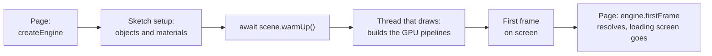

# Loading screens and warm-up

> Ships in null3D 0.1. The API is experimental, so it can still change between versions. `assets.preload`, `assets.onProgress` and upload budgets are not built yet, so coding agents must not use them.



A loading screen covers the canvas while the engine starts, the sketch builds its scene, and the GPU gets ready to draw it. The last step is warm-up: the GPU builds a pipeline for each kind of object in the scene. This page shows how to wait for each step, so the first frame and each later loading stage appear complete.

## Pipelines and warm-up

The GPU draws each object with a pipeline: compiled shaders, and the drawing state that goes with them. One pipeline serves every object with the same shading model and the same vertex format of mesh. A thousand materials of one shading model share it, so a scene needs few pipelines, often fewer than ten. [Performance guide](performance.md#how-the-engine-batches-builds-pipelines-and-times-frames) lists what sets pipelines apart.

Pipelines take time to build. In the engine's warm-up test, a scene of ten pipelines took 0.2 to 0.4 seconds in Safari on a MacBook Pro. It took 0.8 seconds on WebGPU in Firefox. The engine builds pipelines without blocking any thread:

- On WebGPU, the browser builds each pipeline in the background.
- On WebGL2, the browser compiles each program in the background where it has the `KHR_parallel_shader_compile` extension. Chrome, Safari and Brave have it on the Mac, and Safari and Brave have it on the iPad. Firefox does not, and neither does Chrome on some Android phones, such as the Galaxy S24+. There, the first draw with a program waits for its compile.

The first frame waits until every pipeline that it needs is built, so it shows the whole scene. After the first frame, the engine draws each frame at once. An object whose pipeline is still building draws nothing until the pipeline is built, and the rest of the scene draws as usual.

## The first frame

Remove the loading screen when `engine.firstFrame` resolves. The GPU has then finished the first frame, with every pipeline built:

```ts
// page.ts
const engine = await createEngine({
  canvas,
  sketch: new URL('./sketch.ts', import.meta.url),
});
await engine.firstFrame;
loadingScreen.remove();
```

`createEngine` resolves once the sketch's setup has run. Until the first frame is on screen, the canvas is blank, so wait for `engine.firstFrame`, not `createEngine`.

A setup function can also await `scene.warmUp()` after it creates the scene. The engine then builds the pipelines while the setup runs, and it draws the first frame as soon as they are built:

```ts
// sketch.ts
export default defineSketch(async ({ scene, geometry, materials }) => {
  // Create the objects, meshes and materials of the first level here.
  await scene.warmUp();
  return { onUpdate(dt) {} };
});
```

## A later loading stage

Objects created during play need pipelines too, when their shading model and vertex format are new to the scene. To show a new stage complete, create its objects hidden, warm up, then show them:

```ts
// sketch.ts, during play
const pieces = level.map((part) =>
  scene.createMesh({ mesh: part.mesh, material: part.material, position: part.position }),
);
for (const piece of pieces) piece.setVisible(false);
await scene.warmUp(); // every pipeline that the scene needs is built
for (const piece of pieces) piece.setVisible(true);
```

`scene.warmUp()` builds the pipelines of every object in the scene, hidden objects too, and resolves once they are all built. The scene keeps drawing while it waits. Without a warm-up, each new object appears when its pipeline is built, which can be a few frames after the others.

In hold mode, the engine draws one frame, which waits for its pipelines, so `scene.warmUp()` resolves at once.

## Measure the warm-up

`engine.measure()` reports the first frame's warm-up in its `load` figures:

| Figure | What it is |
| --- | --- |
| `load.warmUpMs` | Time from the start of the first frame's pipeline builds until none was building |
| `load.firstFramePipelines` | The pipelines that the first frame built |
| `pipelines` | The pipelines built during the measurement, which stays at 0 in steady play |

Where a browser compiles WebGL2 programs without the extension, `load.warmUpMs` is about 0, and the first frame's draw takes the compile time instead.

## Related pages

- [Performance guide](performance.md): what makes the GPU build a pipeline, and the costs of a frame.
- [Engine](../api/engine.md): `createEngine`, `engine.firstFrame` and `engine.measure`.
- [Scene](../api/scene.md): `scene.warmUp`.
