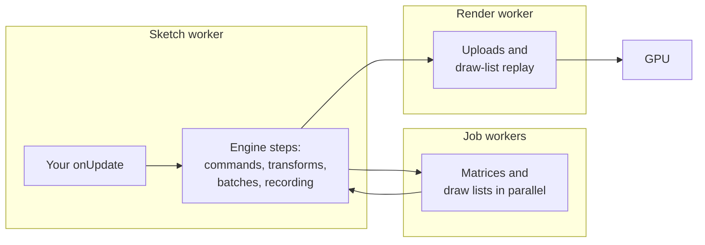

# Performance guide

> Planned for null3d 0.1. No release has these APIs yet, so coding agents must not use them.

null3d keeps its own work per frame small, so your sketch code usually decides how long a frame takes. This guide shows where frame time goes, how to write per-frame code that stays fast, and how to measure. The figures come from the engine's benchmark scenes, and `bun run bench:run` measures them on your own computer.

## Where frame time goes

A frame has three kinds of cost:

| Cost | Where it runs | Grows with |
| --- | --- | --- |
| Your sketch code | The sketch worker | Your loops over objects |
| The engine's own work | The sketch worker, the job workers and the render worker | Moving objects, uploads and draw lists |
| GPU work | The GPU | Pixels, shaders and the instances drawn |

The busiest thread sets the frame rate. In the default pipelined mode, the sketch worker computes one frame while the render worker draws the frame before it.

This is how one frame of the S1 benchmark splits. S1 has 100,000 boxes, and its `onUpdate` moves every box in every frame. It ran in Chrome with WebGPU on a MacBook Pro:

| Thread and step | CPU time per frame |
| --- | --- |
| Sketch worker: the sketch's update | 2.18 ms |
| Sketch worker: the engine's steps | 0.14 ms |
| Render worker | 0.15 ms |
| 16 job workers, all together | 0.45 ms, at most 0.09 ms on one worker |

The update calls `Math.sin` or `Math.cos` three times per box, about 20 nanoseconds per box. Make your own loops tight before you look at the engine.

## The frame budget

At 60 frames per second a frame has 16.7 ms, and at 120 frames per second it has 8.3 ms. The busiest thread must finish its work inside that time. Phones slow down as they heat up, so plan to use at most about 70% of the budget there.

S1 used 2.3 ms of the busiest thread's time for 100,000 moving boxes. That leaves most of a 120 Hz frame for more sketch code.

## Write per-frame code that allocates nothing

Garbage collection pauses the thread that allocated the memory. The render worker runs no sketch code, so your garbage cannot delay drawing. It can still delay your next frame. These habits keep per-frame code free of new objects:

- Read vectors by index. `const [x, y, z] = v` walks an iterator for each read, so write `const x = v[0]` instead.
- Write into arrays that you already have. `axis.set([0, 1, 0])` builds a new array on every call, so set the three elements one at a time.
- Build lookup tables once, outside the functions that run every frame.
- Compute a vector's length with `Math.sqrt(x * x + y * y + z * z)`. `Math.hypot` is slower in hot code.
- Keep reused arrays at their size. Setting `length = 0` frees an array's storage, so the next write allocates it again.
- Do not wrap a browser promise in an `async` function every frame. Each call makes a promise of its own.
- Keep closures out of functions that run every frame, even in a branch that rarely runs. Until the browser optimizes the function, the variables a closure captures are allocated on every call. Move such a branch into a function of its own.
- Change a light's intensity every frame, not its color. `setDirection` and `setIntensity` allocate nothing, but `setColor` converts the color and allocates.

Decimal numbers are a special case. Until the browser optimizes a function, the numbers it computes are stored as small objects. Code that runs once per frame gets optimized only after thousands of frames, so judge allocation after about 30 seconds of play.

## Objects during play

The engine keeps each scene's draw tables, its draw bundle and every object's matrix on the GPU. Some calls change the tables, and a frame with such a change rebuilds them: it records the bundle again and uploads every matrix. At 100,000 instances that is 4.8 MB in one frame. Other calls upload only what they changed. `measure` counts the rebuilding frames in `rebuilds`, which stays at zero in steady play.

| Call | Cost in the frame it takes effect |
| --- | --- |
| `setPosition`, `setRotation`, `setScale`, and writes to a batch's arrays | The changed matrices |
| `setVisible` | The matrix and 4-byte draw entry of the object and of each object under it |
| `setActiveCount` | The 4-byte draw entry of each row that starts or stops drawing |
| Creating or destroying an object or an instance batch | A rebuild, and engine memory can grow in the next frame |
| `setMesh`, `setMaterial`, `setParent` and `setDynamic` | A rebuild |

These habits keep play free of rebuilds:

- Create every object, batch, mesh and material a level needs during setup or behind a loading screen. The engine sizes its memory for the scene it holds, so one created during play makes engine memory grow in the next frame.
- Hide and show objects with `setVisible` instead of destroying and creating them.
- Pool short-lived things, such as bullets and particles, in an instance batch sized for the most rows it will ever need. Show fewer with `setActiveCount`, and keep the live rows at the front of the arrays.
- For a look that changes often, such as a highlight, keep two objects and swap their visibility. Keep `setMaterial` and `setMesh` for rare changes.
- Every row of a batch counts toward the scene's limit of objects and instance rows, active or not. Every device draws 2,097,152, and `engine.capabilities.maxInstances` gives the limit of the device the page runs on (E1501). Engine memory holds about 5 million rows (E1109). So size each batch for the rows it uses.
- Check with `measure`. A `rebuilds` count above zero during play points to one of the calls in the lower rows of the table.

## How the engine batches, builds pipelines and times frames

Performance advice written for other engines often assumes things that do not hold here. These are null3d's answers to the questions that such advice depends on.

| Question | null3d's answer |
| --- | --- |
| What makes the GPU build a pipeline? | A shading model, lit or unlit, with the canvas's color format, the depth format and the sample count. A material never does: materials are rows in one shared table, so a thousand lit materials share one lit pipeline. |
| When are pipelines built? | In the first frame, and again after the browser replaces the GPU. Sketch code never compiles one. `measure` counts builds in `pipelines`. |
| What does the engine batch by itself? | Every object and instance row with the same shading model, mesh and material goes into one bucket, which one indirect draw call draws. Separate objects from `createMesh` batch the same way as the rows of an instance batch. |
| Which passes walk the scene? | Two: a culling pass on the GPU, which tests every object and row against the view, and the main pass, which replays a draw bundle. The engine records the bundle again only when the scene's structure changes. |
| Does the engine know when the GPU finished a frame? | Yes. It listens to the WebGPU queue, or checks a WebGL2 fence, and blocks no thread. `measure` reports `completedFps` and `gpuLatencyMs`. Sketch code never waits for the GPU. |
| What must stay the same for the engine to reuse its work? | The scene's structure. A static object costs nothing until a setter changes it. The calls that rebuild the draw tables are listed in [Objects during play](#objects-during-play). |

So some common advice does not apply:

- **Merge meshes to cut draw calls.** Objects that share a mesh and a material already share one draw. Merging different small static meshes still cuts the number of buckets.
- **Share materials so objects share a shader.** Every material already shares its pipeline. Share materials anyway, because each mesh and material pair is its own bucket and draw.
- **Compile or warm up after each loading stage.** The engine builds its pipelines in the first frame. Wait for `engine.firstFrame` before you remove the loading screen.
- **Turn off matrix updates for objects that do not move.** Objects are static by default, and a static object costs nothing per frame.
- **Mark a changed object for update.** Setters mark the change themselves.
- **Track GPU completion in your own code.** `measure` reports it.

## Moving objects cost uploads

Each dynamic instance uploads its 48-byte world matrix in every frame, so 100,000 moving boxes upload 4.8 MB per frame. A static batch uploads its matrices once and then nothing. The S1-static benchmark draws the same 100,000 boxes standing still. It uploads nothing per frame and takes 0.08 ms of CPU time.

Mark objects and batches static when they rarely move, and call `markDirty` for the rows that you change. See [Static and dynamic objects](../concepts/static-dynamic.md).

The render worker picks how each upload travels, so you do not need to. Uploads from 64 KiB up to 4 MiB have two routes: the direct write call, and staging buffers that the browser keeps mapped. The render worker times both on the device and uses the faster one. In Chrome the staging buffers are 3 to 6 times faster. In Safari the direct call is faster at every size.

## Measure

`engine.measure(seconds)` on the page records every frame for that many seconds and returns these figures:

| Figure | What it is |
| --- | --- |
| `cpuMs` | CPU time per frame of the busiest thread, the thread that limits the frame rate |
| `cpuMsAllThreads` | CPU time per frame summed over every thread, job workers included |
| `threads` | Each thread's time per frame by name, such as `sketch-worker`, `render-worker` and `job-0`, with its steps |
| `gpuMs` | GPU time per frame, where the device has timestamp queries |
| `intervalMs` | Time between frames on the screen |
| `presentedFps` and `completedFps` | Frames per second that the renderer presented, and that the GPU finished |
| `gpuLatencyMs` | Time from a frame's submit to the GPU finishing it |
| `completionSignal` | How the engine learned that the GPU finished a frame: `queue` on WebGPU, `fence` on WebGL2 |
| `refreshHz` | The display's refresh rate, as the engine measured it |
| `mainThread` | Long tasks and input delay on the page's own thread, where the browser reports them (Chrome) |
| `uploadBytes` and `drawCalls` | Bytes uploaded and draw calls made per frame |
| `rebuilds` | Frames whose structure change rebuilt the draw tables |
| `pipelines` | GPU pipelines built, which can stall the frame they happen in |
| `memory` | The engine's WebAssembly memory and the JavaScript heap |

The sketch worker's steps are `update`, `commands`, `transforms`, `batches` and `record`, and the render worker's is `replay`. A thread's time less its `update` step is the engine's own work on that thread.

A frame callback keeps firing at the display rate while the GPU falls behind. So a count of callbacks can report a healthy rate while the screen shows fewer frames. Compare `completedFps` with `presentedFps`. When the GPU finishes fewer frames than the renderer presents, frames queue on the GPU. Then `gpuLatencyMs` grows, and users feel it as input lag. The engine checks a WebGL2 fence at its next frame callback, so there `gpuLatencyMs` rounds up to a frame interval. The `gpuMs` figure is the GPU's working time within a frame, not the time from submit to screen.

Chrome measures the heap of the page and its workers only when every worker answers, or after a minute. Job workers never answer while the engine runs, so each sample takes about a minute and leaves them out. Chrome also adds shared memory, such as the engine's own, to each worker's figure. A render worker whose own heap is 1.4 MB can show as 52 MB. The `jsHeapNote` field says when the figures cover only the page.

## Measure fairly

- Let the sketch run for several seconds before you measure, so that the browser has optimized your per-frame code.
- Keep the page visible, the screen unlocked and the display awake. Safari stops running a page while the Mac is locked.
- Compare runs at the same display refresh rate. `refreshHz` records it with each measurement. Runs at 120 and at 144 frames per second differed by about 10% for both engines.
- Chrome rounds GPU times to 65.5 microseconds unless you start it with `--enable-webgpu-developer-features`.
- Compare engines in the same browser, one run after another.

## Browsers differ

The same S1 update code took 1.7 ms in Safari, 2.2 to 2.6 ms in Chrome and 4.2 ms in Firefox on the same Mac. Test your sketch in each browser that your audience uses.

Safari reports at most 8 logical cores, so the engine starts 6 job workers there. Chrome and Firefox report every core.
