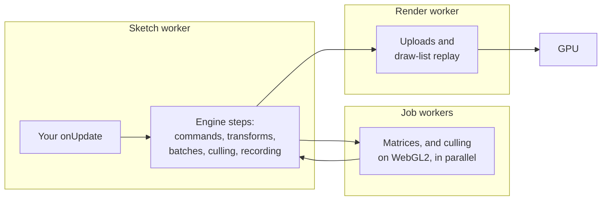

# Performance guide

> Ships in null3D 0.1. The API is experimental, so it can still change between versions.

null3D keeps its own work per frame small, so your sketch code usually decides how long a frame takes. This guide shows where frame time goes, how to write per-frame code that stays fast, and how to measure. The figures come from the engine's benchmark scenes, which the engine's repository runs with `bun run bench:run`.

## Where frame time goes

A frame has three kinds of cost:

| Cost | Where it runs | Grows with |
| --- | --- | --- |
| Your sketch code | The sketch worker | Your loops over objects |
| The engine's own work | The sketch worker, the job workers and the render worker | Moving objects, uploads and draw lists |
| GPU work | The GPU | Pixels, shaders and the instances drawn |

The busiest thread sets the frame rate. In the default pipelined mode, the sketch worker computes one frame while the render worker draws the frame before it.

This is how one frame of the S1 benchmark splits. S1 has 100,000 boxes, and its `onUpdate` moves every box in every frame. It ran in Chrome with WebGPU on a MacBook Pro:

| Thread and step | CPU time per frame |
| --- | --- |
| Sketch worker: the sketch's update | 2.18 ms |
| Sketch worker: the engine's steps | 0.14 ms |
| Render worker | 0.16 ms |
| 16 job workers, all together | 0.45 ms |

The update calls `Math.sin` or `Math.cos` three times per box, about 20 nanoseconds per box. Make your own loops tight before you look at the engine.

`bunx @null3d/cli bench` measures a production build, which leaves out the development checks. In such a build on the same Mac, S1's busiest thread took 1.90 ms per frame with WebGPU and 2.03 ms with WebGL2. The engine's own work on that thread was 0.16 ms and 0.23 ms.

## The frame budget

At 60 frames per second a frame has 16.7 ms, and at 120 frames per second it has 8.3 ms. The busiest thread must finish its work inside that time. Phones slow down as they heat up, so plan to use at most about 70% of the budget there.

S1 used 2.3 ms of the busiest thread's time for 100,000 moving boxes. That leaves most of a 120 Hz frame for more sketch code.

### Phones and tablets

The benchmarks run S1 with 240,000 boxes on phones and tablets. These runs show how heat and the GPU change the frame rate:

| Device, browser and GPU path | CPU time per frame, busiest thread | Frames per second |
| --- | --- | --- |
| Galaxy S24+, Chrome, WebGL2, cool | 13.3 ms | 57 |
| Galaxy S24+, Chrome, WebGL2, warm | 22.1 to 22.8 ms | 30 |
| iPad Pro, Safari, WebGPU | 15.5 ms | 28 |
| iPad Pro, Safari, WebGL2 | 15.6 ms | 29 |

On the Galaxy S24+, the same frame took about 70% longer once the phone was warm. The sketch's own update took most of each frame.

The warm phone showed 30 frames per second, half the display's rate. In pipelined mode, a frame that takes a little longer than one refresh waits for the next one, as [Latency modes](../concepts/architecture.md#latency-modes) explains. Low-latency mode draws each frame in the sketch worker, right after its update. In another run on the warm phone, each frame took about 21 ms of CPU time. There low latency showed 40.4 frames per second, and pipelined mode 32.5.

On the iPad the GPU sets the rate: it took about 28 ms per frame, longer than the CPU's 15.5 ms. [The presented rate, the completed rate and GPU time](#the-presented-rate-the-completed-rate-and-gpu-time) shows how to find the busier side.

### Quality presets

The engine picks a [quality preset](../concepts/quality-presets.md) for each device when it starts: Low on phones, Medium on tablets and High on computers. The GPU path can cap it lower. The preset sets the pixel ratio cap, the texture filtering cap and the texture upload budget.

The pixel ratio cap often decides GPU time on a phone, because the GPU shades each device pixel. Low caps the ratio at 1.5, which fills a quarter of the pixels of a phone screen at ratio 3.

Measure at the presets that your users get. `engine.mode.preset` names the preset that runs, and the `?preset=low` switch fixes one for a test.

## Write per-frame code that allocates nothing

Garbage collection pauses the thread that allocated the memory. The render worker runs no sketch code, so your garbage cannot delay drawing. It can still delay your next frame. These habits keep per-frame code free of new objects:

- Read vectors by index. `const [x, y, z] = v` walks an iterator for each read, so write `const x = v[0]` instead.
- Write into arrays that you already have. `axis.set([0, 1, 0])` builds a new array on every call, so set the three elements one at a time.
- Build lookup tables once, outside the functions that run every frame.
- Compute a vector's length with `Math.sqrt(x * x + y * y + z * z)`. `Math.hypot` is slower in hot code.
- Keep reused arrays at their size. Setting `length = 0` frees an array's storage, so the next write allocates it again.
- Do not wrap a browser promise in an `async` function every frame. Each call makes a promise of its own.
- Keep closures out of functions that run every frame, even in a branch that rarely runs. Until the browser optimizes the function, the variables a closure captures are allocated on every call. Move such a branch into a function of its own.
- Change a light's intensity every frame, not its color. `setDirection` and `setIntensity` allocate nothing, but `setColor` converts the color and allocates.

Decimal numbers are a special case. Until the browser optimizes a function, the numbers it computes are stored as small objects. Code that runs once per frame gets optimized only after thousands of frames, so judge allocation after about 30 seconds of play.

## Objects during play

The engine keeps each scene's draw tables and every object's matrix on the GPU, and on WebGPU a draw bundle too. Some calls change the tables, and a frame with such a change rebuilds them. It uploads every matrix, and on WebGPU it records the bundle again. At 100,000 instances that is 4.8 MB in one frame. Other calls upload only what they changed. `measure` counts the rebuilding frames in `rebuilds`, which stays at zero in steady play.

| Call | Cost in the frame it takes effect |
| --- | --- |
| `setPosition`, `setRotation`, `setScale`, the other transform setters, and writes to a batch's arrays | The changed matrices |
| `setVisible` | The matrix and 4-byte draw entry of the object and of each object under it |
| `setActiveCount` | The 4-byte draw entry of each row that starts or stops drawing |
| `setLayers` | No rebuild: each view tests the new mask from the next frame |
| `setRenderOrder` | Nothing |
| `material.set` | The material's row of 128 bytes. Changes to several materials in one frame upload every row from the first to the last |
| Creating or destroying an instance batch, or an object of any kind, lights included | A rebuild, and engine memory can grow in the next frame |
| `setMaterial`, `setMesh`, `setParent`, `setDynamic`, `setBounds` and `setFrustumCulled` | A rebuild |
| `setCastShadows` and `setReceiveShadows`, on meshes and on lights | A rebuild |
| `texture.update()` with an image of another size, and `texture.destroy()` | A rebuild |

These habits keep play free of rebuilds:

- Create every object, batch, mesh and material a level needs during setup or behind a loading screen. The engine sizes its memory for the scene it holds, so one created during play makes engine memory grow in the next frame.
- Hide and show objects with `setVisible` instead of destroying and creating them.
- Pool short-lived things, such as bullets and particles, in an instance batch sized for the most rows it will ever need. Show fewer with `setActiveCount`, and keep the live rows at the front of the arrays.
- For a look that changes often, such as a highlight, keep two objects and swap their visibility. Keep `setMaterial` and `setMesh` for rare changes.
- Give bounds of your own with `setBounds` to few objects, and set them once: each call rebuilds the draw tables. On WebGPU, each object with bounds of its own takes a draw of its own. Objects that share a mesh and a material share one draw.
- Every row of a batch counts toward the scene's limit of objects and instance rows, active or not. On WebGPU every device draws 2,097,152. On WebGL2 the limit follows the largest texture the device allows. It is 1,048,576 at 2,048 pixels, the least that WebGL2 allows. For the device the page runs on, `engine.capabilities.maxInstances` gives the limit (E1501). The scene's 16,384 object slots count toward it too, so batches hold at most the limit less 16,384 rows. Engine memory holds about 5 million rows (E1109). So size each batch for the rows it uses.
- Check with `measure`. A `rebuilds` count above zero during play points to one of the calls in the lower rows of the table.

## How the engine batches, builds pipelines and times frames

Performance advice written for other engines often assumes things that do not hold here. These are null3D's answers to the questions that such advice depends on.

| Question | null3D's answer |
| --- | --- |
| What makes the GPU build a pipeline? | The material's kind, standard or unlit, and the [options that it fixes](../api/materials.md#options-fixed-at-creation) when you create it, apart from `flatShading` and `fog`. The mesh's vertex format, and the pass's color format, depth format and sample count. Other material values never do: materials are rows in one shared table. So a thousand standard materials in different colors share one pipeline for each vertex format. Tone mapping and exposure are values the shaders read, so changing them builds nothing. |
| When are pipelines built? | In the background, from the first frame that draws a shading model with a vertex format, and again after the browser replaces the GPU. The first frame waits for its pipelines. After that, an object whose pipeline is still building draws nothing until it is built. `scene.warmUp()` resolves once every pipeline is built, and `measure` counts builds in `pipelines`. |
| What does the engine batch by itself? | Every object and instance row with the same shading model, mesh and material goes into one bucket, which one indirect draw call draws. A mesh over 65,535 vertices takes one draw per part. Separate objects from `createMesh` batch the same way as the rows of an instance batch. |
| Which passes walk the scene? | On WebGPU, two: a culling pass on the GPU, which tests each object and row against the view, and the main pass, which replays a draw bundle. The engine records the bundle again only when the scene's structure changes. On WebGL2 the job workers cull on the CPU, and the main pass draws the objects in view. On both paths, culling first skips the still objects of grid cells out of view: [Large worlds](#large-worlds). Where the scene draws HDR color, a final pass then reads each pixel once to tone map it, whatever the scene holds. |
| Does the engine know when the GPU finished a frame? | Yes, for every frame. It listens to the WebGPU queue, or checks a WebGL2 fence, and blocks no thread. `measure` reports `completedFps` and `gpuLatencyMs`. Sketch code never waits for the GPU. |
| How many frames can wait on the GPU? | Two. While two frames are unfinished, the thread that draws takes no new frame, and the sketch worker waits for it. Without that limit, browsers let from 4 to more than 80 frames queue when the GPU falls behind, and each adds a frame of input lag. |
| What must stay the same for the engine to reuse its work? | The scene's structure. A static object costs nothing until a setter changes it. The calls that rebuild the draw tables are listed in [Objects during play](#objects-during-play). |

So some common advice does not apply:

- **Merge meshes to cut draw calls.** Objects that share a mesh and a material already share one draw. Merging different small static meshes still cuts the number of buckets.
- **Share materials so objects share a shader.** Materials of one kind with the same fixed options already share a pipeline for each vertex format. Share materials anyway, because each mesh and material pair is its own bucket and draw.
- **Compile shaders before the first frame.** The first frame waits for its pipelines. Wait for `engine.firstFrame` before you remove the first loading screen. A later loading stage does need a warm-up, as [Loading screens and warm-up](loading-screens.md) shows.
- **Turn off matrix updates for objects that do not move.** Objects are static by default, and a static object costs nothing per frame.
- **Mark a changed object for update.** Setters mark the change themselves.
- **Track GPU completion in your own code.** `measure` reports it.
- **Limit the frames that wait on the GPU.** The engine holds them to two.

## Moving objects cost uploads

Each dynamic instance uploads its 48-byte world matrix in every frame, so 100,000 moving boxes upload 4.8 MB per frame. A static batch uploads its matrices once and then nothing. The S1-static benchmark draws the same 100,000 boxes standing still. It uploads no matrices per frame. In a production build in Chrome on a MacBook Pro, its busiest thread took 0.07 ms per frame with WebGPU and 0.05 ms with WebGL2.

On WebGL2 the job workers cull, so a frame whose view changed also uploads its list of visible objects, at 4 bytes per entry. Each visible object or instance row is one entry, and so is each visible group of 64 rows in a static batch. The `visibleEntries` figure of `measure` counts them. Divide `uploadBytes` by it: when only the camera moves, the result is about 4 bytes.

Mark objects and batches static when they rarely move, and call `markDirty` for the rows that you change. See [Static and dynamic objects](../concepts/static-dynamic.md).

The render worker picks how each upload travels, so you do not need to. Uploads from 64 KiB up to 4 MiB have two routes: the direct write call, and staging buffers that the browser keeps mapped. The render worker times both on the device and uses the faster one. In Chrome the staging buffers are 3 to 6 times faster. In Safari the direct call is faster at every size.

Textures upload in bands of rows, spread over frames. Each frame sends no more texel bytes than the preset's upload budget, from 2 MiB on Low to 16 MiB on Ultra. So loading many textures does not make one frame slow, but a large texture takes several frames to arrive. [Textures](../api/textures.md) covers the budget, and [Phones and tablets](phones.md) covers texture memory.

## Large worlds

The engine divides space into [grid cells](../concepts/culling.md#grid-cells) 1,024 m wide. When a scene spreads over several cells, each view first tests each cell against its frustum. It then skips every still object of the cells out of view, and tests only the rest one by one. A still object is a static object whose parents are all static, or a row of a static instance batch.

The S1-cells benchmark spreads S1-static's 100,000 boxes over 8 x 8 cells, 8 km on each side. Its camera flies low over them, so a few cells are in view. In Chrome on a MacBook Pro:

- On WebGL2, cells cut the busiest thread's CPU time from 0.21 ms to 0.07 ms per frame. The list of visible objects fell from 1,517 entries to 79.
- On WebGPU the GPU culls, so the CPU time stayed at 0.10 ms. The culling pass took 0.025 ms of GPU time with cells, and 0.039 ms without them.

So in a large world, keep the objects that never move static, under static parents. A static object under a dynamic parent moves with it, so every view tests it. The `?cells=off` switch culls without cells, to compare.

## Measure

`engine.measure(seconds)` on the page records every frame for that many seconds and returns these figures:

| Figure | What it is |
| --- | --- |
| `cpuMs` | CPU time per frame of the busiest thread, the thread that limits the frame rate |
| `cpuMsAllThreads` | CPU time per frame summed over every thread, job workers included |
| `threads` | Each thread's time per frame by name, such as `sketch-worker`, `render-worker` and `job-0`, with its steps |
| `gpuMs` | GPU time per frame, where the device has timestamp queries |
| `gpuPassMs` | The parts of `gpuMs`: the copies before the first pass, each pass, and the time between passes |
| `intervalMs` | Time between frames on the screen |
| `presentedFps` and `completedFps` | Frames per second that the renderer presented, and that the GPU finished |
| `gpuLatencyMs` | Time from a frame's submit to the GPU finishing it |
| `completionSignal` | How the engine learned that the GPU finished a frame: `queue` on WebGPU, `fence` on WebGL2 |
| `refreshHz` | The display's refresh rate, as the engine measured it |
| `mainThread` | Long tasks and input delay on the page's own thread, where the browser reports them (Chrome) |
| `uploadBytes` and `drawCalls` | Bytes uploaded and draw calls made per frame |
| `visibleEntries` | On WebGL2, the entries per frame in the list of visible objects. It is null on WebGPU, where the GPU culls |
| `rebuilds` | Frames whose structure change rebuilt the draw tables |
| `pipelines` | GPU pipelines built, which can stall the frame they happen in |
| `memory` | The engine's WebAssembly memory and the JavaScript heap |
| `load` | The start's times in milliseconds: the GPU probe, the core's download and compile, `createEngine`, and the first frame's submit and finish. It also gives the pipelines that the first frame built, and how long they took |
| `downloadBytes` | The size of the engine core's WebAssembly file as the page downloaded it |
| `lostRecords` | Frames that the figures miss, because the page read their records too late. It is 0 in a clean run |

The sketch worker's steps are `update`, `commands`, `transforms`, `batches`, `cull` and `record`, and the render worker's is `replay`. A thread's time less its `update` step is the engine's own work on that thread.

To measure your page with no code, run `bunx @null3d/cli bench` in your project's folder. It builds the project for production and opens the page in a headless browser with the `?bench` switch. That switch publishes the running engine as `window.__null3dEngine`. Then `bench` takes 5 fresh runs of 30 seconds, each after 5 seconds of warm-up. It prints the median and the spread of the figures above ([The `null3d` command](../cli/null3d.md#bench)).

Chrome measures the heap of the page and its workers only when every worker answers, or after a minute. Job workers never answer while the engine runs, so each sample takes about a minute and leaves them out. Chrome also adds shared memory, such as the engine's own, to each worker's figure. A render worker whose own heap is 1.4 MB can show as 52 MB. The `jsHeapNote` field says when the figures cover only the page.

### The presented rate, the completed rate and GPU time

Three figures show whether the GPU keeps up:

- `presentedFps` counts the frames that the renderer presented. A frame callback keeps firing at the display rate while the GPU falls behind. So this count alone can look healthy while the screen shows fewer frames.
- `completedFps` counts the frames that the GPU finished. The engine tracks every frame.
- `gpuMs` is the GPU's working time within a frame, where the device has timestamp queries. It is not the time from submit to screen. The engine measures it on one frame in eight. Timing every frame would cost the drawing thread about as much as drawing a small scene.

The lower of the two rates is the rate that users see. The engine lets at most two frames wait unfinished on the GPU. So when the GPU falls behind, the presented rate falls to the completed rate, and `gpuLatencyMs` stays near two completed frame intervals. A rate below `refreshHz` with `gpuLatencyMs` near two frame intervals means that the GPU limits the frame rate. On a phone without GPU timers, `completedFps` and `gpuLatencyMs` are the GPU's only signal.

Firefox reports finished WebGPU frames to the engine about a frame late. There the limit holds back frames that the GPU has already finished, which costs frame rate when the GPU is busy. In a GPU-bound test on a Mac, Firefox's WebGPU path drew 15% fewer frames at a load that used 60% of the GPU. Under heavier load it drew far fewer. Firefox's WebGL2 path lost none.

The engine checks a WebGL2 fence at its next frame callback, so there `gpuLatencyMs` rounds up to a frame interval. In Safari, a worker that draws with WebGPU waits for the GPU at the end of each frame, so there `gpuLatencyMs` stays near one frame interval. Some GPUs, such as Apple's, work on two frames at once, so a frame's `gpuMs` can be longer than the time between completed frames.

## Measure fairly

- Measure a production build, as your users get it. Development builds check each call's arguments, and check every static object in each frame. In the S2 benchmark on a MacBook Pro, that check cost about 0.06 ms per frame on WebGPU, and 0.03 ms on WebGL2. The other checks cost less than the benchmarks can measure.
- Let the sketch run for several seconds before you measure, so that the browser has optimized your per-frame code.
- Keep the page visible, the screen unlocked and the display awake. Safari stops running a page while the Mac is locked.
- Compare runs at the same display refresh rate. `refreshHz` records it with each measurement. Runs at 120 and at 144 frames per second differed by about 10% for both engines.
- To compare displays with different refresh rates, add `?fps=60` to the page's address. The engine then draws 60 frames per second on any display of 60 Hz or more.
- The engine lets at most two frames wait on the GPU. To see what a browser does without that limit, add `?queue=off` to the page's address. `?queue=3` lets three frames wait.
- Chrome rounds GPU times to 65.5 microseconds unless you start it with `--enable-webgpu-developer-features`. `gpuStepMs` gives the step when the browser rounds.
- In Safari, a worker's frame callbacks run from a timer of about 15 ms, not from the display. The engine holds its frames to the display's rate, which the page measures, but `refreshHz` there reports the timer's rate.
- Compare engines in the same browser, one run after another.

## Browsers differ

S1's busiest thread took 1.74 ms per frame in Safari, 2.32 ms in Chrome and 4.42 ms in Firefox on the same Mac. Most of that time was the same update code. Test your sketch in each browser that your audience uses.

The engine starts one job worker for each logical core that the browser reports, less 2, and at least 1. Browsers report different numbers on the same device:

- Chrome and Firefox report every core: 18 on a MacBook Pro, so the engine starts 16 job workers there.
- Safari reports at most 8 logical cores, so the engine starts 6 job workers there.
- Brave can report fewer. With Shields on, it reported 3 cores on an iPad Pro, so the engine started 1 job worker.
