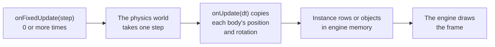

# Using a physics library

> Ships in null3D 0.1. The API is experimental, so it can still change between versions.



null3D has no physics engine of its own. You add a physics library to your sketch, and it runs in the sketch worker beside your code. In each frame, the sketch steps the physics world. Then it copies the position and rotation of each body into the scene. The page's main thread does none of this work.

In the single-threaded build, the sketch runs on the page's thread, and so does the physics library. [Hosting and cross-origin isolation](../getting-started/hosting.md) says when a page gets that build.

Two libraries work well in a sketch:

| Library | Package | What it is |
| --- | --- | --- |
| Rapier | `@dimforge/rapier3d-compat` | A Rust engine compiled to WebAssembly. It is fast with many bodies. |
| cannon-es | `cannon-es` | A JavaScript engine. It is small and simple to use. |

Install one with Bun, as any other package:

```sh
bun add @dimforge/rapier3d-compat
```

## Example: crates that fall on a floor

This sketch drops 300 crates onto a floor with Rapier. Each crate is a Rapier body and a row of one instance batch.

```ts
// sketch.ts
import RAPIER from '@dimforge/rapier3d-compat';
import { defineSketch } from '@null3d/engine';

const COUNT = 300;

export default defineSketch(async ({ scene, geometry, materials }) => {
  await RAPIER.init(); // loads Rapier's WebAssembly in the sketch worker
  const world = new RAPIER.World({ x: 0, y: -9.81, z: 0 });

  const camera = scene.createPerspectiveCamera({ fov: 50, position: [0, 6, 14], target: [0, 1, 0] });
  scene.setActiveCamera(camera);
  scene.createDirectionalLight({ direction: [-1, -2, -1], intensity: 3 });
  scene.createAmbientLight({ intensity: 0.4 });

  // The floor: a fixed collider and a static mesh.
  world.createCollider(RAPIER.ColliderDesc.cuboid(6, 0.5, 6).setTranslation(0, -0.5, 0));
  scene.createMesh({
    mesh: geometry.box({ width: 12, height: 1, depth: 12 }),
    material: materials.standard({ color: '#3a4450' }),
    position: [0, -0.5, 0],
  });

  // The crates: one rigid body for each row of a dynamic instance batch.
  const crates = scene.createInstances(geometry.box({ width: 0.5, height: 0.5, depth: 0.5 }), COUNT, {
    material: materials.standard({ color: '#e8a33d' }),
    dynamic: true,
  });
  const bodies: RAPIER.RigidBody[] = [];
  for (let i = 0; i < COUNT; i++) {
    const start = RAPIER.RigidBodyDesc.dynamic()
      .setTranslation(Math.random() * 4 - 2, 1 + i * 0.1, Math.random() * 4 - 2);
    const body = world.createRigidBody(start);
    world.createCollider(RAPIER.ColliderDesc.cuboid(0.25, 0.25, 0.25), body);
    bodies.push(body);
  }

  return {
    onFixedUpdate(step) {
      world.timestep = step; // 1/60 second at the default rate
      world.step();
    },
    onUpdate() {
      const positions = crates.positions; // read the views in each frame
      const rotations = crates.rotations;
      for (let i = 0; i < COUNT; i++) {
        const p = bodies[i].translation();
        const q = bodies[i].rotation();
        positions[i * 3] = p.x;
        positions[i * 3 + 1] = p.y;
        positions[i * 3 + 2] = p.z;
        rotations[i * 4] = q.x;
        rotations[i * 4 + 1] = q.y;
        rotations[i * 4 + 2] = q.z;
        rotations[i * 4 + 3] = q.w;
      }
    },
  };
});
```

- `RAPIER.init()` loads Rapier's WebAssembly. The setup waits for it, and the engine draws no frame until the setup's promise resolves.
- Gravity points along -Y, because Y points up in null3D. Rapier stores a rotation as a quaternion (x, y, z, w), as null3D does, so the loop copies the numbers as they are.
- The rows are views of engine memory, so the copy costs no call to the engine per crate. A dynamic batch recomputes and uploads every row in each frame. [Instances and batching](../concepts/instances.md) explains the rows.
- The floor never moves, so its mesh is static. A static mesh costs nothing in a frame where it does not change.

The `-compat` package holds Rapier's WebAssembly inside its JavaScript, so it needs no extra Vite setup. That makes it large: it adds about 1.2 MB after Brotli compression to the sketch's download. With cannon-es, the example on this page adds about 20 KB.

## Step the world at a fixed rate

A physics world stays stable when every step has the same length. A frame's step changes with the screen and with slow frames, so the examples step the world in `onFixedUpdate`. The engine calls it 60 times per second of sketch time, before `onUpdate`. The examples copy the transforms in `onUpdate`, once per frame, after the frame's steps.

- At 30 frames per second, each frame runs two steps. At 120 frames per second, every second frame runs one, so the bodies move in every second frame. For smooth motion on a fast screen, raise the rate with `defineSketch(setup, { fixedRate: 120 })`.
- After a slow frame, a frame runs at most 8 steps and drops the rest. So a world that steps too slowly cannot slow down every frame after it.
- In hold mode, each frame after the first runs one step. A held frame then shows the same pile on every run. [Testing your sketch](testing.md) explains hold mode.

[Time](../api/time.md#fixed-steps) gives the rules of the fixed steps.

## Example: one object per body

For a few bodies, give each body a mesh of its own, and copy its transform with `setPosition` and `setRotation`. This sketch drops a ball with cannon-es:

```ts
// sketch.ts
import * as CANNON from 'cannon-es';
import { defineSketch } from '@null3d/engine';

export default defineSketch(({ scene, geometry, materials }) => {
  const world = new CANNON.World({ gravity: new CANNON.Vec3(0, -9.82, 0) });

  const camera = scene.createPerspectiveCamera({ fov: 50, position: [0, 4, 10], target: [0, 1, 0] });
  scene.setActiveCamera(camera);
  scene.createDirectionalLight({ direction: [-1, -2, -1], intensity: 3 });
  scene.createAmbientLight({ intensity: 0.4 });

  const ground = new CANNON.Body({ mass: 0, shape: new CANNON.Plane() });
  ground.quaternion.setFromEuler(-Math.PI / 2, 0, 0); // the plane faces up
  world.addBody(ground);
  scene.createMesh({
    mesh: geometry.box({ width: 12, height: 0.1, depth: 12 }),
    material: materials.standard({ color: '#3a4450' }),
    position: [0, -0.05, 0],
  });

  const ball = new CANNON.Body({ mass: 1, shape: new CANNON.Sphere(0.5) });
  ball.position.set(0, 6, 0);
  ball.velocity.set(1.5, 0, 0);
  world.addBody(ball);
  const ballMesh = scene.createMesh({
    mesh: geometry.sphere({ radius: 0.5 }),
    material: materials.standard({ color: '#e8554e' }),
    dynamic: true,
  });

  return {
    onFixedUpdate(step) {
      world.step(step);
    },
    onUpdate() {
      const p = ball.position;
      const q = ball.quaternion;
      ballMesh.setPosition(p.x, p.y, p.z);
      ballMesh.setRotation(q.x, q.y, q.z, q.w);
    },
  };
});
```

With one argument, `world.step` takes one step of that length. Do not use `world.fixedStep()` in a sketch. It reads the clock, so hold mode cannot fix its steps.

Give a mesh `dynamic: true` when its body moves in most frames. [Static and dynamic objects](../concepts/static-dynamic.md) explains the choice.

## Tell the page about events

The page does not need the transforms, because the engine draws from engine memory. It may need events, such as a hit that changes the score or plays a sound. Send one message for each event with the sketch's `page.post`. In the ball example, take `page` from the context, and add this to the setup:

```ts
// Report each hard bounce to the page.
ball.addEventListener('collide', (event: { contact: CANNON.ContactEquation }) => {
  const speed = Math.abs(event.contact.getImpactVelocityAlongNormal());
  if (speed > 1) page.post('bounce', { position: ball.position.toArray(), speed });
});
```

On the page, `onSketchMessage` receives each `bounce` message with its position and speed.

[Messages between sketch and page](../api/page.md) covers messages, and [Audio with Web Audio](audio.md) plays a sound at a point in the scene.

## Related pages

- [Instances and batching](../concepts/instances.md): the rows of an instance batch.
- [Objects and transforms](../api/objects.md): `setPosition`, `setRotation` and the other setters.
- [Sketch API: defineSketch and the context](../api/sketch.md): `onUpdate` and its step.
- [Testing your sketch](testing.md): hold mode and image tests.
