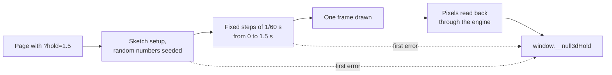

# Testing your sketch

> Ships in null3D 0.1. The API is experimental, so it can still change between versions.



An image test draws your sketch at a set time and compares the frame with a reference image. A live engine draws whenever the browser gives it a frame. The time and the steps of a live frame therefore change from run to run. Hold mode fixes both, and the same code then draws the same frame on every run.

## Hold mode

Start hold mode with the `?hold=<seconds>` switch in the page's address, or with the `hold` option of `createEngine`:

```ts
// page.ts
const engine = await createEngine({
  canvas,
  sketch: new URL('./sketch.ts', import.meta.url),
  hold: 1.5, // seconds of sketch time
});
const { width, height, pixels } = await engine.captureFrame(); // RGBA8 rows, top row first
```

In hold mode, the engine does this:

1. It seeds the engine's random generator, [`math.random`](../api/math.md#random-numbers), in the sketch's thread, and makes `Math.random` draw from it too. This happens before the sketch module loads.
2. It runs the sketch's setup.
3. It steps the sketch from time 0 to the held time. The first frame is at time 0 and its `onUpdate` gets a step of 0. Each later frame adds a fixed step of 1/60 second, and the last one lands on the held time exactly.
4. It draws the last frame on the canvas, and reads its pixels back through its own GPU code.
5. It publishes the frame, or the error that stopped it, as `window.__null3dHold`.

`createEngine` resolves once the frame is read back, and `engine.captureFrame()` returns that frame. `engine.mode.hold` gives the held time, and it is `null` for a live engine. After the held frame, the engine draws nothing more: it runs no frame loop, so `engine.measure()` finds no frames.

A hold at 1.5 seconds runs 91 frames: frame 1 at time 0, then 90 steps. In the last `onUpdate`, `time.now` is 1.5 and `time.frame` is 91.

The switch wins over the option. A bare `?hold` holds at the time of the `hold` option, or at 0 without one. The time must be from 0 to 600 seconds, or the start fails with [E1407](../errors/E1407.md).

Hold mode works in every thread mode and on every GPU tier. The single-threaded build runs the sketch on the page's thread, so there the page's `math.random` is seeded too. The page's `Math.random` draws from it until the engine stops.

## Reading the result in a test

A test runner opens the page with `?hold` and waits for `window.__null3dHold`. The engine sets it the moment the hold ends, so a runner never waits out a timeout on a page that failed. The page needs no test code of its own.

| Field | Held frame | Failed hold |
| --- | --- | --- |
| `ok` | `true` | `false` |
| `time`, `frame` | The sketch time in seconds, and the frame's number | Absent |
| `tier` | The GPU path that drew the frame | Absent |
| `width`, `height`, `pixels` | The frame's size, and its pixels as RGBA8 rows in a `Uint8Array`, top row first | Absent |
| `code`, `error` | Absent | The error's code, or `null` for an error without one, and its message |

With Playwright, a test reads the result like this:

```ts
// tests/boat.spec.ts
await page.goto('/?hold=1.5&gpu=webgl2');
await page.waitForFunction(() => (window as any).__null3dHold);
const result = await page.evaluate(() => {
  const held = (window as any).__null3dHold;
  if (!held.ok) return held;
  let binary = '';
  for (let i = 0; i < held.pixels.length; i += 0x8000)
    binary += String.fromCharCode(...held.pixels.subarray(i, i + 0x8000));
  return { ...held, pixels: btoa(binary) };
});
if (!result.ok) throw new Error(result.error);
const pixels = Buffer.from(result.pixels, 'base64'); // compare with the reference image
```

The engine reads the pixels back with its own GPU code and takes no screenshot of the canvas. Some browsers change what a page reads from a canvas, to stop fingerprinting.

## A held frame from the command line

`bunx @null3d/cli shot` draws one held frame of your page, with no test code. It starts your project's own Vite dev server and opens the page with `?hold` in a headless browser. Then it saves the frame as a PNG file:

```sh
bunx @null3d/cli shot --out shot.png --time 1.5 --gpu webgl2
```

Beside the image, it saves `shot.json` with the frame's time, number and GPU tier, and with what the page logged. When the hold fails, it prints the error and saves no image. [The `null3d` command](../cli/null3d.md) lists its options.

## When a hold fails

Hold mode stops at the first error and publishes it with `ok: false`:

| Failure | What the result says |
| --- | --- |
| The time is not a number of seconds from 0 to 600 | [E1407](../errors/E1407.md) |
| The sketch or the engine failed during a step | [E1408](../errors/E1408.md), with the sketch time and the frame of the failure |
| The frame could not be drawn or read back | E1408, with the reason |
| The sketch's setup threw, or a thread did not start | The same error that a live start gives, such as [E1405](../errors/E1405.md) |
| The browser took the GPU away | [E1302](../errors/E1302.md). Hold mode draws on one device, so it does not start a new one. |

A live engine logs an error in `onUpdate` and carries on. Hold mode stops instead, so a test fails at once. The console shows the sketch's error with its stack.

## Frames that stay the same on every run

- Move things with `time.now` and the `dt` that `onUpdate` receives. `Date.now()` and `performance.now()` change from run to run.
- Use `math.random` or `Math.random`: hold mode seeds both. Random numbers from another source, such as `crypto.getRandomValues`, are not seeded.
- Expect no input. In hold mode, the sketch gets none: every key and button stays up, and the pointer stays at the canvas's top-left corner.
- Finish loading in the setup. Await every asset there, because the hold starts when the setup's promise resolves.
- Pass test settings in the sketch module's address, such as `new URL('./sketch.ts?view=harbor', import.meta.url)`, and read them in the sketch with `new URL(import.meta.url).searchParams`. The page's messages reach the sketch only after the hold, because `createEngine` resolves after it.
- Keep a reference image per GPU tier, and force the tier with `?gpu=webgpu`, `?gpu=compat` or `?gpu=webgl2`. The tiers can differ slightly at edges.
- Compare with a small tolerance. A software GPU in CI and a real GPU differ at object edges. three.js's own rule counts a pixel as different past 10% of the color range. It fails an image when 0.1% or more of its pixels differ.

## Switches for tests

| Switch | Effect |
| --- | --- |
| `?hold=1.5` | Hold mode at 1.5 seconds of sketch time; a bare `?hold` holds at the `hold` option's time, or at 0 |
| `?gpu=webgpu`, `?gpu=compat`, `?gpu=webgl2` | Force a GPU tier, where the device has it |
| `?depth=reversed`, `?depth=reversed-gl`, `?depth=standard` | Force a WebGL2 depth mode. `reversed-gl` draws as browsers without the `EXT_clip_control` extension do, such as Firefox |
| `?threads=off` | The single-threaded build |
| `?render=main` | Draw on the page's main thread |
| `?latency=pipelined`, `?latency=low` | Pick the latency mode |
| `?preset=low`, `?preset=medium`, `?preset=high`, `?preset=ultra` | Fix the quality preset, within the GPU path's highest; the engine then ignores starts that crashed before |
