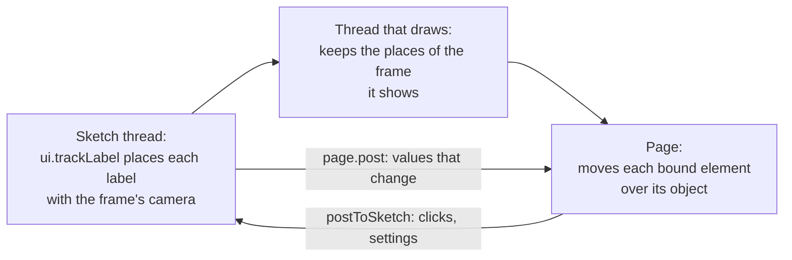

# UI, HTML overlays and labels

> Roadmap step 0.2, first released in null3D 0.1.0. The API is experimental, so it can still change between versions.



The page owns the DOM, and the sketch owns the scene. HTML UI, such as menus, scores and settings panels, lives on the page, over or beside the canvas. The page and the sketch talk with messages when something changes. Labels that follow scene objects need no messages: the engine moves their elements through memory that its threads share.

## HTML UI on the page

Put the canvas and the UI in one container, and lay the UI over the canvas with CSS. Give overlay layers `pointer-events: none`, and turn pointer events back on for the buttons and panels inside them. The canvas then keeps the pointer everywhere else.

```html
<div id="view" style="position: relative">
  <canvas style="width: 100%; height: 100vh; display: block"></canvas>
  <div id="labels" style="position: absolute; inset: 0; overflow: hidden; pointer-events: none"></div>
  <div id="hud" style="position: absolute; top: 12px; left: 12px; pointer-events: none">
    Score: <span id="score">0</span>
    <button id="pause" style="pointer-events: auto">Pause</button>
  </div>
</div>
```

Send events and changes between the page and the sketch, never per-frame state. A score goes to the page when it changes. A button press goes to the sketch when it happens.

```ts
// page.ts
engine.onSketchMessage((type, data) => {
  if (type === 'score') document.querySelector('#score')!.textContent = String(data);
});
document.querySelector('#pause')!.addEventListener('click', () => engine.postToSketch('pause'));
```

## Labels that follow objects

A label is an element that sits over a scene object. The sketch tracks it with `ui.trackLabel`, and the page binds its element with `engine.labels.bind`. [UI overlays and labels](../api/ui.md) describes both calls.

This example gives each unit a health bar. The bar follows its unit in every frame, and only the health value travels as a message, when it changes.

```ts
// sketch.ts
import { defineSketch } from '@null3d/engine';

export default defineSketch(({ scene, geometry, materials, ui, page, time }) => {
  const camera = scene.createPerspectiveCamera({ position: [0, 6, 12], target: [0, 0, 0] });
  scene.setActiveCamera(camera);
  scene.createDirectionalLight({ direction: [-1, -2, -1] });
  const body = geometry.box();
  const paint = materials.standard({ color: '#4a8cff' });
  const units = [0, 1, 2].map((id) => {
    const unit = scene.createMesh({ mesh: body, material: paint, position: [id * 3 - 3, 0, 0], dynamic: true });
    ui.trackLabel(unit, `hp-${id}`, { offset: [0, 1.2, 0] });
    page.post('hp', { id, value: 100 });
    return unit;
  });
  return {
    onUpdate() {
      units.forEach((unit, id) => unit.setPosition(id * 3 - 3, 0, Math.sin(time.now + id) * 2));
    },
  };
});
```

```ts
// page.ts
const layer = document.querySelector<HTMLElement>('#labels')!;
const bars = new Map<number, HTMLElement>();
engine.onSketchMessage((type, data) => {
  if (type !== 'hp') return;
  const { id, value } = data as { id: number; value: number };
  let bar = bars.get(id);
  if (!bar) {
    bar = document.createElement('div');
    bar.className = 'hp';
    layer.append(bar);
    engine.labels.bind(`hp-${id}`, bar);
    bars.set(id, bar);
  }
  bar.style.setProperty('--hp', `${value}%`);
});
```

Keep label elements light. The engine writes only their `transform` and `visibility`, which the browser applies without a new layout. Text or size changes inside a label do cost a layout, so change them only when the value changes.

The engine holds 4,096 labels at once by default. For more, set `createEngine`'s `maxLabels` option. With many labels, bind elements only for the ones the player can see, and untrack the rest.

## GUI panels

A settings panel, such as one made with lil-gui, lives on the page like any other HTML. Each change goes to the sketch as a message, and the sketch applies it in its next frame.

```ts
// page.ts
import GUI from 'lil-gui';

const settings = { exposure: 1, bloom: false };
const gui = new GUI();
gui.add(settings, 'exposure', 0, 3).onChange((value: number) => engine.postToSketch('exposure', value));
gui.add(settings, 'bloom').onChange((on: boolean) => engine.postToSketch('bloom', on));
```

```ts
// sketch.ts
page.onMessage((type, data) => {
  if (type === 'exposure') post.set({ exposure: data as number });
});
```

## Related pages

- [UI overlays and labels](../api/ui.md): `ui.trackLabel` and `engine.labels.bind`.
- [Messages between sketch and page](../api/page.md): `page.post`, `page.onMessage` and `engine.postToSketch`.
- [Cameras](../api/cameras.md): `worldToScreen` places a single point on the canvas.
- [Accessibility](accessibility.md): meaning in HTML around the canvas.
