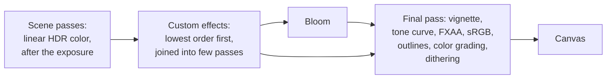

# Porting post-processing

> Ships in null3D 0.2. The API is experimental, so it can still change between versions.

three.js builds post-processing from passes in an `EffectComposer`. null3D has the chain built in. A port turns most passes into settings of `post.set`, and each custom `ShaderPass` into a custom effect with `post.addEffect`.



## Delete the composer

Delete `EffectComposer`, `RenderPass`, `OutputPass`, `GammaCorrectionShader` and the call to `composer.render()`. Delete `composer.setSize` and `composer.setPixelRatio` too: the engine follows the canvas. Then move each pass's numbers into `post.set` in the sketch.

A three.js chain with ACES tone mapping and a vignette:

```js
renderer.toneMapping = THREE.ACESFilmicToneMapping;
renderer.toneMappingExposure = 1.2;
const composer = new EffectComposer(renderer);
composer.addPass(new RenderPass(scene, camera));
const vignette = new ShaderPass(VignetteShader);
vignette.uniforms.offset.value = 1;
vignette.uniforms.darkness.value = 1.2;
composer.addPass(vignette);
composer.addPass(new OutputPass());
```

Close to the same look in null3D. The vignette's `offset` becomes `size`, and its `darkness` becomes `intensity`:

```ts
post.set({ toneMapping: 'aces', exposure: 1.2, vignette: { size: 1, intensity: 1.2 } });
```

## Passes that become settings

| three.js | null3D | Notes |
| --- | --- | --- |
| `RenderPass`, `OutputPass` | Nothing | The scene pass and the final pass are built in. |
| `GammaCorrectionShader`, `SRGBShader` | Delete | The final pass encodes sRGB once. Keeping the pass applies it twice. |
| `renderer.toneMapping`, `toneMappingExposure` | `toneMapping`, `exposure` | `'aces'`, `'agx'`, `'neutral'` and `'none'` use three.js's formulas. Other curves become a [custom tone curve](#port-a-tone-mapping). |
| `UnrealBloomPass` | `bloom` with `blend: 'add'` and `knee: 0.01` | Keep the threshold. The intensity is about 8.8 times `strength`, and `radius` becomes the `weights`. |
| `GTAOPass` | `ao` | The settings keep their names. `distanceFallOff` becomes `distanceFalloff`, and `blendIntensity` becomes `intensity`. |
| `SSAOPass`, `SAOPass`, N8AO | `ao` | Their settings mean other things. Start from the defaults and tune `radius` and `scale` by eye. |
| `OutlinePass` | `outline` and `mesh.setOutlined(true)` | `visibleEdgeColor` becomes `color`, and `hiddenEdgeColor` becomes `hiddenColor`. Set `width` to about twice `edgeThickness`. |
| `LUTPass` | `lut: await assets.loadLut(url)`, `lutIntensity` | Load the same `.cube` or `.3dl` file. A `Data3DTexture` that code fills becomes `await assets.lutFromData({ size, data })`, with floats from 0 to 1 in the same order. |
| `ShaderPass(VignetteShader)` | `vignette: { size: offset, intensity: darkness }` | null3D darkens HDR color before the tone curve, so bright corners darken instead of turning gray. The default falloff gives a close match. With a `darkness` below 1, three.js also lifts dark corners toward a gray, and null3D does not. |
| `FXAAPass`, `ShaderPass(FXAAShader)` | `createEngine({ antialias: 'fxaa' })` on the page | FXAA runs in the final pass. |
| `SMAAPass`, `SSAARenderPass`, `TAARenderPass` | MSAA, which the presets from Medium up use | null3D has no SMAA, SSAA or TAA. |
| `BokehPass` | A custom effect that reads `effectDepth` | Or leave depth of field out. |
| `FilmPass`, `GlitchPass`, `HalftonePass`, `DotScreenPass`, `RenderPixelatedPass` | A custom effect for each | Port each shader as a `ShaderPass`. |
| `AfterimagePass` | No port | It blends in the frame before, which an effect cannot read. |

pmndrs postprocessing maps the same way:

| pmndrs | null3D |
| --- | --- |
| `EffectComposer`, `RenderPass`, `EffectPass` | Nothing |
| `BloomEffect` | `bloom` with `blend: 'screen'`. `luminanceThreshold` becomes `threshold`, and `luminanceSmoothing` becomes `knee`. |
| `ToneMappingEffect` | `toneMapping` |
| `SSAOEffect`, N8AO | `ao`, tuned by eye |
| `OutlineEffect` | `outline`. `xRay: false` becomes `hiddenColor: false`. |
| `LUT3DEffect` | `lut` |
| `VignetteEffect` | `vignette: { size: offset, intensity: darkness }` for the `ESKIL` technique; for the default technique, tune `intensity` and `size` by eye |
| `ChromaticAberrationEffect`, `NoiseEffect`, `ScanlineEffect`, `PixelationEffect` | A custom effect for each |
| `DepthOfFieldEffect` | A custom effect that reads `effectDepth` |

Bloom's glow covers a share of the screen, and three.js's glow covers a number of pixels. So a bloom mapping matches at one canvas size. [The post-processing chain](../concepts/post-processing.md#porting-from-threejs) gives the details for bloom, ambient occlusion and outlines.

## Port a ShaderPass to a custom effect

A custom effect is WGSL that declares `fn effect(input: EffectInput) -> vec4f`. The engine calls it once for each pixel, in a full-screen pass. Port a `ShaderPass` in these steps:

1. Read the fragment shader. List its uniforms, its textures and its depth reads.
2. Write the WGSL `effect` function. The table below maps three.js's names.
3. Declare the uniforms as `struct Uniforms { ... }`. The function reads them as `uniforms.name`.
4. Pass the WGSL and the first uniform values to `post.addEffect`. Keep the `Effect` that it returns.
5. Change uniforms with `post.setEffectUniform`. It allocates nothing, so you can call it every frame.
6. Give each effect an `order` when the chain holds more than one. Effects run from the lowest order to the highest.
7. Compare images of the port and the original, one effect at a time.

The WGSL must be a template literal right after a `/* wgsl */` comment, or a `.wgsl` file that you import. The null3D Vite plugin compiles it while it builds the project. Plain text throws [E1215](../errors/E1215.md).

| three.js `ShaderPass` | null3D effect |
| --- | --- |
| `gl_FragColor = color;` | `return color;` |
| `texture2D(tDiffuse, vUv)` | `input.color`, the color under the pixel |
| `texture2D(tDiffuse, uv)` at another place | `effectColor(uv)`, a filtered read that clamps at the edges |
| `texelFetch(tDiffuse, ivec2(gl_FragCoord.xy), 0)` | `effectPixel(vec2i(input.pixel))`, an exact texel |
| `vUv` | `input.uv`, which is (0, 0) at the top left |
| `vUv.y` | `1.0 - input.uv.y` |
| `gl_FragCoord.xy` | `input.pixel`, counted from the top left |
| A `resolution` uniform | `input.size`, the render size in pixels |
| A `time` uniform | `input.time`, the sketch time in seconds |
| A depth texture read | `effectDepth(uv)`: 1 at the near plane and 0 at the far plane |
| `perspectiveDepthToViewZ(depth, near, far)` | `effectViewPosition(uv).z`, negative in front of the camera |
| `-viewZ` | `effectDistance(uv)`, in world units |
| `uniforms: { amount: { value: 0.5 } }` | `amount: f32` in `struct Uniforms`, and `uniforms: { amount: 0.5 }` |
| `pass.uniforms.amount.value = x` | `post.setEffectUniform(effect, 'amount', x)` |
| `pass.enabled = false` | `post.removeEffect(effect)`, and `post.addEffect` to bring it back |
| A `sampler2D` uniform, such as a noise texture | No textures. Use the noise of `null3d::noise`. |

Uniforms are `f32`, `i32`, `u32`, `vec2f`, `vec3f` or `vec4f`, up to 32 floats in all. Each `vec3f` and `vec4f` starts a new group of four floats. A `vec3f` also takes a color string, which the engine converts from sRGB to linear. A uniform name that the WGSL does not declare fails the TypeScript check, and throws [E1216](../errors/E1216.md) when the sketch runs. [Porting shaders](threejs-shaders.md) maps the rest of GLSL to WGSL.

### Example: RGBShiftShader

three.js's `RGBShiftShader` moves the red and blue channels apart:

```glsl
uniform sampler2D tDiffuse;
uniform float amount;
uniform float angle;
varying vec2 vUv;

void main() {
  vec2 offset = amount * vec2(cos(angle), sin(angle));
  vec4 cr = texture2D(tDiffuse, vUv + offset);
  vec4 cga = texture2D(tDiffuse, vUv);
  vec4 cb = texture2D(tDiffuse, vUv - offset);
  gl_FragColor = vec4(cr.r, cga.g, cb.b, cga.a);
}
```

The app adds it with `new ShaderPass(RGBShiftShader)` and sets `amount` to 0.0015. The port in the sketch:

```ts
const rgbShift = post.addEffect({
  wgsl: /* wgsl */ `
    struct Uniforms { amount: f32, angle: f32 }

    fn effect(input: EffectInput) -> vec4f {
      // The y axis of the image points down, so the offset's y changes sign.
      let offset = uniforms.amount * vec2f(cos(uniforms.angle), -sin(uniforms.angle));
      let red = effectColor(input.uv + offset).r;
      let blue = effectColor(input.uv - offset).b;
      return vec4f(red, input.color.g, blue, input.color.a);
    }`,
  uniforms: { amount: 0.0015, angle: 0 },
});
```

To turn the shift during play, change the angle in `onUpdate`:

```ts
post.setEffectUniform(rgbShift, 'angle', time.now);
```

### Example: fog from the depth

An effect that calls a depth helper reads the scene's depth, on every GPU path. This one fades each pixel toward a fog color by its distance from the camera:

```ts
post.addEffect({
  wgsl: /* wgsl */ `
    struct Uniforms { color: vec3f, density: f32 }

    fn effect(input: EffectInput) -> vec4f {
      let fade = 1.0 - exp(-effectDistance(input.uv) * uniforms.density);
      return vec4f(mix(input.color.rgb, uniforms.color * input.color.a, fade), input.color.a);
    }`,
  uniforms: { color: '#b0c4d8', density: 0.04 },
});
```

## Port a tone mapping

`post.set` takes the WGSL of a custom tone curve in place of a curve's name. The WGSL declares `fn toneCurve(color: vec3f) -> vec3f`. The engine calls it with the exposed linear color of each pixel, after bloom. It clamps the result to 0 to 1, then encodes sRGB, grades and dithers as usual. The vignette has darkened the color already. A tone curve takes no uniforms.

three.js's `ReinhardToneMapping` multiplies the color by `toneMappingExposure` first. null3D's color arrives exposed, so leave that step out and copy the exposure. A three.js renderer with Reinhard's curve:

```js
renderer.toneMapping = THREE.ReinhardToneMapping;
renderer.toneMappingExposure = 1.5;
```

The port:

```ts
const reinhard = /* wgsl */ `
  fn toneCurve(color: vec3f) -> vec3f {
    return color / (vec3f(1.0) + color);
  }`;

post.set({ toneMapping: reinhard, exposure: 1.5 });
```

`CineonToneMapping` ports the same way:

```ts
const cineon = /* wgsl */ `
  fn toneCurve(color: vec3f) -> vec3f {
    let c = max(vec3f(0.0), color - vec3f(0.004));
    return pow((c * (6.2 * c + vec3f(0.5))) / (c * (6.2 * c + vec3f(1.7)) + vec3f(0.06)), vec3f(2.2));
  }`;

post.set({ toneMapping: cineon });
```

For `CustomToneMapping`, copy the body of the app's `CustomToneMapping` function into `toneCurve`, without the exposure step. `post.set({ toneMapping: 'aces' })` returns to a built-in curve.

## Traps

- HDR color: an effect reads linear HDR color, before the tone curve. A `ShaderPass` before `OutputPass` reads the same kind of color. A `ShaderPass` after `OutputPass` reads display color, tone mapped and from 0 to 1. Its numbers need changes.
- Display color math: thresholds, film grain and color math made for display color look different on HDR color. Clamp the color, convert it with `linear_to_srgb` and `srgb_to_linear` from `null3d::color`, or tune the numbers by eye.
- The exposure: null3D applies the exposure before the effects. three.js applies `toneMappingExposure` in `OutputPass`, after its passes. With an exposure other than 1, scale the thresholds of ported effects by it.
- The y axis: `input.uv` and `input.pixel` start at the top left. three.js's `vUv` and `gl_FragCoord` start at the bottom left. Flip the y axis wherever direction matters, such as in gradients and offsets.
- Passes: three.js runs each `ShaderPass` as a pass of its own. null3D joins an effect that reads only its own pixel into the pass of the effect before it. A chain of per-pixel looks then costs one pass, or none when it folds into the final pass. An effect that reads other pixels, such as a blur, starts a new pass.
- At most 8 effects run at once. A ninth throws [E1213](../errors/E1213.md).
- The order: effects run before bloom and the tone curve. A three.js pass that ran after `UnrealBloomPass` now runs before bloom, so bloom spreads its result.
- Alpha: `input.color` holds color multiplied by its coverage, which alpha holds. Return the alpha, and multiply any color you add by it.
- HDR targets: effects and custom tone curves need HDR color, as bloom does. In WebGPU's compatibility mode with MSAA, the first one moves the engine to HDR color with FXAA. On a WebGL2 device with no float targets, they stay off, and development builds warn once.
- Debug views: a debug view turns effects and the custom tone curve off.

## Related pages

- [Post-processing API](../api/post.md): `post.set`, `post.addEffect`, `post.setEffectUniform` and `post.removeEffect`.
- [The post-processing chain](../concepts/post-processing.md): how bloom, ambient occlusion, outlines and the final pass work, and what they cost.
- [Porting shaders](threejs-shaders.md): GLSL to WGSL.
- [Custom passes and render targets](../guides/custom-passes.md): what an effect reads, what effects cost, and custom tone curves.
- [three.js to null3D mapping](threejs-mapping.md): every three.js post-processing class and its port.
